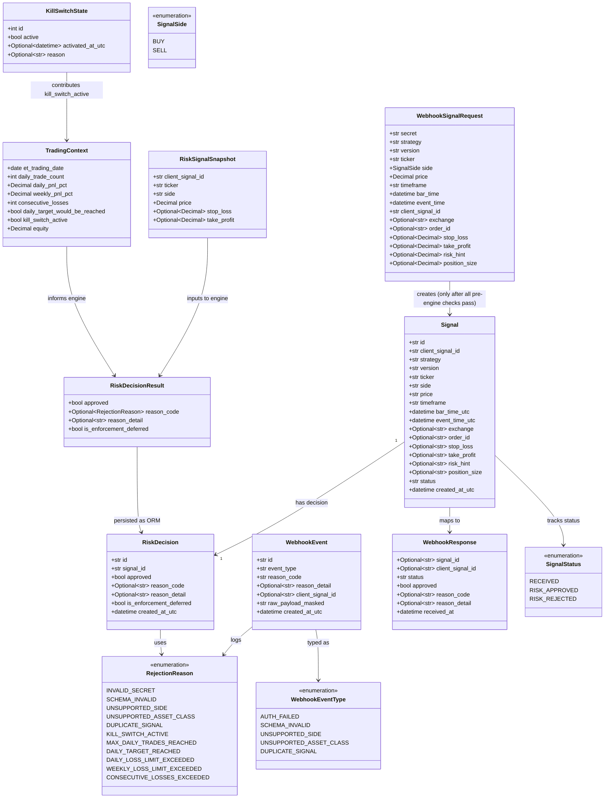

# Trading System V0 — TradingView Webhook Receiver & Risk Engine Simulation

## Requirements

Implement the V0 foundation of a paper-first algorithmic trading system: a TradingView webhook receiver that accepts a raw HTTP body and processes it through a sequential fail-fast pipeline (secret authentication, schema validation, side/asset allowlist, idempotency deduplication), evaluates compliant signals through a stateless Risk Engine, persists all signals and decisions to an auditable SQLite store, logs pre-engine rejections to a separate audit table (`webhook_events`), and returns structured responses.

`approved=True` means risk-approved for observability only. V0 does not execute orders.

Scope constraints:
- No Alpaca API integration. No order creation. No paper or live order execution.
- Only BUY side supported in V0. SELL signals are rejected with `UNSUPPORTED_SIDE`.
- **Enforced risk rules in V0**: kill switch, max daily trades (3).
- **Modeled and logged but NOT enforced in V0** (no fills exist to compute realized PnL): daily target, daily loss, weekly loss, consecutive losses. These produce `approved=True` with `is_enforcement_deferred=True` and an informative `reason_code`. `STOP_AFTER_DAILY_TARGET` is reserved for V1/V2 — it has no effect in V0.
- `signals` table contains only signals that reached the Risk Engine (schema-valid, side=BUY, asset-valid, non-duplicate).
- Pre-engine rejections (auth failures, schema/JSON failures, unsupported side, unsupported asset, duplicates) are persisted to `webhook_events` as an audit log.
- Invalid JSON bodies must also create a `WebhookEvent`. No silent drops.
- All secrets sourced from environment variables. Never committed to version control.
- Tests are mandatory for every risk rule, including deferred rules.

---

## Entities



**Key distinctions:**
- `Signal` (ORM): only signals that reached the Risk Engine. Lifecycle: `RECEIVED → RISK_APPROVED | RISK_REJECTED`.
- `WebhookEvent` (ORM): all pre-engine rejections + invalid JSON events. Audit log only. No foreign key to `signals`.
- `RiskSignalSnapshot`: pure Pydantic value object passed to `engine.evaluate()`. Extracted from the persisted Signal by the service layer. `engine.py` must not import ORM models.
- `RiskDecisionResult`: pure Pydantic value object returned by `engine.evaluate()`. Not persisted directly — the service maps it to a `RiskDecision` ORM row.
- `TradingContext`: immutable Pydantic value object assembled from DB state. Never persisted.

---

## Approach

1. **Raw Payload Ingestion (Router layer)**:
   - The router endpoint receives the raw HTTP body as `Request`, not as a parsed Pydantic model. Pydantic validation must NOT run at the router level — doing so would trigger a 422 before secret validation, leaking information to unauthenticated callers.
   - The router attempts `await request.json()`. On `JSONDecodeError` or any parse failure, the router reads the raw body bytes, creates a safe masked preview (first 500 bytes, decoded with `errors="replace"`), persists a `WebhookEvent(event_type=SCHEMA_INVALID, reason_code=SCHEMA_INVALID)` via the repo, and returns 400. No silent drops for invalid JSON.
   - On successful JSON parse, the router delegates entirely to `signal_service.process_raw_payload(raw_payload, db, settings)`.
   - The router has zero business logic beyond JSON parsing.

2. **Sequential Fail-Fast Pipeline (Service layer)**:
   The service executes a fixed ordered sequence. Each step either passes control to the next or immediately creates an audit record and returns. No step is skipped.

   **Steps 1–5 produce `WebhookEvent` records (no `Signal` created):**

   - **Step 1 — Secret validation**: Extract `raw_payload.get("secret", "")`. Compare against `settings.WEBHOOK_SECRET` using `hmac.compare_digest`. On failure: `WebhookEvent(AUTH_FAILED)` with masked payload. Return 401.
   - **Step 2 — Schema validation**: `WebhookSignalRequest.model_validate(raw_payload)`. On `ValidationError`: `WebhookEvent(SCHEMA_INVALID)` with reason detail from Pydantic. Return 422.
   - **Step 3 — Side validation**: `parsed.side != SignalSide.BUY` → `WebhookEvent(UNSUPPORTED_SIDE)`. Return 422.
   - **Step 4 — Asset class validation**: Ticker contains `/` or not in allowlist → `WebhookEvent(UNSUPPORTED_ASSET_CLASS)`. Return 422.
   - **Step 5 — Idempotency check**: `signal_repo.get_by_client_signal_id()` returns a result → `WebhookEvent(DUPLICATE_SIGNAL)`. Return 409. No second Signal or RiskDecision is ever created.

   **Steps 6–9 produce `Signal` + `RiskDecision` records:**

   - **Step 6 — Persist Signal**: Insert Signal with `status=RECEIVED`. `db.flush()` to obtain `signal.id`.
   - **Step 7 — Assemble TradingContext**: `build_trading_context(db, settings)`. Reads daily trade count, PnL state (all zero in V0), kill switch state. Uses `America/New_York` for day/week boundaries.
   - **Step 8 — Build RiskSignalSnapshot**: Service creates `RiskSignalSnapshot` from the persisted Signal fields (Decimal conversion, enum coercion). This is passed to the engine instead of the ORM object.
   - **Step 9 — Risk Engine evaluation**: `engine.evaluate(snapshot, context, settings)` → `RiskDecisionResult`. Pure function, no I/O.
   - **Step 10 — Atomic persist**: Update `signal.status`. Insert `RiskDecision` mapped from `RiskDecisionResult`. `db.commit()` once.

3. **Risk Engine evaluation order (pure function — V0)**:

   Enforced (return immediately on match, `approved=False`):
   - Kill switch active → `KILL_SWITCH_ACTIVE`
   - Daily trade count ≥ `MAX_DAILY_TRADES` → `MAX_DAILY_TRADES_REACHED`

   Deferred (evaluate all, log each trigger, collect first as informative reason, return `approved=True`):
   - `daily_target_would_be_reached` → `DAILY_TARGET_REACHED` (deferred; `STOP_AFTER_DAILY_TARGET` has no effect in V0)
   - `daily_pnl_pct <= -MAX_DAILY_LOSS_PCT` → `DAILY_LOSS_LIMIT_EXCEEDED`
   - `weekly_pnl_pct <= -MAX_WEEKLY_LOSS_PCT` → `WEEKLY_LOSS_LIMIT_EXCEEDED`
   - `consecutive_losses >= MAX_CONSECUTIVE_LOSSES` → `CONSECUTIVE_LOSSES_EXCEEDED`

   If any deferred condition is triggered: return `RiskDecisionResult(approved=True, is_enforcement_deferred=True, reason_code=<first triggered>, reason_detail=...)`.
   All clear: `RiskDecisionResult(approved=True)`.

   `approved=True` means risk-approved for observability only. V0 does not execute orders.

4. **Masking convention**:
   - The service pre-computes `raw_payload_masked` before calling any repo: `json.dumps({**raw_payload, "secret": "***"})`.
   - For invalid JSON (handled in router): `raw_payload_masked = raw_bytes[:500].decode("utf-8", errors="replace")`.
   - The `create_event()` repo function receives `raw_payload_masked: str` directly — masking is the caller's responsibility.

5. **ALLOWED_TICKERS parsing**:
   - `Settings.ALLOWED_TICKERS` is a `list[str]`, populated from a comma-separated env var string.
   - Normalized to uppercase on load via a `@field_validator`.
   - Empty list = allow all non-crypto tickers. Non-empty = strict allowlist.

6. **Database**:
   - SQLAlchemy 2.x ORM + SQLite via `DATABASE_URL`. All `DateTime` columns use `DateTime(timezone=True)`.
   - All default datetime values use `datetime.now(timezone.utc)` — never `datetime.utcnow()`.
   - `create_all` on startup. No migration framework in V0.

---

## Structure

### Module Layout
```
app/
├── main.py                       # FastAPI app factory + lifespan (init_db)
├── config.py                     # pydantic-settings Settings class
├── database.py                   # SQLAlchemy engine, sessionmaker, Base, get_db, init_db
├── routers/
│   └── webhook.py                # POST /webhook/signal — raw Request, JSON parse, delegate
├── schemas/
│   ├── enums.py                  # SignalSide, SignalStatus, WebhookEventType, RejectionReason
│   ├── signal.py                 # WebhookSignalRequest, WebhookResponse (Pydantic v2)
│   └── risk.py                   # TradingContext, RiskSignalSnapshot, RiskDecisionResult
├── models/
│   ├── signal.py                 # Signal ORM model
│   ├── decision.py               # RiskDecision ORM model
│   ├── webhook_event.py          # WebhookEvent ORM model
│   └── kill_switch.py            # KillSwitchState ORM model
├── repositories/
│   ├── signal_repo.py            # get_by_client_signal_id, create, update_status, get_approved_since
│   ├── decision_repo.py          # create_decision
│   ├── webhook_event_repo.py     # create_event(db, event_type, reason_code, raw_payload_masked, ...)
│   └── kill_switch_repo.py       # get_state, set_active
├── risk/
│   ├── engine.py                 # evaluate(snapshot, context, settings) -> RiskDecisionResult
│   └── context.py                # build_trading_context(db, settings) -> TradingContext
└── services/
    └── signal_service.py         # process_raw_payload(raw, db, settings) -> (WebhookResponse, int)

tests/
├── conftest.py
├── test_risk_engine.py           # pure function tests — all 6 risk rules
├── test_webhook.py               # integration tests — all ACs
└── test_context.py               # TradingContext builder tests
```

### Dependencies
1. `routers/webhook.py` handles JSON parse; on success calls `signal_service.process_raw_payload()`; on JSON error calls `webhook_event_repo.create_event()` directly.
2. `signal_service` calls: `signal_repo`, `decision_repo`, `webhook_event_repo`, `kill_switch_repo`, `risk/context.py`, `risk/engine.py`.
3. `risk/engine.py` imports only from `schemas/` (enums + risk value objects). No ORM model imports. No repo imports.
4. `risk/context.py` calls `signal_repo` and `kill_switch_repo`.
5. All repos depend on `database.py` and `models/`.
6. `main.py` imports `database.py` (lifespan) and `routers/webhook.py`.

### Layered Architecture
1. **Router Layer**: raw HTTP ingestion, JSON parse attempt, invalid-JSON WebhookEvent creation, delegation to service.
2. **Service Layer**: pipeline sequence, transaction management, masking, snapshot creation.
3. **Risk Layer**: pure computation. `context.py` reads DB; `engine.py` evaluates. No writes.
4. **Repository Layer**: DB reads/writes. Caller owns commit/rollback (except `webhook_event_repo` which commits independently for audit durability).
5. **Data Layer**: ORM models, engine, session.
6. **Config Layer**: typed env vars. Single source of truth.

---

## Operations

### Task 1 — Create `requirements.txt` and project scaffolding

1. `requirements.txt`:
   - `fastapi>=0.110.0`
   - `uvicorn[standard]>=0.29.0`
   - `pydantic>=2.6.0`
   - `pydantic-settings>=2.2.0`
   - `sqlalchemy>=2.0.0`
   - `python-dotenv>=1.0.0`
   - `pytest>=8.0.0`
   - `httpx>=0.27.0`

2. `.env.example`:
   ```
   WEBHOOK_SECRET=change_me
   DATABASE_URL=sqlite:///./alpacaview.db
   INITIAL_EQUITY=10000
   DAILY_TARGET_PCT=0.003
   # STOP_AFTER_DAILY_TARGET is reserved for V1/V2. Has no effect in V0. Do not set to true.
   STOP_AFTER_DAILY_TARGET=false
   KILL_SWITCH=false
   MAX_DAILY_TRADES=3
   MAX_DAILY_LOSS_PCT=0.0075
   MAX_WEEKLY_LOSS_PCT=0.025
   MAX_CONSECUTIVE_LOSSES=2
   # Comma-separated uppercase tickers. Empty = allow all non-crypto.
   ALLOWED_TICKERS=SPY,QQQ,AAPL,MSFT,NVDA
   LOG_LEVEL=INFO
   ```

3. `.gitignore` must include: `.env`, `*.db`, `__pycache__/`, `.pytest_cache/`, `*.pyc`.
4. Create `app/__init__.py` and all package `__init__.py` files.

---

### Task 2 — Create `app/schemas/enums.py`

1. All enums extend `str` and `Enum` for JSON serialization and SQLAlchemy column storage.
2. `SignalSide(str, Enum)`: `BUY = "buy"`, `SELL = "sell"`. Both values are schema-valid; SELL is a business-layer rejection.
3. `SignalStatus(str, Enum)`: `RECEIVED = "received"`, `RISK_APPROVED = "risk_approved"`, `RISK_REJECTED = "risk_rejected"`.
4. `WebhookEventType(str, Enum)`: `AUTH_FAILED`, `SCHEMA_INVALID`, `UNSUPPORTED_SIDE`, `UNSUPPORTED_ASSET_CLASS`, `DUPLICATE_SIGNAL`, `INTERNAL_ERROR`.
5. `RejectionReason(str, Enum)`:
   - Enforced: `INVALID_SECRET`, `SCHEMA_INVALID`, `UNSUPPORTED_SIDE`, `UNSUPPORTED_ASSET_CLASS`, `DUPLICATE_SIGNAL`, `KILL_SWITCH_ACTIVE`, `MAX_DAILY_TRADES_REACHED`
   - Deferred (V1/V2): `DAILY_TARGET_REACHED`, `DAILY_LOSS_LIMIT_EXCEEDED`, `WEEKLY_LOSS_LIMIT_EXCEEDED`, `CONSECUTIVE_LOSSES_EXCEEDED`
   - Infrastructure: `INTERNAL_ERROR`
6. No imports from other `app/` modules.

---

### Task 3 — Create `app/config.py`

1. Class: `Settings(BaseSettings)` with `pydantic-settings`.
2. Fields:
   - `WEBHOOK_SECRET: str` — required, no default
   - `DATABASE_URL: str = "sqlite:///./alpacaview.db"`
   - `INITIAL_EQUITY: Decimal = Decimal("10000")`
   - `DAILY_TARGET_PCT: Decimal = Decimal("0.003")`
   - `STOP_AFTER_DAILY_TARGET: bool = False` — reserved for V1/V2; has no effect in V0
   - `KILL_SWITCH: bool = False` — env var fallback; DB flag takes precedence at runtime
   - `MAX_DAILY_TRADES: int = 3`
   - `MAX_DAILY_LOSS_PCT: Decimal = Decimal("0.0075")`
   - `MAX_WEEKLY_LOSS_PCT: Decimal = Decimal("0.025")`
   - `MAX_CONSECUTIVE_LOSSES: int = 2`
   - `ALLOWED_TICKERS: list[str] = []`
   - `LOG_LEVEL: str = "INFO"`
3. `ALLOWED_TICKERS` validator:
   ```python
   @field_validator("ALLOWED_TICKERS", mode="before")
   @classmethod
   def parse_allowed_tickers(cls, v: Any) -> list[str]:
       if isinstance(v, str):
           return [t.strip().upper() for t in v.split(",") if t.strip()]
       if isinstance(v, list):
           return [str(t).upper() for t in v if t]
       return []
   ```
4. `model_config = SettingsConfigDict(env_file=".env", env_file_encoding="utf-8")`
5. `@lru_cache def get_settings() -> Settings: return Settings()`

---

### Task 4 — Create `app/database.py`

1. `DATABASE_URL`: read via `os.environ.get("DATABASE_URL", "sqlite:///./alpacaview.db")` at module level — **not** via `Settings()`. Rationale: `Settings()` requires `WEBHOOK_SECRET` to be set; reading the env var directly avoids this requirement at import time and allows tests to override `get_db` without needing a valid `WEBHOOK_SECRET`.
2. `connect_args = {"check_same_thread": False} if "sqlite" in DATABASE_URL else {}` — SQLite-only setting.
3. `engine`: `create_engine(DATABASE_URL, connect_args=connect_args)`
4. `SessionLocal = sessionmaker(autocommit=False, autoflush=False, bind=engine)`
5. `Base = declarative_base()`
6. `get_db()` generator: yields `SessionLocal()`, closes in `finally`.
7. `init_db()`: `Base.metadata.create_all(bind=engine)`. Called once from app lifespan.

---

### Task 5 — Create `app/schemas/signal.py`

1. `WebhookSignalRequest(BaseModel)`:
   - All 10 required fields. `side: SignalSide` accepts BUY and SELL (SELL is a service-layer rejection, not schema rejection).
   - `price: Decimal` — field validator asserts > 0.
   - `bar_time: datetime`, `event_time: datetime` — normalized to UTC-aware via `@field_validator("bar_time", "event_time", mode="after")`.
   - `client_signal_id: str` — `min_length=1`.
   - `@field_validator("ticker", mode="before")` uppercases the value.
   - `model_config = ConfigDict(str_strip_whitespace=True)`
2. `WebhookResponse(BaseModel)`:
   - `signal_id: Optional[str] = None` — None for WebhookEvent-only rejections
   - `client_signal_id: Optional[str] = None`
   - `status: str`
   - `approved: bool`
   - `reason_code: Optional[str] = None`
   - `reason_detail: Optional[str] = None`
   - `received_at: datetime`
   - `model_config = ConfigDict(use_enum_values=True)`

---

### Task 6 — Create `app/schemas/risk.py`

1. `TradingContext(BaseModel)`:
   - `et_trading_date: date`
   - `daily_trade_count: int`
   - `daily_pnl_pct: Decimal = Decimal("0")` — zero in V0
   - `weekly_pnl_pct: Decimal = Decimal("0")` — zero in V0
   - `consecutive_losses: int = 0` — zero in V0
   - `daily_target_would_be_reached: bool = False` — False in V0 (no fills)
   - `kill_switch_active: bool = False`
   - `equity: Decimal`
   - `model_config = ConfigDict(frozen=True)`

2. `RiskSignalSnapshot(BaseModel)`:
   - `client_signal_id: str`
   - `ticker: str`
   - `side: SignalSide`
   - `price: Decimal`
   - `stop_loss: Optional[Decimal] = None`
   - `take_profit: Optional[Decimal] = None`
   - `model_config = ConfigDict(frozen=True)`
   - Purpose: isolates `engine.py` from ORM models. Service creates this from the persisted Signal before calling the engine.

3. `RiskDecisionResult(BaseModel)`:
   - `approved: bool`
   - `reason_code: Optional[RejectionReason] = None`
   - `reason_detail: Optional[str] = None`
   - `is_enforcement_deferred: bool = False`
   - `model_config = ConfigDict(frozen=True)`
   - Pure return type of `engine.evaluate()`. Not an ORM model.

---

### Task 7 — Create `app/models/signal.py`

1. Table name: `signals`. Only signals that reached the Risk Engine.
2. Columns using SQLAlchemy 2.x `Mapped` + `mapped_column`:
   - `id: Mapped[str]` — PK, `default=lambda: str(uuid4())`
   - `client_signal_id: Mapped[str]` — `unique=True, nullable=False, index=True`
   - `strategy`, `version`, `ticker`, `side`, `timeframe`: `Mapped[str]`, nullable=False
   - `price: Mapped[str]` — Decimal stored as string
   - `bar_time_utc: Mapped[datetime]` — `mapped_column(DateTime(timezone=True), nullable=False)`
   - `event_time_utc: Mapped[datetime]` — `mapped_column(DateTime(timezone=True), nullable=False)`
   - `exchange`, `order_id`: `Mapped[Optional[str]]`
   - `stop_loss`, `take_profit`, `risk_hint`, `position_size`: `Mapped[Optional[str]]`
   - `status: Mapped[str]` — `SignalStatus` value
   - `created_at_utc: Mapped[datetime]` — `mapped_column(DateTime(timezone=True), default=lambda: datetime.now(timezone.utc))`
3. Relationship: `decision: Mapped[Optional["RiskDecision"]] = relationship(back_populates="signal", uselist=False)` — `Optional` because a Signal may not yet have a decision (e.g., mid-pipeline before Step 10 completes).

---

### Task 8 — Create `app/models/decision.py`

1. Table name: `risk_decisions`.
2. Columns:
   - `id: Mapped[str]` — PK, UUID string
   - `signal_id: Mapped[str]` — `ForeignKey("signals.id"), nullable=False, index=True`
   - `approved: Mapped[bool]` — nullable=False
   - `reason_code: Mapped[Optional[str]]` — nullable; set even for deferred-approved decisions
   - `reason_detail: Mapped[Optional[str]]`
   - `is_enforcement_deferred: Mapped[bool]` — `default=False`; True for V0 deferred limits
   - `created_at_utc: Mapped[datetime]` — `mapped_column(DateTime(timezone=True), default=lambda: datetime.now(timezone.utc))`
3. Relationship: `signal: Mapped["Signal"] = relationship(back_populates="decision")`

---

### Task 9 — Create `app/models/webhook_event.py`

1. Table name: `webhook_events`. All pre-engine rejections and JSON parse failures.
2. Columns:
   - `id: Mapped[str]` — PK, UUID string
   - `event_type: Mapped[str]` — `WebhookEventType` value
   - `reason_code: Mapped[str]` — `RejectionReason` value; always set
   - `reason_detail: Mapped[Optional[str]]`
   - `client_signal_id: Mapped[Optional[str]]` — extracted if available; None for AUTH_FAILED/JSON-error when field is missing
   - `raw_payload_masked: Mapped[str]` — pre-masked string from caller; secret replaced with `"***"`, or raw body preview for JSON errors
   - `created_at_utc: Mapped[datetime]` — `mapped_column(DateTime(timezone=True), default=lambda: datetime.now(timezone.utc))`
3. No foreign key to `signals`.

---

### Task 10 — Create `app/models/kill_switch.py`

1. Table name: `kill_switch_state`. Singleton (always id=1).
2. Columns:
   - `id: Mapped[int]` — PK
   - `active: Mapped[bool]` — nullable=False, default False
   - `activated_at_utc: Mapped[Optional[datetime]]` — `mapped_column(DateTime(timezone=True))`
   - `reason: Mapped[Optional[str]]`

---

### Task 11 — Create `app/repositories/signal_repo.py`

1. `get_by_client_signal_id(db: Session, client_signal_id: str) -> Optional[Signal]`
2. `create(db: Session, signal_data: dict) -> Signal` — inserts, calls `db.flush()`, then `db.refresh(signal)` to ensure server-generated values are populated, returns signal
3. `update_status(db: Session, signal: Signal, status: SignalStatus) -> None` — sets field, no flush/commit
4. `get_approved_since(db: Session, since_utc: datetime) -> list[Signal]` — `status == RISK_APPROVED AND created_at_utc >= since_utc`
5. No business logic. Caller owns commit/rollback.

---

### Task 12 — Create `app/repositories/decision_repo.py`

1. `create_decision(db: Session, signal_id: str, result: RiskDecisionResult) -> RiskDecision`:
   - Maps `result.approved`, `result.reason_code.value` (or None), `result.reason_detail`, `result.is_enforcement_deferred` to ORM columns.
   - Inserts. Calls `db.flush()`. No commit — caller owns the transaction.

---

### Task 13 — Create `app/repositories/webhook_event_repo.py`

1. `create_event(db: Session, event_type: WebhookEventType, reason_code: RejectionReason, raw_payload_masked: str, client_signal_id: Optional[str] = None, reason_detail: Optional[str] = None) -> WebhookEvent`:
   - `raw_payload_masked` is pre-computed by the caller (secret already replaced, or body preview for JSON errors).
   - Inserts WebhookEvent row.
   - Calls `db.commit()` immediately and independently — audit events must persist even if the main transaction rolls back.

2. Helper used by callers to build `raw_payload_masked` from a valid dict:
   ```python
   def mask_payload(raw_payload: dict) -> str:
       return json.dumps({**raw_payload, "secret": "***"})
   ```
   This helper lives in `webhook_event_repo.py` and is imported by the service and router.

---

### Task 14 — Create `app/repositories/kill_switch_repo.py`

1. `get_state(db: Session) -> Optional[KillSwitchState]` — query id=1
2. `set_active(db: Session, active: bool, reason: Optional[str] = None) -> KillSwitchState` — upsert id=1; sets `activated_at_utc=datetime.now(timezone.utc)` when activating

---

### Task 15 — Create `app/risk/context.py`

1. Function: `build_trading_context(db: Session, settings: Settings) -> TradingContext`
2. Logic:
   ```python
   from zoneinfo import ZoneInfo
   from datetime import datetime, timezone, timedelta, time

   et_tz = ZoneInfo("America/New_York")
   et_now = datetime.now(et_tz)
   et_today = et_now.date()
   week_start_et = et_today - timedelta(days=et_today.weekday())  # Monday

   # Convert ET boundaries to UTC-aware datetimes for DB queries
   today_utc_start = datetime.combine(et_today, time.min, tzinfo=et_tz).astimezone(timezone.utc)
   week_utc_start = datetime.combine(week_start_et, time.min, tzinfo=et_tz).astimezone(timezone.utc)

   daily_signals = signal_repo.get_approved_since(db, today_utc_start)
   daily_trade_count = len(daily_signals)

   kill_switch_row = kill_switch_repo.get_state(db)
   kill_switch_active = kill_switch_row.active if kill_switch_row else settings.KILL_SWITCH

   return TradingContext(
       et_trading_date=et_today,
       daily_trade_count=daily_trade_count,
       daily_pnl_pct=Decimal("0"),      # V0: no fills
       weekly_pnl_pct=Decimal("0"),     # V0: no fills
       consecutive_losses=0,             # V0: no fills
       daily_target_would_be_reached=False,  # V0: no fills
       kill_switch_active=kill_switch_active,
       equity=settings.INITIAL_EQUITY,
   )
   ```
3. Log `debug` note that PnL fields are deferred: `"pnl_tracking=deferred, v0_no_fills"`.
4. No writes. No commit.

---

### Task 16 — Create `app/risk/engine.py`

1. Allowed imports: `decimal`, `logging`, `typing`, `app.schemas.enums`, `app.schemas.risk`. **Must not import any ORM model or SQLAlchemy Session.**
2. Function: `evaluate(snapshot: RiskSignalSnapshot, context: TradingContext, settings: Settings) -> RiskDecisionResult`
3. Evaluation logic:

   ```python
   log = logging.getLogger(__name__)

   def evaluate(snapshot: RiskSignalSnapshot, context: TradingContext, settings: Settings) -> RiskDecisionResult:

       # --- Enforced checks ---

       if context.kill_switch_active:
           return RiskDecisionResult(
               approved=False,
               reason_code=RejectionReason.KILL_SWITCH_ACTIVE,
               is_enforcement_deferred=False,
           )

       if context.daily_trade_count >= settings.MAX_DAILY_TRADES:
           return RiskDecisionResult(
               approved=False,
               reason_code=RejectionReason.MAX_DAILY_TRADES_REACHED,
               reason_detail=f"daily_trade_count={context.daily_trade_count} max={settings.MAX_DAILY_TRADES}",
               is_enforcement_deferred=False,
           )

       # --- Deferred checks (V0: evaluate, log, do not block) ---
       # STOP_AFTER_DAILY_TARGET has no effect in V0.

       deferred_reason: RejectionReason | None = None
       deferred_detail: str | None = None

       def _set_deferred(reason: RejectionReason, detail: str) -> None:
           nonlocal deferred_reason, deferred_detail
           log.warning("deferred_limit_triggered", extra={"reason": reason.value, "detail": detail,
                       "client_signal_id": snapshot.client_signal_id, "ticker": snapshot.ticker})
           if deferred_reason is None:
               deferred_reason = reason
               deferred_detail = detail

       if context.daily_target_would_be_reached:
           _set_deferred(RejectionReason.DAILY_TARGET_REACHED, "daily_target_pct_deferred_v0")

       if context.daily_pnl_pct <= -abs(settings.MAX_DAILY_LOSS_PCT):
           _set_deferred(RejectionReason.DAILY_LOSS_LIMIT_EXCEEDED,
                         f"daily_pnl_pct={context.daily_pnl_pct}")

       if context.weekly_pnl_pct <= -abs(settings.MAX_WEEKLY_LOSS_PCT):
           _set_deferred(RejectionReason.WEEKLY_LOSS_LIMIT_EXCEEDED,
                         f"weekly_pnl_pct={context.weekly_pnl_pct}")

       if context.consecutive_losses >= settings.MAX_CONSECUTIVE_LOSSES:
           _set_deferred(RejectionReason.CONSECUTIVE_LOSSES_EXCEEDED,
                         f"consecutive_losses={context.consecutive_losses}")

       if deferred_reason is not None:
           return RiskDecisionResult(
               approved=True,
               reason_code=deferred_reason,
               reason_detail=deferred_detail,
               is_enforcement_deferred=True,
           )

       return RiskDecisionResult(approved=True)
   ```

4. All deferred conditions are evaluated (not short-circuited); only the first is reported as the primary reason.
5. `approved=True` means risk-approved for observability only. V0 does not execute orders.

---

### Task 17 — Create `app/services/signal_service.py`

1. Function: `def process_raw_payload(raw_payload: dict, db: Session, settings: Settings) -> tuple[WebhookResponse, int]`
2. Pipeline:

   ```python
   received_at = datetime.now(timezone.utc)

   # Step 1 — Secret validation
   incoming_secret = str(raw_payload.get("secret", ""))
   if not hmac.compare_digest(incoming_secret.encode(), settings.WEBHOOK_SECRET.encode()):
       masked = webhook_event_repo.mask_payload(raw_payload)
       webhook_event_repo.create_event(db, WebhookEventType.AUTH_FAILED,
                                       RejectionReason.INVALID_SECRET, masked)
       return (_rejection_response(None, None, RejectionReason.INVALID_SECRET, received_at), 401)

   # Step 2 — Schema validation
   try:
       parsed = WebhookSignalRequest.model_validate(raw_payload)
   except ValidationError as e:
       masked = webhook_event_repo.mask_payload(raw_payload)
       webhook_event_repo.create_event(db, WebhookEventType.SCHEMA_INVALID,
                                       RejectionReason.SCHEMA_INVALID, masked,
                                       client_signal_id=raw_payload.get("client_signal_id"),
                                       reason_detail=str(e))
       return (_rejection_response(None, raw_payload.get("client_signal_id"),
                                   RejectionReason.SCHEMA_INVALID, received_at), 422)

   # Step 3 — Side validation
   if parsed.side != SignalSide.BUY:
       masked = webhook_event_repo.mask_payload(raw_payload)
       webhook_event_repo.create_event(db, WebhookEventType.UNSUPPORTED_SIDE,
                                       RejectionReason.UNSUPPORTED_SIDE, masked,
                                       client_signal_id=parsed.client_signal_id,
                                       reason_detail=f"side={parsed.side.value}")
       return (_rejection_response(None, parsed.client_signal_id,
                                   RejectionReason.UNSUPPORTED_SIDE, received_at), 422)

   # Step 4 — Asset class validation
   if _is_unsupported_asset(parsed.ticker, settings):
       masked = webhook_event_repo.mask_payload(raw_payload)
       webhook_event_repo.create_event(db, WebhookEventType.UNSUPPORTED_ASSET_CLASS,
                                       RejectionReason.UNSUPPORTED_ASSET_CLASS, masked,
                                       client_signal_id=parsed.client_signal_id,
                                       reason_detail=f"ticker={parsed.ticker}")
       return (_rejection_response(None, parsed.client_signal_id,
                                   RejectionReason.UNSUPPORTED_ASSET_CLASS, received_at), 422)

   # Step 5 — Idempotency check
   if signal_repo.get_by_client_signal_id(db, parsed.client_signal_id):
       masked = webhook_event_repo.mask_payload(raw_payload)
       webhook_event_repo.create_event(db, WebhookEventType.DUPLICATE_SIGNAL,
                                       RejectionReason.DUPLICATE_SIGNAL, masked,
                                       client_signal_id=parsed.client_signal_id)
       return (_rejection_response(None, parsed.client_signal_id,
                                   RejectionReason.DUPLICATE_SIGNAL, received_at), 409)

   # Step 6 — Persist Signal
   try:
       signal = signal_repo.create(db, _map_to_signal_dict(parsed))
       db.flush()
   except IntegrityError:
       db.rollback()
       masked = webhook_event_repo.mask_payload(raw_payload)
       webhook_event_repo.create_event(db, WebhookEventType.DUPLICATE_SIGNAL,
                                       RejectionReason.DUPLICATE_SIGNAL, masked,
                                       client_signal_id=parsed.client_signal_id,
                                       reason_detail="race_condition_integrity_error")
       return (_rejection_response(None, parsed.client_signal_id,
                                   RejectionReason.DUPLICATE_SIGNAL, received_at), 409)

   # Step 7 — TradingContext
   context = build_trading_context(db, settings)

   # Step 8 — RiskSignalSnapshot (isolates engine from ORM)
   snapshot = RiskSignalSnapshot(
       client_signal_id=signal.client_signal_id,
       ticker=signal.ticker,
       side=SignalSide(signal.side),
       price=Decimal(signal.price),
       stop_loss=Decimal(signal.stop_loss) if signal.stop_loss else None,
       take_profit=Decimal(signal.take_profit) if signal.take_profit else None,
   )

   # Step 9 — Risk Engine evaluation
   result: RiskDecisionResult = engine.evaluate(snapshot, context, settings)

   # Step 10 — Atomic persist
   final_status = SignalStatus.RISK_APPROVED if result.approved else SignalStatus.RISK_REJECTED
   signal_repo.update_status(db, signal, final_status)
   decision_repo.create_decision(db, signal.id, result)
   db.commit()

   http_status = 202 if result.approved else 200
   return (_approved_response(signal, result, received_at), http_status)
   ```

3. `_is_unsupported_asset(ticker: str, settings: Settings) -> bool`:
   - Returns `True` if `"/" in ticker`
   - OR `settings.ALLOWED_TICKERS` is non-empty AND `ticker.upper() not in settings.ALLOWED_TICKERS`
4. `_map_to_signal_dict(parsed: WebhookSignalRequest) -> dict`: maps schema fields to ORM column dict with `status=SignalStatus.RECEIVED`, converts Decimal to string for price fields, converts datetimes to UTC-aware.
5. Handle unexpected exceptions in Steps 7 and 10: `db.rollback()`, log with traceback (exclude secret from extra fields), create `WebhookEvent(INTERNAL_ERROR, INTERNAL_ERROR, masked, client_signal_id=parsed.client_signal_id, reason_detail="context_build_failed"|"persist_decision_failed")`, return 500. This satisfies Safeguard 16: every inbound request produces an audit record.

---

### Task 18 — Create `app/routers/webhook.py`

1. `router = APIRouter(prefix="/webhook", tags=["webhook"])`
2. Endpoint:
   ```python
   @router.post("/signal")
   async def receive_signal(
       request: Request,
       db: Session = Depends(get_db),
       settings: Settings = Depends(get_settings),
   ) -> Response:
       # Attempt JSON parse
       try:
           raw_payload = await request.json()
       except Exception:
           # Invalid JSON — create WebhookEvent audit record
           raw_bytes = await request.body()
           body_preview = raw_bytes[:500].decode("utf-8", errors="replace")
           webhook_event_repo.create_event(
               db,
               WebhookEventType.SCHEMA_INVALID,
               RejectionReason.SCHEMA_INVALID,
               raw_payload_masked=body_preview,
               reason_detail="Invalid JSON body",
           )
           return Response(
               content='{"approved":false,"reason_code":"schema_invalid","reason_detail":"invalid json body"}',
               status_code=400,
               media_type="application/json",
           )

       webhook_response, status_code = signal_service.process_raw_payload(raw_payload, db, settings)
       return Response(
           content=webhook_response.model_dump_json(),
           status_code=status_code,
           media_type="application/json",
       )
   ```
3. The router must not import `WebhookSignalRequest` or perform any validation logic beyond JSON parsing.
4. The `secret` field must not appear in any router-level log or exception detail.

---

### Task 19 — Create `app/main.py`

1. `@asynccontextmanager async def lifespan(app)`: calls `init_db()` on startup.
2. `create_app()`: instantiates FastAPI with lifespan, includes webhook router.
3. Configure root logger: level from `Settings().LOG_LEVEL`, JSON formatter, filter that drops `secret` from `extra` fields.
4. `app = create_app()` at module level.

---

### Task 20 — Create `tests/conftest.py`

1. `settings() -> Settings`:
   ```python
   Settings(
       WEBHOOK_SECRET="test-secret",
       DATABASE_URL="sqlite:///:memory:",
       INITIAL_EQUITY=Decimal("10000"),
       STOP_AFTER_DAILY_TARGET=False,   # V0: never enforced
       KILL_SWITCH=False,
       ALLOWED_TICKERS=["SPY", "QQQ", "AAPL", "MSFT", "NVDA"],
       MAX_DAILY_TRADES=3,
       MAX_DAILY_LOSS_PCT=Decimal("0.0075"),
       MAX_WEEKLY_LOSS_PCT=Decimal("0.025"),
       MAX_CONSECUTIVE_LOSSES=2,
       DAILY_TARGET_PCT=Decimal("0.003"),
   )
   ```
2. `db(settings)`: in-memory SQLite engine, `create_all`, yields `Session`, `drop_all` after test. Scope: `function`.
3. `client(db, settings) -> TestClient`: overrides `get_db` and `get_settings` dependencies.
4. `valid_payload() -> dict`: complete valid dict with `ticker="SPY"`, `side="buy"`, unique `client_signal_id` (generate with `uuid4()`), all required fields.
5. `make_payload(**overrides) -> dict`: merges `valid_payload()` with overrides.

---

### Task 21 — Create `tests/test_risk_engine.py`

1. Pure function tests. Inject `TradingContext` and `RiskSignalSnapshot` directly. No DB, no HTTP.
2. Helper fixture `spy_snapshot() -> RiskSignalSnapshot` with minimal valid fields.
3. Helper `clean_context(**overrides) -> TradingContext` with all zeros + `kill_switch_active=False`.

4. Required test cases:

   **Enforced — Kill switch:**
   - `test_kill_switch_rejects`: `kill_switch_active=True` → `approved=False, reason_code=KILL_SWITCH_ACTIVE, is_enforcement_deferred=False`
   - `test_kill_switch_overrides_all_deferred`: `kill_switch_active=True`, `daily_trade_count=0` → still `KILL_SWITCH_ACTIVE`

   **Enforced — Max daily trades:**
   - `test_max_daily_trades_rejects_at_limit`: `daily_trade_count=3` → `approved=False, MAX_DAILY_TRADES_REACHED`
   - `test_daily_trades_passes_below_limit`: `daily_trade_count=2` → not rejected by trade count alone
   - `test_max_daily_trades_custom_limit`: override `settings.MAX_DAILY_TRADES=1`, `daily_trade_count=1` → rejected

   **Deferred — Daily target:**
   - `test_daily_target_deferred`: `daily_target_would_be_reached=True` → `approved=True, is_enforcement_deferred=True, reason_code=DAILY_TARGET_REACHED`
   - `test_stop_after_daily_target_setting_has_no_effect_in_v0`: `STOP_AFTER_DAILY_TARGET=True` (overridden), `daily_target_would_be_reached=True` → still `approved=True` (deferred)

   **Deferred — Daily loss:**
   - `test_daily_loss_exceeded_deferred`: `daily_pnl_pct=Decimal("-0.01")` → `approved=True, is_enforcement_deferred=True, DAILY_LOSS_LIMIT_EXCEEDED`

   **Deferred — Weekly loss:**
   - `test_weekly_loss_exceeded_deferred`: `weekly_pnl_pct=Decimal("-0.03")` → `approved=True, is_enforcement_deferred=True, WEEKLY_LOSS_LIMIT_EXCEEDED`

   **Deferred — Consecutive losses:**
   - `test_consecutive_losses_deferred`: `consecutive_losses=2` → `approved=True, is_enforcement_deferred=True, CONSECUTIVE_LOSSES_EXCEEDED`

   **All clear:**
   - `test_all_clear_approves`: clean context → `approved=True, reason_code=None, is_enforcement_deferred=False`

   **Multiple deferred — first wins:**
   - `test_multiple_deferred_first_wins`: `daily_target_would_be_reached=True` AND `daily_pnl_pct=-0.01` → `reason_code=DAILY_TARGET_REACHED` (evaluated first)

   **Engine purity:**
   - `test_engine_has_no_orm_imports`: `import ast; inspect engine.py source; assert "from app.models" not in source and "sqlalchemy" not in source`

---

### Task 22 — Create `tests/test_webhook.py`

1. Integration tests using `TestClient`. Uses `conftest.py` `client` fixture.

   **Happy path:**
   - `test_valid_buy_signal_returns_202`: valid SPY BUY → 202, `approved=True`
   - `test_signal_persisted_in_signals_table`: signal in DB with `status=risk_approved`
   - `test_risk_decision_persisted_approved`: `risk_decisions` row with `approved=True`
   - `test_no_webhook_event_on_success`: `webhook_events` table empty after successful signal

   **Invalid JSON:**
   - `test_invalid_json_returns_400`: send `"not-json"` body with `content-type: application/json` → 400
   - `test_invalid_json_creates_webhook_event`: `webhook_events` has `SCHEMA_INVALID` row, `signals` empty

   **Auth failures:**
   - `test_invalid_secret_returns_401`: wrong secret → 401, `reason_code=invalid_secret`
   - `test_invalid_secret_creates_webhook_event`: `webhook_events` has `AUTH_FAILED`
   - `test_invalid_secret_no_signal_created`: `signals` table empty
   - `test_secret_masked_in_webhook_event`: `webhook_events.raw_payload_masked` contains `"***"` not the actual secret

   **Schema failures:**
   - `test_missing_ticker_returns_422`: → 422
   - `test_schema_failure_creates_webhook_event_not_signal`: `webhook_events` has `SCHEMA_INVALID`, `signals` empty

   **Side validation:**
   - `test_sell_returns_422_unsupported_side`: `side="sell"` → 422, `reason_code=unsupported_side`
   - `test_sell_creates_webhook_event_not_signal`: `webhook_events` UNSUPPORTED_SIDE, `signals` empty

   **Asset class:**
   - `test_crypto_slash_ticker_rejected`: `ticker="BTC/USD"` → 422, `UNSUPPORTED_ASSET_CLASS`
   - `test_ticker_not_in_allowlist_rejected`: `ticker="TSLA"` → 422
   - `test_asset_rejection_creates_webhook_event_not_signal`: `signals` empty

   **Idempotency:**
   - `test_duplicate_returns_409`: same `client_signal_id` twice → second 409
   - `test_duplicate_creates_webhook_event`: `webhook_events` has `DUPLICATE_SIGNAL`
   - `test_no_second_signal_on_duplicate`: `signals` has exactly 1 row
   - `test_no_second_risk_decision_on_duplicate`: `risk_decisions` has exactly 1 row

   **Kill switch:**
   - `test_kill_switch_rejects_with_200_risk_rejected`: activate via DB, send valid signal → 200, `approved=False`, `kill_switch_active`
   - `test_kill_switch_signal_status_is_risk_rejected`: signal in DB with `status=risk_rejected`

   **Max daily trades:**
   - `test_max_daily_trades_rejects_4th_signal`: seed 3 approved signals today, send 4th → 200, `approved=False`

   **Audit:**
   - `test_secret_not_in_response_body`: response JSON does not contain `settings.WEBHOOK_SECRET` value
   - `test_approved_true_message_no_execution_language`: response does not contain "execut" (execution, execute, etc.)

---

## Norms

1. **Language**: Python 3.11+. All parameters and return types annotated. No `Any` without justification.

2. **Pydantic v2**: `ConfigDict`. `@field_validator` with explicit `mode`. `Decimal` for all financial fields — never `float`.

3. **SQLAlchemy 2.x**: `Mapped[T]` + `mapped_column()`. All `DateTime` columns use `DateTime(timezone=True)`. Sync `Session` only. `db.flush()` before reading generated IDs. `db.commit()` in service layer only. Exception: `webhook_event_repo` commits independently for audit durability.

4. **Datetime**: Use `datetime.now(timezone.utc)` everywhere. **Never `datetime.utcnow()`** — it returns a naive datetime and is deprecated in Python 3.12+. Use `ZoneInfo("America/New_York")` (stdlib `zoneinfo`) for ET timezone. Never `pytz`. All ORM datetime default lambdas: `default=lambda: datetime.now(timezone.utc)`.

5. **Financial arithmetic**: `Decimal` everywhere. Never `float`. String conversion for DB storage: `str(decimal_value)`, reconstruction: `Decimal(str_value)`.

6. **Secret handling**: `hmac.compare_digest(a.encode(), b.encode())`. Masking: `{**raw_payload, "secret": "***"}` before any logging or audit write. Never log the raw secret value.

7. **Logging**: Python standard `logging` with JSON formatter. Fields per entry: `stage`, `result`, `client_signal_id` (when known), `ticker` (when known). Deferred limit triggers: `WARNING` level with `reason`. Never include `secret` in `extra`.

8. **Risk Engine isolation**: `engine.py` imports only from `app.schemas.*`. No ORM model imports (`app.models.*`). No `Session`. No repos. This is enforced by a test that inspects the source AST.

9. **ALLOWED_TICKERS**: Always normalized to uppercase list in `Settings`. Comparison in service always uses `ticker.upper()`.

10. **Testing**: In-memory SQLite for all tests. `TestClient` (sync). Fixture scope `function`. `STOP_AFTER_DAILY_TARGET=False` in all test fixtures. Every risk rule (enforced AND deferred) has at least one test.

11. **No Alpaca imports**: `alpaca` must not appear in any import or URL in V0 code.

---

## Safeguards

1. **Kill switch is absolute**: First check in `engine.evaluate()`. Cannot be bypassed. Test verifies it overrides clean context.

2. **`STOP_AFTER_DAILY_TARGET` has no effect in V0**: The engine never reads `settings.STOP_AFTER_DAILY_TARGET`. `DAILY_TARGET_REACHED` is deferred unconditionally. A test must verify that setting `STOP_AFTER_DAILY_TARGET=True` still produces `approved=True` with deferred result.

3. **`approved=True` does not mean order execution**: The phrase "signal proceeds to execution" is forbidden in code comments, log messages, and response fields. Use "risk-approved for observability only" or "approved for V1 execution".

4. **Secret comparison is constant-time**: `hmac.compare_digest` only. Direct `==` on secrets is forbidden.

5. **Idempotency at DB level**: `signals.client_signal_id` has a `UNIQUE` constraint. Application pre-check is an optimization; `IntegrityError` is caught as a fallback for race conditions and produces a `WebhookEvent(DUPLICATE_SIGNAL)`.

6. **No Signal created for pre-engine rejections**: Auth, schema, JSON parse, unsupported side, unsupported asset, and duplicate events write to `webhook_events` only. `signals` table must be empty after these rejections.

7. **No second Signal or RiskDecision for duplicates**: A duplicate `client_signal_id` produces exactly one `WebhookEvent` and returns 409.

8. **Invalid JSON must not be silently dropped**: A JSON parse failure in the router creates a `WebhookEvent(SCHEMA_INVALID)` with a safe body preview (first 500 bytes). Test verifies this.

9. **Deferred decisions are approved with full audit trail**: `is_enforcement_deferred=True`, `reason_code` set. Persisted as `RiskDecision(approved=True)`. Observable in DB without requiring V1 to be built.

10. **SELL side actively rejected as WebhookEvent**: SELL produces `WebhookEvent(UNSUPPORTED_SIDE)`, returns 422, and never appears in `signals` table.

11. **Crypto tickers actively rejected as WebhookEvent**: Tickers with `/` produce `WebhookEvent(UNSUPPORTED_ASSET_CLASS)`, return 422, never appear in `signals`.

12. **No float for financial values**: `Decimal` only. Verifiable by grep for `float(` in `risk/` and `services/`.

13. **No Alpaca API calls**: No `alpaca` in imports or URLs. Verifiable by grep.

14. **All timestamps UTC-aware**: `DateTime(timezone=True)` on all ORM columns. `datetime.now(timezone.utc)` for all defaults. No `datetime.utcnow()` anywhere.

15. **`engine.py` has no ORM imports**: Verified by AST inspection test. `engine.py` must not import from `app.models`.

16. **Every inbound request produces an audit record**: WebhookEvent (pre-engine rejections + infrastructure failures) or Signal+RiskDecision pair (engine-evaluated signals). Zero silent drops. Infrastructure failures (context build, decision persist) produce `WebhookEvent(INTERNAL_ERROR)` after rollback, then return 500.

17. **Tests mandatory for all 6 risk rules**: Kill switch, max daily trades (enforced). Daily target, daily loss, weekly loss, consecutive losses (deferred). Missing test for any is a blocking defect.
