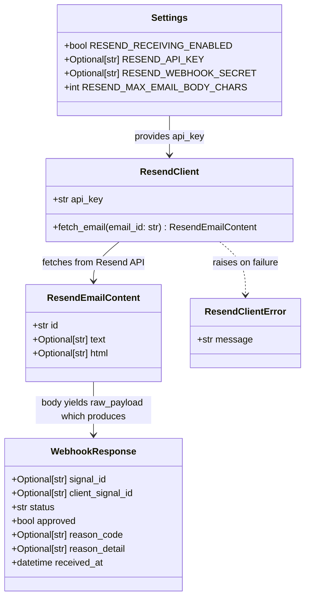

# Resend Inbound Email Adapter — Signal Intake via Email

## Requirements

Implement an optional email-to-signal adapter that accepts TradingView alert emails forwarded by Resend, extracts the embedded JSON payload from the email body, and routes it through the existing signal processing pipeline without duplicating any validation logic.

- Create `POST /integrations/resend/inbound` as a new intake channel that is disabled by default (`RESEND_RECEIVING_ENABLED=False`) and independent of the existing `POST /webhook/signal` endpoint.
- Introduce four opt-in settings (`RESEND_RECEIVING_ENABLED`, `RESEND_API_KEY`, `RESEND_WEBHOOK_SECRET`, `RESEND_MAX_EMAIL_BODY_CHARS`) that default to `False`/`None`/`None`/`50000` so that app startup and the existing webhook path are unaffected when Resend is not configured.
- Enforce the following response matrix before delegating to the signal pipeline: 404 when disabled, 503 when key is missing, 200 when event type is not `email.received`, 502 when the Resend API fails, 413 when the email body exceeds `RESEND_MAX_EMAIL_BODY_CHARS`, 422 when no JSON is found in the email body.
- Delegate all signal validation, idempotency, risk evaluation, and persistence to `signal_service.process_raw_payload` — no logic duplication.
- Never log `RESEND_API_KEY` or the `secret` field from the extracted JSON payload.

---

## Entities



**Notes on existing entities:**
- `Settings` already exists in `app/config.py` — four new fields are added (`RESEND_RECEIVING_ENABLED`, `RESEND_API_KEY`, `RESEND_WEBHOOK_SECRET`, `RESEND_MAX_EMAIL_BODY_CHARS`); no other field is modified.
- `WebhookResponse` already exists in `app/schemas/signal.py` — returned as-is; not modified.
- `ResendInboundEvent` and `ResendEventData` **do not exist** — the service reads the Resend webhook payload as a plain `dict` using `event_payload.get("type")` and `event_payload.get("data")`. No Pydantic schema is validated before the event-type gate fires.
- `ResendEmailContent` and `ResendClientError` are defined in `app/integrations/resend_client.py` (co-located with the client that produces them).

---

## Approach

1. **Adapter pattern with an `integrations/` boundary**:
   - Introduce `app/integrations/` as a new package for third-party HTTP clients. `ResendClient` lives there, wrapping `httpx.AsyncClient` with Resend-specific request construction, timeout, and error mapping.
   - This isolates the external Resend API dependency from the service layer, making `ResendClient` fully substitutable in tests.

2. **Thin router + service orchestrator (mirrors `webhook.py`)**:
   - `app/routers/resend_inbound.py` follows the exact pattern of the existing `webhook.py`: parse body, inject dependencies, delegate to service, return serialized `Response`. No business logic in the router.
   - `app/services/resend_inbound_service.py` owns the Resend-specific orchestration: feature flag gate → key gate → **dict-based event type gate** → email_id extraction → fetch email → body size gate → extract JSON → delegate to `signal_service.process_raw_payload`.
   - The event type is read directly from `event_payload.get("type")` before any strict schema is applied. This ensures any unrecognized Resend event (delivery, open, etc.) is silently ignored with 200 and never triggers a fetch or pipeline call.

3. **Feature flag and key guard at service entry**:
   - `RESEND_RECEIVING_ENABLED=False` (default) causes the service to return a 404-bearing response immediately, before any DB access or external call.
   - `RESEND_API_KEY=None` with `RESEND_RECEIVING_ENABLED=True` causes a 503 with `reason_code="resend_not_configured"`, surfacing the misconfiguration clearly.

4. **JSON extraction strategy — plain text first, HTML fallback**:
   - Attempt extraction from the `text` field first, since TradingView alert emails are plain text by default.
   - If not found or parse fails, strip HTML tags from the `html` field and retry.
   - Use `json.JSONDecoder().raw_decode()` starting from the first `{` character for deterministic first-match semantics and correct handling of nested objects.
   - Both "no `{` found" and `json.JSONDecodeError` are treated as 422 — no partial or malformed payloads reach `process_raw_payload`.

5. **Zero-duplication delegation**:
   - Once a valid `dict` is extracted from the email, it is passed directly to `signal_service.process_raw_payload(raw_payload, db, settings)`. The adapter adds no validation of its own on signal fields — the full existing pipeline (secret check, schema, side, asset class, idempotency, risk engine) runs unchanged.

6. **Dependency injection for testability**:
   - `ResendClient` is provided via a `get_resend_client(settings)` factory function that is registered as a FastAPI `Depends`, following the `get_settings` / `get_db` precedent. Tests override this dependency to inject a mock client without patching.

---

## Structure

### Inheritance Relationships
1. `ResendEmailContent` extends `pydantic.BaseModel`
2. `ResendClientError` extends `Exception`

### Dependencies
1. `resend_inbound` router depends on `resend_inbound_service` and FastAPI `Depends` injectors
2. `resend_inbound_service` depends on `ResendClient` and `signal_service`
3. `ResendClient` depends on `httpx.AsyncClient` (already in `requirements.txt`)
4. `app/main.py` includes `resend_inbound.router`
5. `app/config.py` is extended with four new fields; no other file is modified

### Layered Architecture
1. **Router layer** (`app/routers/resend_inbound.py`): Receive HTTP request, parse JSON body, inject `db` / `settings` / `ResendClient` via `Depends`, delegate to `resend_inbound_service.process_resend_event()`, return serialized `Response`.
2. **Service layer** (`app/services/resend_inbound_service.py`): Enforce response matrix gates, call `ResendClient`, extract JSON from email body, delegate to `signal_service.process_raw_payload`.
3. **Integration layer** (`app/integrations/resend_client.py`): HTTP adapter for `GET https://api.resend.com/emails/{id}`. Owns `Authorization` header construction, timeout, and error mapping to `ResendClientError`.
4. **Existing signal pipeline** (`app/services/signal_service.py`): Unchanged. Called via `process_raw_payload(raw_payload, db, settings)`.
5. **Configuration layer** (`app/config.py`): Holds four new Resend fields alongside existing settings.

---

## Operations

### Update Settings — `app/config.py`

1. **Responsibility**: Expose Resend configuration as optional env-var-backed settings.
2. **Changes**:
   - Add `from typing import Optional` import (if not already present — currently uses `Any`; add `Optional` to the same import).
   - Add four fields to the `Settings` class body, after the existing `LOG_LEVEL` field:
     ```
     RESEND_RECEIVING_ENABLED: bool = False
     RESEND_API_KEY: Optional[str] = None
     RESEND_WEBHOOK_SECRET: Optional[str] = None
     RESEND_MAX_EMAIL_BODY_CHARS: int = 50000
     ```
3. **Constraints**:
   - `RESEND_API_KEY` must never have a non-`None` default value.
   - `RESEND_RECEIVING_ENABLED` defaults to `False` — the adapter is opt-in.
   - No `@field_validator` is needed for these fields.
   - App startup must not fail if all four fields are absent from `.env`.

---

### Create Package — `app/integrations/__init__.py`

1. **Responsibility**: Mark `app/integrations/` as a Python package boundary for third-party HTTP client adapters.
2. **Content**: Empty file.

---

### Create Integration Client — `app/integrations/resend_client.py`

1. **Responsibility**: Encapsulate all HTTP communication with the Resend API. Expose one async method. Raise `ResendClientError` on any upstream failure, never propagating raw `httpx` exceptions to callers.

2. **Define `ResendClientError(Exception)`**:
   - A plain exception subclass.
   - Constructor takes a `message: str`. The message must not include the API key value.

3. **Define `ResendEmailContent(BaseModel)`** (Pydantic v2):
   - `id: str`
   - `text: Optional[str] = None`
   - `html: Optional[str] = None`
   - Uses `model_config = ConfigDict(extra="ignore")` so additional Resend API fields are silently discarded.

4. **Define `ResendClient`**:
   - Constructor: `__init__(self, api_key: str) -> None`. Stores `api_key` as a private attribute `_api_key`.
   - Method: `async def fetch_email(self, email_id: str) -> ResendEmailContent`
     - Logic:
       1. Open an `httpx.AsyncClient` with `timeout=10.0`.
       2. Send `GET https://api.resend.com/emails/receiving/{email_id}` with header `Authorization: Bearer {self._api_key}`. Note: `/emails/receiving/` is the correct Resend endpoint for inbound emails; `/emails/` is the sent-email endpoint and returns 404 for received messages.
       3. On `httpx.HTTPStatusError`: log WARNING `"resend_fetch_http_error"` with `extra={"stage": "resend_fetch_http_error", "email_id": email_id, "status_code": e.response.status_code}`, then raise `ResendClientError(f"resend_api_error: {type(e).__name__}")`.
       4. On `httpx.RequestError` (network-level failures with no response): raise `ResendClientError(f"resend_api_error: {type(e).__name__}")` silently — no `status_code` is available.
       5. On success: parse the response JSON as `ResendEmailContent` and return it.

5. **Define `get_resend_client(settings: Settings = Depends(get_settings)) -> ResendClient`**:
   - Factory function for FastAPI dependency injection.
   - Returns `ResendClient(api_key=settings.RESEND_API_KEY or "")`.
   - The service layer guards against a missing key before calling the client; the factory always returns a constructable instance.

6. **Logging**: Module-level `log = logging.getLogger(__name__)`. Only `fetch_email` emits log records. Only `httpx.HTTPStatusError` produces a WARNING (carrying `email_id` and `status_code`). `httpx.RequestError` is silent. The `Authorization` header, `_api_key` value, and raw response body must never appear in any log record — neither in the message string nor in `extra` fields.

---

### Create Service — `app/services/resend_inbound_service.py`

1. **Responsibility**: Orchestrate the full Resend inbound flow. Enforce the response matrix. Delegate signal processing to `signal_service.process_raw_payload` without modification.

   **No Pydantic models are defined in this module.** The incoming event is processed as a plain `dict` throughout. Schema validation is intentionally deferred until the event type is known to be `"email.received"`.

2. **Define `async def process_resend_event(event_payload: dict, db: Session, settings: Settings, resend_client: ResendClient) -> tuple[str, int]`**:
   - Returns a tuple of `(json_body: str, http_status_code: int)`.
   - Logic:
     1. **Feature flag gate**: If `settings.RESEND_RECEIVING_ENABLED` is `False`, return `('{"detail":"not_found"}', 404)`.
     2. **Key gate**: If `settings.RESEND_API_KEY` is `None`, return `('{"reason_code":"resend_not_configured","detail":"Resend adapter is enabled but RESEND_API_KEY is not set"}', 503)`.
     3. **Event type gate — dict-based**: `event_type = event_payload.get("type")`. If `event_type != "email.received"`, log at INFO: `{"stage": "resend_event_ignored", "event_type": event_type}`, return `('{"status":"ignored","reason_code":"unsupported_resend_event_type"}', 200)`. This gate fires before any strict schema validation, so any unrecognized Resend event (delivery receipts, opens, etc.) is silently accepted without triggering `fetch_email` or the signal pipeline.
     4. **Extract email_id**: `data = event_payload.get("data") or {}`. `email_id = data.get("email_id") or data.get("id")` — accepts both field names for compatibility. If `email_id` is falsy, return `('{"detail":"invalid_resend_event"}', 422)`.
     5. **Fetch email**: Call `await resend_client.fetch_email(email_id)`. On `ResendClientError`, log at WARNING: `{"stage": "resend_fetch_failed", "email_id": email_id}`, return `('{"detail":"upstream_error"}', 502)`.
     6. **Body size gate**: Check `len(content.text or "") > settings.RESEND_MAX_EMAIL_BODY_CHARS` or `len(content.html or "") > settings.RESEND_MAX_EMAIL_BODY_CHARS`. If either exceeds the limit, log at WARNING: `{"stage": "resend_body_too_large", "email_id": email_id}`, return `('{"reason_code":"email_body_too_large","detail":"email body exceeds configured limit"}', 413)`.
     7. **JSON extraction**: Call `_extract_first_json(content)`. If `None`, log at WARNING: `{"stage": "resend_no_json", "email_id": email_id}`, return `('{"detail":"no_json_in_email"}', 422)`.
     8. **Delegate and return**: Call `signal_service.process_raw_payload(raw_payload, db, settings)` → unpack `(webhook_response, status_code)`. Before returning, apply the duplicate translation: if `status_code == 409` and `webhook_response.reason_code == "duplicate_signal"`, set `status_code = 200` — Resend must receive 200 so it does not retry the email; the body is returned unchanged so the caller can still observe `status="duplicate_signal"` and `reason_code="duplicate_signal"`; all audit records (`webhook_events`) were already written by the pipeline before this point. Return `(webhook_response.model_dump_json(), status_code)`.

5. **Define `def _extract_first_json(content: ResendEmailContent) -> Optional[dict]`**:
   - Logic (called only after the body size gate has already passed):
     1. Try `_parse_first_json_from_text(content.text or "")`.
     2. If `None` and `content.html` is not empty, strip HTML tags from `content.html` using `re.sub(r'<[^>]+>', '', content.html)`, then try `_parse_first_json_from_text(cleaned_html)`.
     3. Return the parsed dict or `None`.
   - Note: no truncation is applied here — the body size gate upstream guarantees the content is within the configured limit.

6. **Define `def _parse_first_json_from_text(text: str) -> Optional[dict]`**:
   - Logic:
     1. Find the index of the first `{` in `text`. If not found, return `None`.
     2. Attempt `json.JSONDecoder().raw_decode(text, idx)` where `idx` is the position of `{`.
     3. On success: return the parsed `dict` (first element of the `raw_decode` tuple). Ignore subsequent content.
     4. On `json.JSONDecodeError`: return `None`.

7. **Logging constraints**:
   - Never log `event_payload` directly (may contain the `secret` field from the TradingView alert).
   - Only log structured `extra={}` dicts with non-sensitive identifiers (`email_id`, `event_type`, `stage`).

---

### Create Router — `app/routers/resend_inbound.py`

1. **Responsibility**: Thin HTTP layer. Parse the request body, inject dependencies, delegate to `resend_inbound_service.process_resend_event`, return a serialized `Response`.

2. **Router definition**:
   - `router = APIRouter(prefix="/integrations/resend", tags=["integrations"])`

3. **Define `async def receive_resend_inbound(request, db, settings, resend_client)`**:
   - Route: `POST /inbound`
   - Dependencies: `db: Session = Depends(get_db)`, `settings: Settings = Depends(get_settings)`, `resend_client: ResendClient = Depends(get_resend_client)`
   - Logic:
     1. Attempt `await request.json()`. On failure, log WARNING `{"stage": "resend_json_parse", "result": "failed"}`, return `Response(content='{"detail":"invalid json body"}', status_code=400, media_type="application/json")`.
     2. Call `await resend_inbound_service.process_resend_event(raw_payload, db, settings, resend_client)`.
     3. Return `Response(content=body, status_code=status_code, media_type="application/json")`.

---

### Update Application — `app/main.py`

1. **Responsibility**: Register the Resend inbound router with the FastAPI application.
2. **Changes**:
   - Add import: `from app.routers import resend_inbound`
   - Add `application.include_router(resend_inbound.router)` after `application.include_router(webhook.router)`
3. **Constraint**: No other changes to `main.py`. The existing `webhook.router` registration is not moved or modified.

---

### Create Tests — `tests/test_resend_inbound.py`

1. **Responsibility**: Full integration and unit coverage of the Resend inbound adapter. Uses existing `conftest.py` fixtures (`client`, `db`, `settings`) and overrides the `get_resend_client` dependency with a mock.

2. **Test fixtures**:
   - `mock_resend_client() -> MagicMock`: returns `MagicMock(spec=ResendClient)` with `fetch_email = AsyncMock()`.
   - `resend_settings() -> Settings`: returns a `Settings` instance with `RESEND_RECEIVING_ENABLED=True`, `RESEND_API_KEY="test-resend-key"`, `RESEND_MAX_EMAIL_BODY_CHARS=50000`, and all other fields set to test values.
   - `resend_test_client(db, resend_settings, mock_resend_client) -> TestClient`: creates a fresh `create_app()` instance, overrides `get_db`, `get_settings`, and `get_resend_client` with the test values, yields a `TestClient`, then clears `dependency_overrides`. Does NOT wrap the existing `client` fixture — creates its own `TestClient` to allow full dependency override control.
   - **`tests/conftest.py` update**: The base `settings` fixture is extended to pin all four Resend fields explicitly (`RESEND_RECEIVING_ENABLED=False`, `RESEND_API_KEY=None`, `RESEND_WEBHOOK_SECRET=None`, `RESEND_MAX_EMAIL_BODY_CHARS=50000`). This prevents `pydantic-settings` from reading real `.env` values into the test environment when `RESEND_RECEIVING_ENABLED=True` or a real `RESEND_API_KEY` is present in the developer's `.env` file.

3. **Helper — `resend_event_payload(email_id)`**:
   - Returns `{"type": "email.received", "data": {"id": email_id}}`.

4. **Helper — `email_content_with_json(raw_signal_dict, email_id)`**:
   - Returns a `ResendEmailContent` with `id=email_id` and `text=json.dumps(raw_signal_dict)`.

5. **Test cases**:

   **RESEND_RECEIVING_ENABLED=False (default)**
   - `test_disabled_returns_404`: POST to `/integrations/resend/inbound` with valid payload. Assert 404. Mock client must not be called.

   **RESEND_API_KEY missing**
   - `test_missing_api_key_returns_503`: Uses an inline `TestClient` setup (not `resend_test_client`) with `RESEND_RECEIVING_ENABLED=True` and `RESEND_API_KEY=None`. Assert 503 and `reason_code="resend_not_configured"` in response.

   **Event type ignored**
   - `test_non_email_received_event_returns_200`: `RESEND_RECEIVING_ENABLED=True`, valid key. Send `{"type": "email.delivered", "data": {"id": "abc"}}`. Assert 200, `status="ignored"`, and `reason_code="unsupported_resend_event_type"`. Mock client fetch must not be called. Signal count in DB must remain 0.

   **Resend API failure**
   - `test_resend_api_failure_returns_502`: Mock `fetch_email` raises `ResendClientError("upstream error")`. Assert 502.

   **Body too large**
   - `test_body_too_large_returns_413`: Mock returns `ResendEmailContent(id="x", text="x" * 50001, html=None)`. Settings use `RESEND_MAX_EMAIL_BODY_CHARS=50000`. Assert 413 and `reason_code="email_body_too_large"`. Verify `fetch_email` was called but `process_raw_payload` was not.

   **No JSON in email**
   - `test_plain_text_no_json_returns_422`: Mock returns `ResendEmailContent(id="x", text="No JSON here", html=None)`. Assert 422.
   - `test_html_no_json_after_strip_returns_422`: Mock returns `ResendEmailContent(id="x", text=None, html="<p>Nothing here</p>")`. Assert 422.
   - `test_empty_body_returns_422`: Mock returns `ResendEmailContent(id="x", text=None, html=None)`. Assert 422.
   - `test_malformed_json_block_returns_422`: Mock returns `ResendEmailContent(id="x", text="{not: valid json}", html=None)`. Assert 422. (A `{` is found but `json.JSONDecodeError` is raised — treated identically to no JSON found.)

   **Happy path — plain text JSON**
   - `test_valid_signal_in_plain_text_returns_202`: Mock returns email with `text=json.dumps(valid_payload)`. Assert 202 and `approved=True`.

   **Happy path — HTML fallback**
   - `test_valid_signal_in_html_returns_202`: Mock returns email with `text=None`, `html=f"<p>Alert</p><pre>{json.dumps(valid_payload)}</pre>"`. Assert 202 and `approved=True`.

   **JSON extraction — first block wins**
   - `test_first_json_block_extracted`: Mock returns email with `text=f"{json.dumps(valid_payload)} some trailing text {{invalid"`. Assert 202 (first valid block is the signal).

   **Pipeline delegation — bad secret**
   - `test_bad_secret_in_extracted_json_returns_401`: Extract valid JSON with `"secret": "wrong-secret"`. Assert 401.

   **Pipeline delegation — duplicate signal**
   - `test_resend_duplicate_signal_returns_200_to_resend`: Post the same valid signal payload twice (different email IDs, same `client_signal_id`). First request asserts 202. Second request asserts HTTP 200 (not 409 — Resend must not retry). Assert `body["status"] == "duplicate_signal"` and `body["reason_code"] == "duplicate_signal"`. Assert `db.query(Signal).count() == 1` — no second Signal row is created.

   **Invalid JSON body at router**
   - `test_invalid_json_body_returns_400`: POST with `content=b"not-json"`. Assert 400.

   **Event type absent or unrecognized — always ignored**
   - `test_non_email_received_event_returns_200_ignored`: POST `{"wrong_field": "x"}` (no `type` field present). Assert 200, `status="ignored"`, `reason_code="unsupported_resend_event_type"`. Mock client fetch must not be called. Signal count in DB must remain 0.

   **email.received with missing email_id**
   - `test_email_received_missing_email_id_returns_422`: POST `{"type": "email.received", "data": {}}` — `type` is `"email.received"` but `data` contains neither `id` nor `email_id`. Assert 422 and `detail="invalid_resend_event"`. Mock client fetch must not be called.
   - `test_email_received_missing_data_field_returns_422`: POST `{"type": "email.received"}` — `type` is `"email.received"` but the `data` key is absent entirely. Assert 422 and `detail="invalid_resend_event"`. Mock client fetch must not be called.

---

### Create Client Unit Tests — `tests/test_resend_client.py`

1. **Responsibility**: Verify the HTTP contract of `ResendClient` in isolation — correct endpoint URL, `Authorization` header, structured error logging, error mapping, and `extra="ignore"` on `ResendEmailContent`. All tests patch `httpx.AsyncClient` directly; no FastAPI `TestClient` is involved.

2. **Async test pattern**: All tests are `@pytest.mark.anyio` async functions. The `anyio` plugin (already in `requirements.txt`) handles the event loop. No additional `pytest-asyncio` dependency is needed.

3. **Helper — `_make_mock_http_client(response)`**:
   - Returns a `MagicMock` configured as an async context manager (`__aenter__` / `__aexit__` via `AsyncMock`) whose `get` method is an `AsyncMock` returning `response`.

4. **Helper — `_ok_response(email_id)`**:
   - Returns a `MagicMock` with `raise_for_status = MagicMock()` (no-op) and `json()` returning `{"id": email_id, "text": "hello", "html": None}`.

5. **Test cases**:

   **URL contract**
   - `test_fetch_email_calls_receiving_endpoint`: Patch `httpx.AsyncClient`. Assert `mock.get` was called with exactly `https://api.resend.com/emails/receiving/{email_id}` and `headers={"Authorization": f"Bearer {api_key}"}`. Assert returned value is a `ResendEmailContent` with the correct `id`.

   **Key safety**
   - `test_fetch_email_does_not_log_api_key`: On a successful call, capture all log records from the module logger at DEBUG level and assert the `api_key` value appears in neither `getMessage()` nor `str(record.__dict__)` for any record.

   **HTTP error logging**
   - `test_fetch_email_404_logs_email_id_and_status`: Configure `raise_for_status` to raise `httpx.HTTPStatusError` with `response.status_code=404`. Assert exactly one WARNING record is emitted; assert `record.email_id == email_id` and `record.status_code == 404`; assert `api_key` does not appear anywhere in the record.

   **Error mapping**
   - `test_fetch_email_http_error_raises_resend_client_error`: Any `httpx.HTTPStatusError` → `ResendClientError` is raised.
   - `test_fetch_email_request_error_raises_resend_client_error`: `httpx.ConnectError` (a `RequestError` subclass) → `ResendClientError` is raised.

   **Response parsing**
   - `test_fetch_email_ignores_extra_fields`: Response JSON includes `subject`, `from`, and other Resend API fields not in `ResendEmailContent`. Assert only `id`, `text`, and `html` are captured; extra fields are silently discarded.

---

## Norms

1. **Typed Python**: All functions and methods must have complete type annotations. Use `Optional[str]` not `str | None` for consistency with the existing codebase style.

2. **Pydantic v2**: All DTOs use `pydantic.BaseModel` with `model_config = ConfigDict(extra="ignore")`. Use `model_validate()` and `model_dump_json()` (not v1-style `.parse_obj()` or `.json()`).

3. **Structured logging**: All log calls use `log.info(...)` or `log.warning(...)` with `extra={"key": "value"}` dicts. Message strings are snake_case stage identifiers (e.g., `"resend_event_ignored"`, `"resend_fetch_failed"`). No f-strings with variable data in the message body.

4. **Secret discipline**: `RESEND_API_KEY` must not appear in any log line, structured or unstructured. The `_SecretFilter` in `main.py` handles `secret` fields at the log handler level; the adapter must not log the raw event payload. `httpx` debug logging must not be enabled.

5. **Async consistency**: The router function and `process_resend_event` are `async`. The `fetch_email` method on `ResendClient` is `async`. `signal_service.process_raw_payload` is synchronous and is called directly from the async service function — acceptable in V0 because it performs only in-process computation and fast SQLite I/O with no blocking network calls.

6. **Dependency injection**: `ResendClient` is provided via `get_resend_client` registered as `Depends`. Tests override `get_resend_client` in `app.dependency_overrides` using the same pattern as `get_db` and `get_settings` in `conftest.py`.

7. **httpx usage**: Use `httpx.AsyncClient` as an async context manager (`async with httpx.AsyncClient(...) as client:`) inside `fetch_email`. Set `timeout=10.0`. Do not reuse client instances across requests in V0.

8. **Error wrapping**: All `httpx` exceptions are caught at the `ResendClient` boundary and re-raised as `ResendClientError`. No `httpx` types leak into the service layer.

9. **Test fixture pattern**: Tests use `TestClient` + `StaticPool` SQLite from `conftest.py`. The `ResendClient` mock must implement the same `async fetch_email` interface. Use `unittest.mock.AsyncMock` or a simple `AsyncMock` fixture class.

10. **No new dependencies**: `httpx` is already in `requirements.txt`. Do not add any new packages (no `beautifulsoup4`, no `lxml`). HTML stripping is handled by `re.sub(r'<[^>]+>', '', html)` inline.

---

## Safeguards

1. **Functional constraints**:
   - `POST /webhook/signal` must not be modified in any way.
   - `signal_service.process_raw_payload` must not be modified in any way.
   - `app/config.py` changes are additive only — no existing field is renamed, removed, or given a different default.
   - The Resend adapter must contain zero Alpaca imports, zero order-related imports, zero execution logic.

2. **Security constraints**:
   - `RESEND_API_KEY` must never appear in log output, error messages, or exception messages.
   - `ResendClient` does log structured WARNING records on `httpx.HTTPStatusError` — only `email_id` and `status_code` are included; the `Authorization` header, `_api_key` value, and raw response body are never included.
   - The `secret` field from the extracted JSON must not be logged. The existing `_SecretFilter` in `main.py` handles this at the handler level, but the service must not log `event_payload` or `raw_payload` directly.
   - `RESEND_RECEIVING_ENABLED=False` (the default) returns 404 — the endpoint must not reveal its existence when disabled.
   - `RESEND_WEBHOOK_SECRET` is stored in `Settings` but has no enforcement logic in V0. It must not be used for signature validation in this version.

3. **Configuration constraints**:
   - App startup must succeed with all four Resend settings absent from `.env`.
   - If `RESEND_RECEIVING_ENABLED=True` but `RESEND_API_KEY` is absent, the endpoint returns 503 at request time — not a startup error.
   - `@lru_cache` on `get_settings()` means Resend settings cannot be toggled at runtime without process restart. This is acceptable and consistent with existing behavior.

4. **Response matrix constraints** (authoritative — must be tested):
   | Condition | Required HTTP Status |
   |-----------|---------------------|
   | `RESEND_RECEIVING_ENABLED=False` | 404 |
   | `RESEND_RECEIVING_ENABLED=True`, `RESEND_API_KEY=None` | 503 |
   | `event_type != email.received` | 200 |
   | Resend API unreachable or non-2xx | 502 |
   | Email body exceeds `RESEND_MAX_EMAIL_BODY_CHARS` | 413 |
   | No parseable JSON in email body | 422 |
   | Malformed JSON block found | 422 |
   | Empty email body (text and html both null) | 422 |
   | `event_type = "email.received"`, `data.id` and `data.email_id` both absent | 422 |
   | Invalid JSON request body at router | 400 |
   | Valid extraction → delegates to `process_raw_payload` (non-duplicate) | as returned by `process_raw_payload` |
   | `process_raw_payload` returns 409 with `reason_code="duplicate_signal"` | 200 (body preserved: `status="duplicate_signal"`, `reason_code="duplicate_signal"`) |

5. **Extraction and size constraints**:
   - Only the first complete JSON object is extracted. Subsequent JSON in the same email is ignored.
   - HTML stripping uses only `re.sub(r'<[^>]+>', '', html)` — no third-party HTML parsers.
   - Body size is enforced by a dedicated gate at step 6 of `process_resend_event`, before `_extract_first_json` is called. The gate checks `len(content.text or "")` and `len(content.html or "")` independently against `settings.RESEND_MAX_EMAIL_BODY_CHARS`. If either exceeds the limit, return 413 with `reason_code="email_body_too_large"`.
   - `RESEND_MAX_EMAIL_BODY_CHARS` defaults to `50000` and is configurable via env var. No hardcoded magic numbers in the service or client.

6. **Test coverage constraints** — all of the following must have a dedicated test:
   - 404 when disabled
   - 503 when key missing
   - 200 when event type ignored
   - 502 on Resend API failure
   - 413 when email body exceeds `RESEND_MAX_EMAIL_BODY_CHARS`
   - 422 on no JSON (plain text, HTML fallback, empty body)
   - 422 on malformed JSON
   - 202 on happy path (plain text)
   - 202 on happy path (HTML fallback)
   - 401 passthrough from `process_raw_payload` (bad secret)
   - 200 to Resend on duplicate signal (pipeline returns 409 internally, adapter translates to 200; body carries `status="duplicate_signal"`, `reason_code="duplicate_signal"`; no second Signal row created)
   - 400 on invalid JSON body at router
   - 200 on any event type that is not `email.received` (including events with no `type` field at all)
   - 422 on `email.received` event with `email_id` absent from `data` (both `data.id` and `data.email_id` missing)
   - `ResendClient` URL contract: `GET https://api.resend.com/emails/receiving/{email_id}` (unit test via `httpx.AsyncClient` patch)
   - `ResendClient` key safety: API key never appears in any log record (unit test via `caplog`)
   - `ResendClient` HTTP error logging: WARNING emitted with `email_id` + `status_code` on `HTTPStatusError`, no API key

7. **Architecture constraints**:
   - `app/integrations/resend_client.py` must not import from `app/services/`.
   - `app/services/resend_inbound_service.py` must not import from `app/routers/`.
   - The `integrations/` package is reserved for third-party HTTP clients only — no business logic.
   - `get_resend_client` is the only factory registered as a FastAPI dependency for `ResendClient`.
