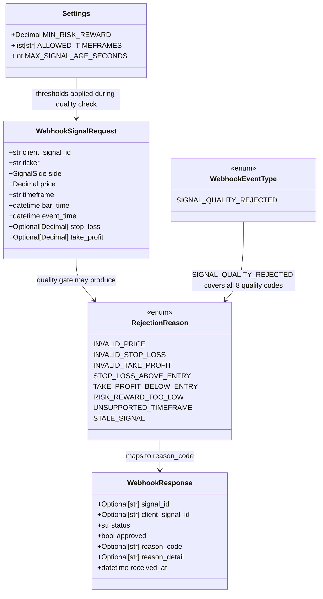

# V0.1 — Signal Quality Validation

## Requirements

Extend the signal processing pipeline with a dedicated signal quality validation step that evaluates the intrinsic properties of a BUY signal before allowing it to reach the Risk Engine. Reject signals whose price, stop_loss, take_profit, risk/reward ratio, timeframe, or staleness do not meet configurable thresholds. All rejections are audited in `webhook_events` using the existing audit pattern. No Signal row is created for quality-rejected signals. Three new configurable settings are added. No Alpaca, no order execution.

---

## Entities



**Notes on existing entities:**
- `Settings` already exists in `app/config.py` — three fields added (`MIN_RISK_REWARD`, `ALLOWED_TIMEFRAMES`, `MAX_SIGNAL_AGE_SECONDS`). No existing field is modified.
- `WebhookSignalRequest` already exists in `app/schemas/signal.py` — the `price_must_be_positive` `@field_validator` is removed. `price` absent/non-numeric remains `schema_invalid`; `price` numeric but ≤ 0 is now `invalid_price` from the quality gate.
- `RejectionReason` already exists in `app/schemas/enums.py` — 8 new enforced values added.
- `WebhookEventType` already exists in `app/schemas/enums.py` — 1 new value added.
- `WebhookResponse` is unchanged.
- No new ORM models. Quality rejections create a `WebhookEvent` row (same audit table as existing pre-pipeline rejections), not a `Signal` or `RiskDecision` row.

---

## Approach

1. **Pre-persistence pipeline step (step 4.5)**:
   - Quality validation fires after asset class check (step 4) and before idempotency check (step 5). Signals that fail quality are never persisted — only a `WebhookEvent` audit record is written. This is the same pattern used by UNSUPPORTED_SIDE and UNSUPPORTED_ASSET_CLASS.
   - Keeping quality checks pre-persistence means quality-rejected signals never acquire a `client_signal_id` in the DB, which is correct — they were never accepted into the system.

2. **Dedicated pure module `app/services/signal_quality.py`**:
   - A single exported function receives `WebhookSignalRequest`, `Settings`, and a `now: datetime` (injected from `received_at` in the service, for clock-independent testing). Returns `None` on pass, or `(RejectionReason, detail_str)` on the first failing check.
   - No DB imports, no side effects. Mirrors the purity pattern of `app/risk/engine.py`.

3. **Fail-fast validation order** — checks run in dependency order, first failure returns immediately:
   1. `price <= 0` → `invalid_price`
   2. `stop_loss is None or stop_loss <= 0` → `invalid_stop_loss`
   3. `take_profit is None or take_profit <= 0` → `invalid_take_profit`
   4. `stop_loss >= price` → `stop_loss_above_entry` (covers equality, prevents division by zero in step 6)
   5. `take_profit <= price` → `take_profit_below_entry` (covers equality)
   6. `risk_reward < MIN_RISK_REWARD` → `risk_reward_too_low`
   7. `timeframe not in ALLOWED_TIMEFRAMES` → `unsupported_timeframe` (skipped if `ALLOWED_TIMEFRAMES` is empty)
   8. `age > MAX_SIGNAL_AGE_SECONDS` → `stale_signal` (skipped if `MAX_SIGNAL_AGE_SECONDS == 0`)

4. **Settings additions**:
   - `MIN_RISK_REWARD: Decimal = Decimal("1.5")` — configurable floor for reward/risk ratio.
   - `ALLOWED_TIMEFRAMES: list[str] = ["5m", "15m", "1h"]` — prescriptive allowlist. Empty list disables the check (consistent with `ALLOWED_TICKERS` convention). Needs a `parse_allowed_timeframes` validator for comma-string handling.
   - `MAX_SIGNAL_AGE_SECONDS: int = 900` — maximum age in seconds. `0` disables the staleness check.

5. **Test fixture updates**:
   - `tests/conftest.py` `valid_payload`: add `stop_loss` and `take_profit` with values that pass all quality checks; replace hardcoded timestamps with dynamic values relative to `datetime.now(UTC)` so the staleness check doesn't reject the fixture.
   - `tests/conftest.py` `settings`: pin three new settings.
   - `tests/test_resend_inbound.py` `resend_settings`: pin three new settings for `.env` isolation.

---

## Structure

### Inheritance Relationships
1. `app/services/signal_quality.py` — standalone module; no class hierarchy; exports one function
2. `RejectionReason` extends `str, Enum` (existing pattern, add 8 values)
3. `WebhookEventType` extends `str, Enum` (existing pattern, add 1 value)

### Dependencies
1. `signal_quality.validate_signal_quality` depends on `WebhookSignalRequest` and `Settings` (no DB, no ORM)
2. `signal_service.process_raw_payload` calls `signal_quality.validate_signal_quality` at step 4.5
3. `app/config.py` is extended with three new fields; nothing else changes

### Layered Architecture
1. **Router layer** — unchanged
2. **Service layer** (`signal_service.py`): orchestrates quality gate call at step 4.5; creates `WebhookEvent` on failure
3. **Quality validation layer** (`signal_quality.py`): pure function; no DB, no I/O
4. **Risk Engine layer** (`engine.py`): unchanged; receives only signals that passed all pre-engine gates
5. **Configuration layer** (`config.py`): three new fields added

---

## Operations

### Update Enums — `app/schemas/enums.py`

1. **Responsibility**: Extend `WebhookEventType` and `RejectionReason` with V0.1 signal quality values.

2. **Add to `WebhookEventType`**:
   ```
   SIGNAL_QUALITY_REJECTED = "signal_quality_rejected"
   ```

3. **Add to `RejectionReason`** — insert 8 new values in the enforced section, after `MAX_DAILY_TRADES_REACHED` and before the deferred section:
   ```
   INVALID_PRICE = "invalid_price"
   INVALID_STOP_LOSS = "invalid_stop_loss"
   INVALID_TAKE_PROFIT = "invalid_take_profit"
   STOP_LOSS_ABOVE_ENTRY = "stop_loss_above_entry"
   TAKE_PROFIT_BELOW_ENTRY = "take_profit_below_entry"
   RISK_REWARD_TOO_LOW = "risk_reward_too_low"
   UNSUPPORTED_TIMEFRAME = "unsupported_timeframe"
   STALE_SIGNAL = "stale_signal"
   ```

4. **Update docstring**: Add "V0.1 enforced: INVALID_PRICE, INVALID_STOP_LOSS, INVALID_TAKE_PROFIT, STOP_LOSS_ABOVE_ENTRY, TAKE_PROFIT_BELOW_ENTRY, RISK_REWARD_TOO_LOW, UNSUPPORTED_TIMEFRAME, STALE_SIGNAL" to the `RejectionReason` class docstring.

---

### Update Settings — `app/config.py`

1. **Responsibility**: Expose three new signal quality thresholds as env-var-backed settings.

2. **Changes** — add after `ALLOWED_TICKERS` field and its validator, before `LOG_LEVEL`:
   ```
   MIN_RISK_REWARD: Decimal = Decimal("1.5")
   ALLOWED_TIMEFRAMES: list[str] = ["5m", "15m", "1h"]
   MAX_SIGNAL_AGE_SECONDS: int = 900
   ```

3. **Add `parse_allowed_timeframes` validator** (same pattern as `parse_allowed_tickers`):
   - `mode="before"`, input can be `str` (comma-separated) or `list`
   - Strip whitespace, discard empty tokens, preserve original case (timeframes are case-sensitive)
   - Return empty list if input is empty or None

4. **Constraints**:
   - `MIN_RISK_REWARD` default must be `Decimal("1.5")`, not `float`. Use `Decimal` import already present.
   - `MAX_SIGNAL_AGE_SECONDS = 0` is valid (disables the staleness check at runtime).
   - App startup must succeed with all three fields absent from `.env`.

---

### Update Schema — `app/schemas/signal.py`

1. **Responsibility**: Remove the schema-level price validator so `price <= 0` can produce `invalid_price` at the quality gate rather than `schema_invalid`.

2. **Changes**: Delete the `price_must_be_positive` `@field_validator` method entirely:
   ```python
   @field_validator("price", mode="after")
   @classmethod
   def price_must_be_positive(cls, v: Decimal) -> Decimal:
       if v <= 0:
           raise ValueError("price must be positive")
       return v
   ```
   Remove only this method. All other validators (`uppercase_ticker`, `normalize_to_utc`, `client_signal_id_not_empty`) are unchanged.

3. **Constraints**:
   - `price` field type (`Decimal`) and required status are unchanged.
   - `price` absent or non-numeric still produces `schema_invalid` (Pydantic type coercion handles this).
   - Only `price > 0` enforcement moves to the quality gate.

---

### Create Signal Quality Module — `app/services/signal_quality.py`

1. **Responsibility**: Pure signal quality validation function. Evaluates all 8 quality rules in dependency order against a parsed signal and settings. No DB access, no side effects, no I/O.

2. **Imports**: `datetime`, `Decimal` from standard library; `Optional` from typing; `Settings` from `app.config`; `RejectionReason` from `app.schemas.enums`; `WebhookSignalRequest` from `app.schemas.signal`.

3. **Define `def validate_signal_quality(signal: WebhookSignalRequest, settings: Settings, now: datetime) -> Optional[tuple[RejectionReason, Optional[str]]]`**:
   - Returns `None` if all checks pass.
   - Returns `(RejectionReason, detail_str)` on the first failing check — fail-fast, single reason per call.
   - `now` is injected from the service layer's `received_at` timestamp (same UTC instant used throughout the pipeline).
   - Logic (in order):
     1. If `signal.price <= 0`: return `(INVALID_PRICE, f"price={signal.price}")`.
     2. If `signal.stop_loss is None or signal.stop_loss <= 0`: return `(INVALID_STOP_LOSS, f"stop_loss={signal.stop_loss}")`.
     3. If `signal.take_profit is None or signal.take_profit <= 0`: return `(INVALID_TAKE_PROFIT, f"take_profit={signal.take_profit}")`.
     4. If `signal.stop_loss >= signal.price`: return `(STOP_LOSS_ABOVE_ENTRY, f"stop_loss={signal.stop_loss} price={signal.price}")`. (Equality is caught here, preventing zero denominator in step 6.)
     5. If `signal.take_profit <= signal.price`: return `(TAKE_PROFIT_BELOW_ENTRY, f"take_profit={signal.take_profit} price={signal.price}")`.
     6. Compute `risk = signal.price - signal.stop_loss` (guaranteed `> 0` by checks 1, 2, 4). Compute `reward = signal.take_profit - signal.price` (guaranteed `> 0` by checks 1, 3, 5). Compute `risk_reward = reward / risk`. If `risk_reward < settings.MIN_RISK_REWARD`: return `(RISK_REWARD_TOO_LOW, f"risk_reward={risk_reward} min={settings.MIN_RISK_REWARD}")`.
     7. If `settings.ALLOWED_TIMEFRAMES` is non-empty and `signal.timeframe not in settings.ALLOWED_TIMEFRAMES`: return `(UNSUPPORTED_TIMEFRAME, f"timeframe={signal.timeframe} allowed={settings.ALLOWED_TIMEFRAMES}")`.
     8. If `settings.MAX_SIGNAL_AGE_SECONDS > 0`: compute `age_seconds = (now - signal.event_time).total_seconds()`. If `age_seconds > settings.MAX_SIGNAL_AGE_SECONDS`: return `(STALE_SIGNAL, f"age_seconds={age_seconds:.0f} max={settings.MAX_SIGNAL_AGE_SECONDS}")`.
     9. Return `None`.

4. **Constraints**:
   - `Decimal` arithmetic only — no `float` in any comparison or calculation.
   - `signal.event_time` is already UTC-normalised by `WebhookSignalRequest.normalize_to_utc`; `now` must also be UTC-aware. No timezone conversion needed at this layer.
   - Never log in this module. Logging is the caller's responsibility.

---

### Update Signal Service — `app/services/signal_service.py`

1. **Responsibility**: Insert signal quality validation as step 4.5 in `process_raw_payload`. The new step fires after asset class validation (step 4) and before idempotency check (step 5).

2. **Add import**: `from app.services import signal_quality`

3. **Insert step 4.5 after the asset class block and before the idempotency block**:
   - Call `quality_failure = signal_quality.validate_signal_quality(parsed, settings, received_at)`.
   - If `quality_failure` is not `None`:
     - Unpack `(reason_code, detail) = quality_failure`.
     - Create masked payload: `masked = webhook_event_repo.mask_payload(raw_payload)`.
     - Call `webhook_event_repo.create_event(db, WebhookEventType.SIGNAL_QUALITY_REJECTED, reason_code, masked, client_signal_id=parsed.client_signal_id, reason_detail=detail)`.
     - Log at WARNING: `{"stage": "signal_quality_check", "result": "failed", "reason_code": reason_code.value, "client_signal_id": parsed.client_signal_id}`.
     - Return `(_rejection_response(None, parsed.client_signal_id, reason_code, received_at, reason_detail=detail), 422)`.
   - If `quality_failure` is `None`: continue to step 5.

4. **No other changes** to steps 1–4 or 6–10. The existing pipeline is untouched.

---

### Update conftest.py — `tests/conftest.py`

1. **Responsibility**: Pin three new settings for test isolation and update `valid_payload` to satisfy the V0.1 quality gate.

2. **Add imports** at the top of the file:
   - `from datetime import timedelta` (add to the existing `from datetime import ...` import)

3. **Update `settings` fixture** — add three new fields after the existing Resend pins:
   ```
   MIN_RISK_REWARD=Decimal("1.5"),
   ALLOWED_TIMEFRAMES=["5m", "15m", "1h"],
   MAX_SIGNAL_AGE_SECONDS=900,
   ```

4. **Update `valid_payload` fixture** — three changes:
   - Add `"stop_loss": "445.00"` — below price (450.00), yields `risk = 5.00`.
   - Add `"take_profit": "458.00"` — above price (450.00), yields `reward = 8.00`, `risk_reward = 1.6 >= 1.5`.
   - Replace hardcoded `"event_time": "2024-01-15T14:30:01Z"` with `datetime.now(timezone.utc).isoformat()` — prevents stale signal rejection under `MAX_SIGNAL_AGE_SECONDS=900`.
   - Replace hardcoded `"bar_time": "2024-01-15T14:30:00Z"` with `(datetime.now(timezone.utc) - timedelta(minutes=5)).isoformat()`.
   - Add `from datetime import datetime, timezone, timedelta` to the imports (replace or extend existing datetime import).

5. **Constraints**:
   - `valid_payload` must remain self-consistent: all existing tests that use it or `make_payload` must continue to pass without modification.
   - The chosen `stop_loss`/`take_profit` values must satisfy all 6 price-level quality checks for `price="450.00"`.

---

### Update resend_settings Fixture — `tests/test_resend_inbound.py`

1. **Responsibility**: Pin three new settings in the `resend_settings` fixture to prevent `.env` leakage.

2. **Changes** — add to the `resend_settings` `Settings(...)` call:
   ```
   MIN_RISK_REWARD=Decimal("1.5"),
   ALLOWED_TIMEFRAMES=["5m", "15m", "1h"],
   MAX_SIGNAL_AGE_SECONDS=900,
   ```

3. **Constraint**: No other changes to the Resend adapter or its tests. The `valid_payload` fixture from `conftest.py` already includes `stop_loss` and `take_profit` — Resend tests that use `valid_payload` will automatically pass the quality gate.

---

### Create Unit Tests — `tests/test_signal_quality.py`

1. **Responsibility**: Pure unit tests for `validate_signal_quality` in isolation. No DB, no TestClient, no fixtures except locally defined helpers.

2. **Test helper — `_make_signal(**overrides) -> WebhookSignalRequest`**:
   - Builds a `WebhookSignalRequest` from a baseline of fully valid field values that pass all 8 checks.
   - Baseline: `price="450.00"`, `stop_loss="445.00"`, `take_profit="458.00"`, `timeframe="5m"`, `event_time=datetime.now(UTC).isoformat()`, `bar_time=datetime.now(UTC).isoformat()`, `side="buy"`, plus all required fields.
   - `**overrides` replaces individual fields for negative-case tests.

3. **Test helper — `_make_settings(**overrides) -> Settings`**:
   - Builds a `Settings` instance with `MIN_RISK_REWARD=Decimal("1.5")`, `ALLOWED_TIMEFRAMES=["5m","15m","1h"]`, `MAX_SIGNAL_AGE_SECONDS=900`, plus all required fields pinned.
   - `**overrides` replaces settings for threshold-boundary tests.

4. **Test helper — `_now() -> datetime`**: Returns `datetime.now(timezone.utc)`. Used as `now` argument in all calls.

5. **Test cases**:

   **Happy path**
   - `test_valid_signal_passes_all_checks`: baseline signal, all checks pass, return value is `None`.

   **invalid_price**
   - `test_invalid_price_zero`: `price="0"` → `INVALID_PRICE`.
   - `test_invalid_price_negative`: `price="-1.00"` → `INVALID_PRICE`.

   **invalid_stop_loss**
   - `test_invalid_stop_loss_none`: `stop_loss=None` → `INVALID_STOP_LOSS`.
   - `test_invalid_stop_loss_zero`: `stop_loss="0"` → `INVALID_STOP_LOSS`.
   - `test_invalid_stop_loss_negative`: `stop_loss="-1.00"` → `INVALID_STOP_LOSS`.

   **invalid_take_profit**
   - `test_invalid_take_profit_none`: `take_profit=None` → `INVALID_TAKE_PROFIT`.
   - `test_invalid_take_profit_zero`: `take_profit="0"` → `INVALID_TAKE_PROFIT`.
   - `test_invalid_take_profit_negative`: `take_profit="-1.00"` → `INVALID_TAKE_PROFIT`.

   **stop_loss_above_entry**
   - `test_stop_loss_equals_price`: `stop_loss="450.00"` (== price) → `STOP_LOSS_ABOVE_ENTRY`.
   - `test_stop_loss_above_price`: `stop_loss="451.00"` (> price) → `STOP_LOSS_ABOVE_ENTRY`.

   **take_profit_below_entry**
   - `test_take_profit_equals_price`: `take_profit="450.00"` (== price) → `TAKE_PROFIT_BELOW_ENTRY`.
   - `test_take_profit_below_price`: `take_profit="449.00"` (< price) → `TAKE_PROFIT_BELOW_ENTRY`.

   **risk_reward_too_low**
   - `test_risk_reward_too_low`: `stop_loss="449.00"` (risk=1), `take_profit="451.00"` (reward=1), `risk_reward=1.0 < 1.5` → `RISK_REWARD_TOO_LOW`.
   - `test_risk_reward_at_minimum_passes`: values giving exactly `risk_reward=1.5` → `None` (passes).
   - `test_risk_reward_above_minimum_passes`: values giving `risk_reward=2.0` → `None` (passes).
   - `test_min_risk_reward_zero_disables_check`: `_make_settings(MIN_RISK_REWARD=Decimal("0"))` with low ratio → `None` (check disabled effectively).

   **unsupported_timeframe**
   - `test_unsupported_timeframe`: `timeframe="4h"` with default settings → `UNSUPPORTED_TIMEFRAME`.
   - `test_supported_timeframe_passes`: `timeframe="15m"` → `None`.
   - `test_empty_timeframe_allowlist_passes_all`: `_make_settings(ALLOWED_TIMEFRAMES=[])`, any timeframe → `None`.

   **stale_signal**
   - `test_stale_signal`: `event_time` = `now - timedelta(seconds=901)` with `MAX_SIGNAL_AGE_SECONDS=900` → `STALE_SIGNAL`.
   - `test_fresh_signal_passes`: `event_time` = `now - timedelta(seconds=10)` → `None`.
   - `test_max_signal_age_zero_disables_check`: `_make_settings(MAX_SIGNAL_AGE_SECONDS=0)`, very old `event_time` → `None`.

   **Fail-fast ordering**
   - `test_invalid_price_fires_before_stop_loss`: both `price="0"` and `stop_loss=None` → `INVALID_PRICE` (not `INVALID_STOP_LOSS`).
   - `test_stop_loss_validity_fires_before_relationship`: `stop_loss="-1.00"` (invalid) and `stop_loss` would also fail relationship check → `INVALID_STOP_LOSS` (not `STOP_LOSS_ABOVE_ENTRY`).

---

### Create Integration Tests — `tests/test_signal_quality_integration.py`

1. **Responsibility**: Integration coverage of the new pipeline step 4.5 via TestClient + in-memory SQLite. One test per new reason code, plus a DB-state test confirming no Signal is created on quality rejection.

2. **Uses the `client` and `valid_payload`/`make_payload` fixtures from `conftest.py`** — no new fixtures needed.

3. **HTTP status for all quality rejections**: 422.

4. **Test cases**:

   **invalid_price**
   - `test_invalid_price_returns_422`: `make_payload(price="0")` → 422, `reason_code="invalid_price"`.

   **invalid_stop_loss**
   - `test_missing_stop_loss_returns_422`: `make_payload(stop_loss=None)` → 422, `reason_code="invalid_stop_loss"`.
   - `test_zero_stop_loss_returns_422`: `make_payload(stop_loss="0")` → 422, `reason_code="invalid_stop_loss"`.

   **invalid_take_profit**
   - `test_missing_take_profit_returns_422`: `make_payload(take_profit=None)` → 422, `reason_code="invalid_take_profit"`.

   **stop_loss_above_entry**
   - `test_stop_loss_above_entry_returns_422`: `make_payload(stop_loss="455.00")` (> price 450) → 422, `reason_code="stop_loss_above_entry"`.

   **take_profit_below_entry**
   - `test_take_profit_below_entry_returns_422`: `make_payload(take_profit="440.00")` (< price 450) → 422, `reason_code="take_profit_below_entry"`.

   **risk_reward_too_low**
   - `test_risk_reward_too_low_returns_422`: `make_payload(stop_loss="449.00", take_profit="451.00")` — risk=1, reward=1, ratio=1.0 < 1.5 → 422, `reason_code="risk_reward_too_low"`.

   **unsupported_timeframe**
   - `test_unsupported_timeframe_returns_422`: `make_payload(timeframe="4h")` → 422, `reason_code="unsupported_timeframe"`.

   **stale_signal**
   - `test_stale_signal_returns_422`: `make_payload(event_time=(datetime.now(UTC) - timedelta(seconds=1800)).isoformat())` with default `MAX_SIGNAL_AGE_SECONDS=900` → 422, `reason_code="stale_signal"`.

   **No Signal row created on quality rejection**
   - `test_quality_rejection_creates_no_signal`: POST with `stop_loss=None`. Assert response 422. Assert `db.query(Signal).count() == 0`.

   **V0 behaviour preserved**
   - `test_valid_signal_still_returns_202`: POST with baseline `valid_payload`. Assert 202, `approved=True` — V0 happy path unchanged.

---

### Create Validation Document — `docs/validation/v0.1-validation.md`

1. **Responsibility**: Operator-facing documentation describing all V0.1 signal quality rules, their reason codes, HTTP status codes, configurable settings, and example payloads.

2. **Sections**:
   - Overview: when quality validation runs and what it governs
   - Table of all 8 rules: rule description, reason code, HTTP status, triggering condition
   - Settings reference: `MIN_RISK_REWARD`, `ALLOWED_TIMEFRAMES`, `MAX_SIGNAL_AGE_SECONDS` with defaults and `.env` syntax
   - Edge cases: `stop_loss == price`, `MIN_RISK_REWARD = 0`, `MAX_SIGNAL_AGE_SECONDS = 0`, `ALLOWED_TIMEFRAMES = []`
   - Example valid payload and example rejected payloads (one per reason code)
   - Pipeline position: where quality validation sits relative to other pipeline steps

---

## Norms

1. **Typed Python**: All functions have complete type annotations. Use `Optional[X]` not `X | None`. Use `Decimal` for all price/ratio arithmetic, never `float`.

2. **Pure quality module**: `app/services/signal_quality.py` must not import from `app.models`, `app.repositories`, or `sqlalchemy`. It is a pure function — inputs in, result out, no side effects. Mirrors the purity pattern of `app/risk/engine.py`.

3. **Structured logging**: Quality rejection logged at WARNING in `signal_service.py` with `extra={"stage": "signal_quality_check", "result": "failed", "reason_code": ..., "client_signal_id": ...}`. No logging inside `signal_quality.py`.

4. **Decimal arithmetic**: `risk_reward = reward / risk` uses `Decimal` division. At the point of this calculation, both `reward` and `risk` are guaranteed `> 0` by prior checks. No explicit zero-guard is needed inside the division expression, but the check order in `validate_signal_quality` must maintain this guarantee.

5. **Clock injection**: `validate_signal_quality` receives `now: datetime` from the caller rather than calling `datetime.now()` internally. This makes the staleness check deterministic in tests without patching.

6. **Fail-fast ordering**: Within `validate_signal_quality`, each check returns immediately on failure. The order is fixed: price → stop_loss → take_profit → sl/price relationship → tp/price relationship → risk_reward → timeframe → staleness.

7. **Test isolation**: The `settings` fixture in `conftest.py` must pin all new settings explicitly (`MIN_RISK_REWARD`, `ALLOWED_TIMEFRAMES`, `MAX_SIGNAL_AGE_SECONDS`). The `resend_settings` fixture in `test_resend_inbound.py` must also be updated. This prevents `.env` values from leaking into any test suite.

8. **`valid_payload` currency**: The `valid_payload` fixture must remain self-consistent after adding `stop_loss`/`take_profit` — every existing test that uses `make_payload` with partial overrides must continue to pass without modification.

---

## Safeguards

1. **Functional constraints**:
   - `POST /webhook/signal` must continue to accept and approve the existing `valid_payload` pattern (202 + `approved=True`).
   - All V0 rejection paths (secret, schema, side, asset class, duplicate, kill switch, max daily trades) must return the same HTTP status and reason codes as before.
   - No Signal row is created for any quality-rejected signal.
   - No changes to `app/routers/`, `app/risk/`, `app/repositories/`, or `app/models/`.
   - No changes to the Resend adapter beyond pinning the three new settings in `resend_settings` fixture.
   - No Alpaca imports. No order execution.

2. **Security constraints**:
   - `validate_signal_quality` must not log `raw_payload` or any field that could contain the `secret` value. Only structured identifiers (`reason_code`, `client_signal_id`) are logged.

3. **Configuration constraints**:
   - App startup must succeed with all three new settings absent from `.env` (all have defaults).
   - `ALLOWED_TIMEFRAMES=` (empty string in `.env`) must produce an empty list, which disables the timeframe check.
   - `MAX_SIGNAL_AGE_SECONDS=0` disables the staleness check at request time.

4. **Response matrix — quality gate** (new rows; existing matrix unchanged):
   | Condition | Reason Code | HTTP Status |
   |-----------|-------------|-------------|
   | `price <= 0` | `invalid_price` | 422 |
   | `stop_loss is None or <= 0` | `invalid_stop_loss` | 422 |
   | `take_profit is None or <= 0` | `invalid_take_profit` | 422 |
   | `stop_loss >= price` | `stop_loss_above_entry` | 422 |
   | `take_profit <= price` | `take_profit_below_entry` | 422 |
   | `risk_reward < MIN_RISK_REWARD` | `risk_reward_too_low` | 422 |
   | `timeframe not in ALLOWED_TIMEFRAMES` (and list non-empty) | `unsupported_timeframe` | 422 |
   | `age > MAX_SIGNAL_AGE_SECONDS` (and setting > 0) | `stale_signal` | 422 |

5. **Test coverage constraints** — all of the following must have a dedicated test:
   - Unit: each of the 8 reason codes in isolation
   - Unit: happy path (all checks pass, returns `None`)
   - Unit: fail-fast ordering (higher-priority check fires before lower)
   - Unit: threshold boundaries (exact minimum passes, below minimum rejects)
   - Unit: disabled-by-config cases (`ALLOWED_TIMEFRAMES=[]`, `MAX_SIGNAL_AGE_SECONDS=0`, `MIN_RISK_REWARD=0`)
   - Integration: each reason code via TestClient → 422
   - Integration: no Signal row created on quality rejection
   - Integration: V0 happy path still returns 202

6. **Exact reason codes** (authoritative — must not deviate):
   `invalid_price`, `invalid_stop_loss`, `invalid_take_profit`, `stop_loss_above_entry`, `take_profit_below_entry`, `risk_reward_too_low`, `unsupported_timeframe`, `stale_signal`

7. **`price_must_be_positive` removal**:
   - After removal, `price="0"` must yield `reason_code="invalid_price"` (not `schema_invalid`).
   - `price` absent from payload must still yield `schema_invalid`.
   - `price="abc"` must still yield `schema_invalid`.
   - All existing `test_webhook.py` tests must be audited to ensure none rely on `schema_invalid` for a numeric-but-zero price.
