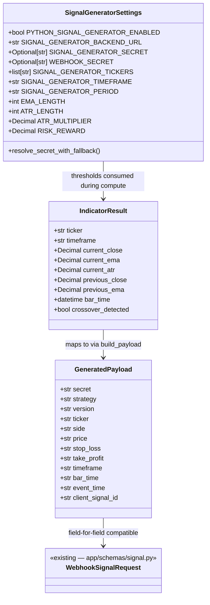

# V0.2b — Python Signal Generator

## Requirements

Build a standalone Python CLI tool that replaces TradingView alerts for local development. The tool downloads OHLCV data via yfinance, calculates EMA 21 and ATR 14, detects an EMA crossover BUY signal, and either prints or POSTs a payload fully compatible with the existing `POST /webhook/signal` pipeline. No Alpaca, no orders, no changes to the FastAPI server or Risk Engine.

---

## Entities



**Notes on existing entities:**
- `WebhookSignalRequest` is unchanged. The generator must produce a `dict` that `WebhookSignalRequest.model_validate()` would accept.
- `SignalGeneratorSettings` is completely independent of `app/config.py`. No cross-import.
- `IndicatorResult` is a `dataclass` — no DB persistence, no ORM.
- `GeneratedPayload` is a plain `dict`. All numeric fields are serialised as `str` with 4 decimal places to match what the server's Pydantic schema expects.

---

## Approach

1. **Standalone CLI in `src/signal_generator/`**:
   - The `src/` directory is already present and empty — the designated home for tools outside the FastAPI app.
   - The generator is never imported by `app/`. It is invoked via `python -m src.signal_generator.cli` or a direct script call.
   - Three operating modes share identical fetch/compute/build logic; only the final action differs:
     - **dry-run** (default — no `--send`; also expressible with explicit `--dry-run` flag): print payload JSON to stdout, no HTTP call.
     - **send** (`--send`): POST to `BACKEND_URL/webhook/signal`, log response.
     - **force** (`--force`): bypass crossover check, use last completed bar regardless.
   - `--timeframe` and `--period` flags allow per-run overrides without changing `.env`.

2. **Module decomposition — pure inner layers**:
   - `config.py` → `SignalGeneratorSettings`
   - `data_fetcher.py` → fetches OHLCV from yfinance, raises `DataFetchError`
   - `indicators.py` → pure pandas functions (EMA, ATR) + `compute_indicators()` returning `IndicatorResult | None`
   - `signal_builder.py` → pure functions `build_client_signal_id()` and `build_payload()` returning `dict | None`
   - `cli.py` → click entry point, orchestrates the above, handles I/O and exit codes
   - Inner layers (`indicators.py`, `signal_builder.py`) have no I/O, no network, no side effects — mirrors `app/risk/engine.py` purity pattern.

3. **Partial bar discipline**:
   - Always skip `df.iloc[-1]` (may be in-progress bar). Use `df.iloc[-2]` as "current closed bar" and `df.iloc[-3]` as "previous closed bar". Crossover evaluated on previous/current pair.
   - If `len(df) < max(EMA_LENGTH, ATR_LENGTH) + 3`, return `None` (insufficient data). CLI logs `"no_signal"` and exits 0.

4. **`bar_time` UTC Z-format**:
   - `bar_time` = UTC start time of the current closed bar (`df.index[-2]` converted to UTC).
   - Format: `"%Y-%m-%dT%H:%M:%SZ"` — e.g., `"2026-05-20T14:30:00Z"`.
   - The same formatted string is used in both the payload's `bar_time` field and inside `client_signal_id`.

5. **409 duplicate handling**:
   - If server returns 409 with `reason_code="duplicate_signal"`, log `"signal already processed"` and exit 0. Not an error.
   - All other non-200/202 responses: log reason_code + reason_detail, exit 1.

---

## Structure

### Inheritance Relationships
1. `SignalGeneratorSettings` extends `BaseSettings` (pydantic-settings, same pattern as `app/config.py`)
2. `IndicatorResult` is a `@dataclass` (no inheritance)
3. `DataFetchError` extends `Exception`

### Dependencies
1. `cli.py` depends on `config.py`, `data_fetcher.py`, `indicators.py`, `signal_builder.py`; resolves `timeframe` and `period` from CLI flags or settings in `main()` and passes them explicitly to `_run_for_ticker`
2. `signal_builder.py` depends on `indicators.py` (for `IndicatorResult` type)
3. `indicators.py` depends on pandas and numpy only — no app imports
4. `data_fetcher.py` depends on yfinance and pandas only — no app imports
5. `config.py` depends on pydantic-settings only — no app imports
6. No file in `src/` imports from `app/`

### Layered Architecture
1. **CLI layer** (`cli.py`): I/O, exit codes, mode dispatch, error messages
2. **Config layer** (`config.py`): settings, validation, `.env` loading
3. **Data layer** (`data_fetcher.py`): yfinance download, DataFrame normalisation
4. **Indicator layer** (`indicators.py`): pure EMA/ATR/crossover computation
5. **Payload layer** (`signal_builder.py`): pure payload construction and ID generation

---

## Operations

### Create Package Init Files — `src/__init__.py` and `src/signal_generator/__init__.py`

1. **Responsibility**: Make `src/` and `src/signal_generator/` importable as Python packages.
2. **Content**: Both files are empty (`# intentionally empty`).

---

### Create Settings — `src/signal_generator/config.py`

1. **Responsibility**: Load all signal generator configuration from environment / `.env`. Fully isolated from `app/config.py`.

2. **Imports**: `Decimal` from `decimal`; `Any`, `Optional` from `typing`; `field_validator`, `model_validator` from pydantic; `BaseSettings`, `SettingsConfigDict` from pydantic_settings.

3. **Define `class SignalGeneratorSettings(BaseSettings)`**:

   Fields:
   - `PYTHON_SIGNAL_GENERATOR_ENABLED: bool = False`
   - `SIGNAL_GENERATOR_BACKEND_URL: str = "http://127.0.0.1:8000"`
   - `SIGNAL_GENERATOR_SECRET: Optional[str] = None`
   - `WEBHOOK_SECRET: Optional[str] = None` — fallback: populated from server `.env`; used only if `SIGNAL_GENERATOR_SECRET` is absent
   - `SIGNAL_GENERATOR_TICKERS: list[str] = ["SPY", "QQQ", "AAPL", "MSFT", "NVDA"]`
   - `SIGNAL_GENERATOR_TIMEFRAME: str = "15m"`
   - `SIGNAL_GENERATOR_PERIOD: str = "5d"`
   - `EMA_LENGTH: int = 21`
   - `ATR_LENGTH: int = 14`
   - `ATR_MULTIPLIER: Decimal = Decimal("1.5")`
   - `RISK_REWARD: Decimal = Decimal("2.0")`

4. **Add `resolve_secret_with_fallback` model validator** (`mode="after"`):
   - If `SIGNAL_GENERATOR_SECRET` is falsy and `WEBHOOK_SECRET` is set: assign `WEBHOOK_SECRET` value to `SIGNAL_GENERATOR_SECRET` via `object.__setattr__`.
   - If both are absent: raise `ValueError("SIGNAL_GENERATOR_SECRET is required. Set SIGNAL_GENERATOR_SECRET in .env, or provide WEBHOOK_SECRET as a fallback.")`.
   - Rationale: generator and server share the same `.env`; WEBHOOK_SECRET already present in most setups avoids key duplication.

5. **Add `parse_signal_generator_tickers` validator** (`mode="before"`, field `SIGNAL_GENERATOR_TICKERS`):
   - If `str`: split on comma, strip whitespace, uppercase, discard empty tokens.
   - If `list`: uppercase each item, discard empty.
   - Same pattern as `app/config.py`'s `parse_allowed_tickers`.

6. **`model_config`**: `SettingsConfigDict(env_file=".env", env_file_encoding="utf-8", extra="ignore")`.
   - `extra="ignore"` is required: generator and server share the same `.env`; server variables must not cause validation errors.

7. **Constraints**:
   - After model validation, `SIGNAL_GENERATOR_SECRET` is always a non-empty `str` or the validator has raised.
   - `ATR_MULTIPLIER` and `RISK_REWARD` must be `Decimal`, never `float`.

---

### Create Data Fetcher — `src/signal_generator/data_fetcher.py`

1. **Responsibility**: Download OHLCV from yfinance and return a normalised single-level-column DataFrame. Raise `DataFetchError` on all failure modes so the CLI layer can handle the exit cleanly.

2. **Imports**: `pandas as pd`; `yfinance as yf`.

3. **Define `class DataFetchError(Exception)`**: no body needed beyond `pass`.

4. **Define `TIMEFRAME_MAP: dict[str, str]`**:
   ```
   {"1m": "1m", "5m": "5m", "15m": "15m", "30m": "30m", "1h": "60m", "1d": "1d"}
   ```

5. **Define `def fetch_ohlcv(ticker: str, period: str, timeframe: str) -> pd.DataFrame`**:
   - Map `timeframe` through `TIMEFRAME_MAP`; fall back to the raw value if not found.
   - Call `yf.download(ticker, period=period, interval=mapped_interval, progress=False, auto_adjust=True)` inside a `try/except Exception`.
   - On exception: raise `DataFetchError(f"yfinance error for {ticker}: {exc}")`.
   - If result is `None` or `df.empty`: raise `DataFetchError(f"No data returned for {ticker}")`.
   - If `df.columns` is a `pd.MultiIndex`: call `df.columns = df.columns.droplevel(1)` to flatten.
   - Return the normalised `df`.

6. **Constraints**:
   - Never catch `DataFetchError` inside this module — only raise it.
   - `progress=False` is mandatory to suppress yfinance console output.
   - `auto_adjust=True` ensures prices are adjusted for splits and dividends.

---

### Create Indicator Functions — `src/signal_generator/indicators.py`

1. **Responsibility**: Pure EMA and ATR calculations over a pandas DataFrame, plus `compute_indicators()` which extracts the two-bar window needed for crossover detection and returns a fully typed `IndicatorResult`. No I/O, no side effects.

2. **Imports**: `dataclasses.dataclass`; `datetime` from `datetime`; `timezone` from `datetime`; `Decimal` from `decimal`; `Optional` from `typing`; `pandas as pd`.

3. **Define `@dataclass class IndicatorResult`**:
   - `ticker: str`
   - `timeframe: str`
   - `current_close: Decimal`
   - `current_ema: Decimal`
   - `current_atr: Decimal`
   - `previous_close: Decimal`
   - `previous_ema: Decimal`
   - `bar_time: datetime` — UTC, start of current closed bar
   - `crossover_detected: bool`

4. **Define `def calculate_ema(close: pd.Series, length: int) -> pd.Series`**:
   - Return `close.ewm(span=length, adjust=False).mean()`.

5. **Define `def calculate_atr(high: pd.Series, low: pd.Series, close: pd.Series, length: int) -> pd.Series`**:
   - `prev_close = close.shift(1)`
   - True range per bar: `max(high - low, |high - prev_close|, |low - prev_close|)`.
   - Use `pd.concat([...], axis=1).max(axis=1)` to compute TR column-wise.
   - Return `tr.rolling(window=length).mean()`.

6. **Define `def compute_indicators(df: pd.DataFrame, ticker: str, timeframe: str, ema_length: int, atr_length: int) -> Optional[IndicatorResult]`**:
   - Minimum rows check: `min_required = max(ema_length, atr_length) + 3`. If `len(df) < min_required`: return `None`.
   - Compute `ema_series = calculate_ema(df["Close"], ema_length)`.
   - Compute `atr_series = calculate_atr(df["High"], df["Low"], df["Close"], atr_length)`.
   - Check `pd.isna(atr_series.iloc[-2])`: return `None` if true (ATR not yet warmed up).
   - Extract values at indices `-2` (current) and `-3` (previous):
     - All scalar values converted via `Decimal(str(round(float_val, 6)))`.
   - Extract `bar_time`:
     - `bar_ts = df.index[-2]`
     - If `bar_ts.tzinfo is not None`: `bar_time = bar_ts.to_pydatetime().astimezone(timezone.utc)`
     - Else: `bar_time = bar_ts.to_pydatetime().replace(tzinfo=timezone.utc)`
   - Compute crossover: `crossover = (previous_close <= previous_ema) and (current_close > current_ema)`.
   - Return `IndicatorResult(...)`.

7. **Constraints**:
   - No imports from `app/` or `src/signal_generator/config.py`.
   - All price values stored as `Decimal` — never retain `float` in `IndicatorResult`.
   - `bar_time` must always be UTC-aware — enforce in the extraction step.

---

### Create Payload Builder — `src/signal_generator/signal_builder.py`

1. **Responsibility**: Pure payload construction. Given an `IndicatorResult` and settings values, compute `stop_loss` and `take_profit`, build the full payload `dict`, and generate the deterministic `client_signal_id`. No I/O, no side effects.

2. **Imports**: `datetime` from `datetime`; `timezone` from `datetime`; `Decimal` from `decimal`; `Optional` from `typing`; `IndicatorResult` from `src.signal_generator.indicators`.

3. **Define module-level constants**:
   - `STRATEGY: str = "python_atr_generator"`
   - `VERSION: str = "0.2b.0"`

4. **Define `def _bar_time_to_z(bar_time: datetime) -> str`** (private helper):
   - Return `bar_time.strftime("%Y-%m-%dT%H:%M:%SZ")`.
   - Example output: `"2026-05-20T14:30:00Z"`.

5. **Define `def build_client_signal_id(ticker: str, timeframe: str, bar_time: datetime) -> str`**:
   - Return `f"{STRATEGY}:{VERSION}:{ticker}:{timeframe}:{_bar_time_to_z(bar_time)}:buy"`.
   - Example: `"python_atr_generator:0.2b.0:SPY:15m:2026-05-20T14:30:00Z:buy"`.

6. **Define `def build_payload(result: IndicatorResult, secret: str, atr_multiplier: Decimal, risk_reward: Decimal) -> Optional[dict]`**:
   - `price = result.current_close`
   - `stop_loss = price - result.current_atr * atr_multiplier`
   - If `stop_loss <= 0`: return `None`.
   - `risk = price - stop_loss`
   - `take_profit = price + risk * risk_reward`
   - `bar_time_str = _bar_time_to_z(result.bar_time)` — used in both `bar_time` field and `client_signal_id`
   - `event_time_str = _bar_time_to_z(datetime.now(timezone.utc))`
   - Return dict with keys: `secret`, `strategy`, `version`, `ticker`, `side` (`"buy"`), `price`, `stop_loss`, `take_profit`, `timeframe`, `bar_time`, `event_time`, `client_signal_id`.
   - All numeric values serialised as `f"{value:.4f}"` strings.

7. **Constraints**:
   - `bar_time` string in `client_signal_id` must match `bar_time` field in payload (same `_bar_time_to_z()` call).
   - All arithmetic in `Decimal` — never `float`.
   - `build_payload` must return `None` (not raise) when `stop_loss <= 0`.

---

### Create CLI Entry Point — `src/signal_generator/cli.py`

1. **Responsibility**: click CLI that loads settings, iterates over tickers, orchestrates the fetch/compute/build pipeline, and dispatches to dry-run, force, or send mode. Owns all exit codes and user-facing messages.

2. **Imports**: `json`; `logging`; `sys`; `Optional` from `typing`; `click`; `requests`; and all four internal modules.

3. **Define `@click.command() def main(...)`** with options:
   - `--force`: `is_flag=True`, default `False` — bypass crossover check.
   - `--send`: `is_flag=True`, default `False` — POST to backend.
   - `--dry-run` (Python name `dry_run`): `is_flag=True`, default `False` — explicit form of the default mode; print payload to stdout without sending.
   - `--ticker`: `default=None` — override tickers list with a single ticker.
   - `--timeframe`: `default=None` — bar interval (e.g. `15m`); overrides `SIGNAL_GENERATOR_TIMEFRAME` for this run.
   - `--period`: `default=None` — lookback window (e.g. `5d`); overrides `SIGNAL_GENERATOR_PERIOD` for this run.
   - Body:
     1. Instantiate `settings = SignalGeneratorSettings()`.
     2. If `not settings.PYTHON_SIGNAL_GENERATOR_ENABLED`: `click.echo("PYTHON_SIGNAL_GENERATOR_ENABLED=false. Set to true to enable.")` then `sys.exit(0)`.
     3. Resolve: `resolved_timeframe = timeframe or settings.SIGNAL_GENERATOR_TIMEFRAME`.
     4. Resolve: `resolved_period = period or settings.SIGNAL_GENERATOR_PERIOD`.
     5. Build `tickers = [ticker.upper()] if ticker else settings.SIGNAL_GENERATOR_TICKERS`.
     6. For each `t` in `tickers`: call `_run_for_ticker(t, settings, timeframe=resolved_timeframe, period=resolved_period, force=force, send=send)`.

4. **Define `def _run_for_ticker(ticker: str, settings: SignalGeneratorSettings, timeframe: str, period: str, force: bool, send: bool) -> None`**:
   - Fetch: `fetch_ohlcv(ticker, period, timeframe)` — uses explicit params resolved in `main()`. On `DataFetchError`: echo to stderr, `sys.exit(1)`.
   - Compute: `compute_indicators(df, ticker, timeframe, settings.EMA_LENGTH, settings.ATR_LENGTH)` — uses explicit `timeframe`. If `None`: `click.echo(f"[{ticker}] no_signal: insufficient data for indicators")`, return.
   - Crossover check: if `not force and not result.crossover_detected`: `click.echo(f"[{ticker}] no crossover detected")`, return.
   - Build: `build_payload(result, settings.SIGNAL_GENERATOR_SECRET, settings.ATR_MULTIPLIER, settings.RISK_REWARD)` — if `None`: `click.echo(f"[{ticker}] stop_loss <= 0, signal skipped")`, return.
   - Dispatch:
     - If `send`: call `_post_payload(ticker, payload, settings.SIGNAL_GENERATOR_BACKEND_URL)`.
     - Else (dry-run — default when `--send` not passed, regardless of `--dry-run`): `click.echo(json.dumps(payload, indent=2))`.

5. **Define `def _post_payload(ticker: str, payload: dict, backend_url: str) -> None`**:
   - URL: `f"{backend_url.rstrip('/')}/webhook/signal"`.
   - `requests.post(url, json=payload, timeout=10)` — on `requests.RequestException`: echo to stderr, `sys.exit(1)`.
   - Parse response body with `resp.json()` inside `try/except`; fall back to `{}` on parse failure.
   - If `resp.status_code == 409` and `body.get("reason_code") == "duplicate_signal"`: `click.echo(f"[{ticker}] signal already processed")`, return.
   - If `resp.status_code not in (200, 202)`: echo `reason_code` + `reason_detail` to stderr, `sys.exit(1)`.
   - On success: `click.echo(f"[{ticker}] signal accepted: approved={body.get('approved')} signal_id={body.get('signal_id')}")`.

6. **`if __name__ == "__main__": main()`** at the bottom of the file.

7. **Constraints**:
   - Never log the value of `secret` or `SIGNAL_GENERATOR_SECRET`.
   - All user-facing messages use `click.echo()`. Errors go to stderr via `err=True`.
   - `sys.exit(1)` only on true errors (fetch failure, network failure, server rejection other than 409 duplicate).

---

### Update `.env.example`

1. **Responsibility**: Document the new generator settings in the existing `.env.example`.

2. **Append the following block** after the existing `LOG_LEVEL=INFO` line:
   ```
   # Signal Generator (V0.2b) — standalone CLI, not part of the server
   PYTHON_SIGNAL_GENERATOR_ENABLED=false
   SIGNAL_GENERATOR_BACKEND_URL=http://127.0.0.1:8000
   SIGNAL_GENERATOR_SECRET=change_me
   SIGNAL_GENERATOR_TICKERS=SPY,QQQ,AAPL,MSFT,NVDA
   SIGNAL_GENERATOR_TIMEFRAME=15m
   SIGNAL_GENERATOR_PERIOD=5d
   EMA_LENGTH=21
   ATR_LENGTH=14
   ATR_MULTIPLIER=1.5
   RISK_REWARD=2.0
   ```

---

### Create Indicator Unit Tests — `tests/test_signal_generator_indicators.py`

1. **Responsibility**: Pure unit tests for `calculate_ema`, `calculate_atr`, and `compute_indicators`. No yfinance calls, no network, no CLI. Uses synthetic pandas DataFrames.

2. **Test helper — `make_df(closes, highs=None, lows=None) -> pd.DataFrame`**:
   - Builds a synthetic OHLCV DataFrame with a timezone-aware UTC-offset `DatetimeIndex` (`tz="America/New_York"`).
   - If `highs`/`lows` not provided: `high = close * 1.01`, `low = close * 0.99`.
   - Index uses `pd.date_range("2026-05-20 14:00", periods=n, freq="15min", tz="America/New_York")`.

3. **Test cases**:

   **EMA**
   - `test_ema_series_length_matches_input`: `len(ema) == len(close)`.
   - `test_ema_converges_to_constant_price`: constant close series → EMA converges to same constant.
   - `test_ema_responds_to_price_change`: series with sudden jump → EMA between old and new price.

   **ATR**
   - `test_atr_series_length_matches_input`: `len(atr) == len(df)`.
   - `test_atr_constant_range_converges`: H-L=2.0 constant, no gaps → ATR ≈ 2.0 after warmup.
   - `test_atr_nan_before_warmup`: fewer rows than `length` → `atr.iloc[-1]` is NaN.

   **compute_indicators**
   - `test_insufficient_data_returns_none`: `len(df) < max(21,14) + 3 = 24` → returns `None`.
   - `test_crossover_detected`: build series where `close[-3] < ema[-3]` and `close[-2] > ema[-2]` → `crossover_detected=True`.
   - `test_no_crossover_when_price_stays_above_ema`: constant price → `crossover_detected=False`.
   - `test_partial_bar_skipped`: `df.iloc[-1].close = 9999.0` anomalous value → `result.current_close != Decimal("9999.0")`.
   - `test_bar_time_is_utc`: `result.bar_time.utcoffset().total_seconds() == 0`.
   - `test_all_result_price_fields_are_decimal`: `current_close`, `current_ema`, `current_atr` are all `Decimal` instances.

---

### Create Payload Unit Tests — `tests/test_signal_generator_payload.py`

1. **Responsibility**: Pure unit tests for `build_client_signal_id` and `build_payload`. No I/O, no network. Uses a `make_result()` helper.

2. **Test helper — `make_result(**overrides) -> IndicatorResult`**:
   - Baseline: `ticker="SPY"`, `timeframe="15m"`, `current_close=Decimal("450.0000")`, `current_ema=Decimal("448.0000")`, `current_atr=Decimal("2.0000")`, `previous_close=Decimal("447.0000")`, `previous_ema=Decimal("448.5000")`, `bar_time=datetime(2026,5,20,14,30,0, tzinfo=timezone.utc)`, `crossover_detected=True`.

3. **Test cases**:

   **client_signal_id**
   - `test_client_signal_id_exact_format`: `build_client_signal_id("SPY","15m",datetime(2026,5,20,14,30,0,tzinfo=UTC))` == `"python_atr_generator:0.2b.0:SPY:15m:2026-05-20T14:30:00Z:buy"`.
   - `test_client_signal_id_uses_z_not_offset`: result must contain `"Z"` and must not contain `"+00:00"`.
   - `test_client_signal_id_is_deterministic`: same arguments → same ID on two calls.

   **build_payload**
   - `test_build_payload_stop_loss_calculation`: `price=450`, `ATR=2`, `multiplier=1.5` → `stop_loss` string ≈ `"447.0000"`.
   - `test_build_payload_take_profit_calculation`: same input → `take_profit` string ≈ `"456.0000"` (risk=3, rr=2.0).
   - `test_build_payload_stop_loss_zero_returns_none`: `price=1.0`, `ATR=1.0`, `multiplier=2.0` → `stop_loss=-1` → returns `None`.
   - `test_build_payload_bar_time_z_format`: `payload["bar_time"] == "2026-05-20T14:30:00Z"`.
   - `test_build_payload_client_signal_id_matches_bar_time`: `payload["client_signal_id"]` contains `"2026-05-20T14:30:00Z"`.
   - `test_build_payload_price_fields_are_strings`: `price`, `stop_loss`, `take_profit` are all `str`.
   - `test_build_payload_required_fields_present`: all required `WebhookSignalRequest` fields present in payload.
   - `test_build_payload_strategy_and_version_constants`: `payload["strategy"] == "python_atr_generator"`, `payload["version"] == "0.2b.0"`.

---

### Create CLI Unit Tests — `tests/test_signal_generator_cli.py`

1. **Responsibility**: CliRunner-based tests for all CLI flags, dispatch modes, and error paths. No network, no yfinance. All external calls mocked via `unittest.mock.patch`.

2. **Test helper — `make_settings(**overrides) -> MagicMock`**:
   - Baseline: `PYTHON_SIGNAL_GENERATOR_ENABLED=True`, `SIGNAL_GENERATOR_TICKERS=["SPY"]`, `SIGNAL_GENERATOR_TIMEFRAME="15m"`, `SIGNAL_GENERATOR_PERIOD="5d"`, `SIGNAL_GENERATOR_SECRET="test-secret"`, `SIGNAL_GENERATOR_BACKEND_URL="http://127.0.0.1:8000"`, `ATR_MULTIPLIER=Decimal("1.5")`, `RISK_REWARD=Decimal("2.0")`, `EMA_LENGTH=21`, `ATR_LENGTH=14`.
   - Any keyword argument overrides the corresponding attribute.

3. **Patch targets**: `src.signal_generator.cli.SignalGeneratorSettings`, `src.signal_generator.cli.fetch_ohlcv`, `src.signal_generator.cli.compute_indicators`, `src.signal_generator.cli.build_payload`, `src.signal_generator.cli.requests.post`.

4. **Test cases**:

   **Enabled gate**
   - `test_disabled_exits_0_with_message`: `PYTHON_SIGNAL_GENERATOR_ENABLED=False` → exit 0, message contains `"PYTHON_SIGNAL_GENERATOR_ENABLED=false"`.

   **Dry-run (default)**
   - `test_default_is_dry_run_prints_json`: no `--send` → exit 0, stdout is valid JSON with `ticker`.
   - `test_explicit_dry_run_flag_prints_json`: `--dry-run` explicit → same JSON output as default.

   **--send**
   - `test_send_flag_posts_to_backend`: `--send` → `requests.post` called once, exit 0, output contains `"signal accepted"`.
   - `test_send_posts_to_correct_url`: call URL equals `"http://127.0.0.1:8000/webhook/signal"`.
   - `test_send_409_duplicate_exits_0`: 409 + `reason_code="duplicate_signal"` → exit 0, output contains `"signal already processed"`.
   - `test_send_4xx_non_duplicate_exits_1`: 422 + other reason → exit 1.

   **--timeframe**
   - `test_timeframe_flag_passed_to_fetch`: `--timeframe 5m` → `fetch_ohlcv` called with `"5m"` as third positional arg.
   - `test_timeframe_flag_passed_to_compute_indicators`: `--timeframe 5m` → `compute_indicators` called with `"5m"` as third positional arg.
   - `test_timeframe_defaults_to_settings_when_not_passed`: no `--timeframe`, settings `SIGNAL_GENERATOR_TIMEFRAME="1h"` → `fetch_ohlcv` called with `"1h"`.

   **--period**
   - `test_period_flag_passed_to_fetch`: `--period 60d` → `fetch_ohlcv` called with `"60d"` as second positional arg.
   - `test_period_defaults_to_settings_when_not_passed`: no `--period`, settings `SIGNAL_GENERATOR_PERIOD="30d"` → `fetch_ohlcv` called with `"30d"`.

   **--force**
   - `test_force_bypasses_no_crossover`: `crossover_detected=False`, `--force` → `build_payload` called, no `"no crossover"` in output.
   - `test_no_crossover_without_force_skips`: `crossover_detected=False`, no `--force` → output contains `"no crossover"`, exit 0.

   **--ticker**
   - `test_ticker_flag_runs_only_that_ticker`: settings has 3 tickers, `--ticker nvda` → `fetch_ohlcv` called once with `"NVDA"`.
   - `test_no_ticker_flag_runs_all_settings_tickers`: no `--ticker`, settings has 2 tickers → exit 0 (both run).

   **Error paths**
   - `test_fetch_error_exits_1`: `fetch_ohlcv` raises `DataFetchError` → exit 1, output contains `"fetch failed"`.
   - `test_insufficient_data_logs_and_continues`: `compute_indicators` returns `None` → exit 0, output contains `"no_signal"`.
   - `test_stop_loss_zero_skips_ticker`: `build_payload` returns `None` → exit 0, output contains `"stop_loss"`.

---

### Create Documentation — `docs/validation/v0.2b-validation.md`

1. **Responsibility**: Operator-facing guide for the signal generator. Covers operating modes, settings reference, output format, and expected server responses.

2. **Sections**:
   - Overview: what the generator does and why it exists (TradingView replacement for local dev)
   - Operating modes: dry-run (default), `--send`, `--force`
   - Settings reference table: all 10 settings with types, defaults, and `.env` syntax
   - Signal logic: EMA crossover condition, stop_loss/take_profit formulas, risk_reward semantics
   - `client_signal_id` format: exact pattern, bar_time format requirement
   - Partial bar rule: explanation of row[-2]/row[-3] logic
   - Server response handling: 202 (accepted), 409 (duplicate, not an error), other errors
   - Example dry-run output (formatted JSON)
   - Quickstart: 3-step usage guide (set env, enable flag, run)

---

## Norms

1. **Typed Python**: Full type annotations on all functions. `Optional[X]` not `X | None`. `Decimal` for all price/ratio arithmetic throughout `indicators.py` and `signal_builder.py`.

2. **Pure inner modules**: `indicators.py` and `signal_builder.py` must not import from `app/`, `src/signal_generator/config.py`, or any I/O module. They receive all inputs as function arguments.

3. **No app cross-import**: Nothing in `src/` may import from `app/`. The generator is a client, not an extension.

4. **`Decimal` for all prices**: yfinance returns `float`; convert immediately via `Decimal(str(round(value, 6)))` to avoid float arithmetic errors. All arithmetic in `build_payload` uses `Decimal` operands.

5. **Z-format for all UTC timestamps**: All datetime-to-string conversions use `strftime("%Y-%m-%dT%H:%M:%SZ")`. Never use `isoformat()` in the payload layer (it produces `+00:00` not `Z`).

6. **No secrets in output**: `SIGNAL_GENERATOR_SECRET` must never appear in any `click.echo()`, log message, or exception message. Payload JSON printed in dry-run mode contains the secret but that is the intended behaviour (local development only).

7. **Exit codes**: 0 = success or no-op (including 409 duplicate). 1 = error (fetch failure, network failure, server rejection). CLI must never raise an unhandled exception to the user — wrap all external calls.

8. **Test isolation**: All tests in `test_signal_generator_indicators.py` and `test_signal_generator_payload.py` must work without network access. Synthetic DataFrames only. `fetch_ohlcv` is never called in these tests.

---

## Safeguards

1. **No server modification**: `app/`, `app/config.py`, `app/services/`, `app/routers/`, `app/risk/` must not be changed. The existing test suite must continue to pass 100%.

2. **`PYTHON_SIGNAL_GENERATOR_ENABLED=false` hard gate**: The CLI must check this flag as the very first action after loading settings. If false, output the disabled message and exit 0 immediately — before any yfinance call, before any payload construction.

3. **Partial bar rule is non-negotiable**: `df.iloc[-1]` is always skipped. `current = df.iloc[-2]`, `previous = df.iloc[-3]`. This is not configurable.

4. **`client_signal_id` format is authoritative**:
   `python_atr_generator:0.2b.0:{ticker}:{timeframe}:{bar_time_z}:buy`
   where `{bar_time_z}` uses `strftime("%Y-%m-%dT%H:%M:%SZ")` on the UTC bar start time.

5. **`stop_loss <= 0` must be a silent skip**: `build_payload` returns `None`. CLI logs the skip and returns without error. Never send a payload with `stop_loss <= 0` — it would be rejected by the server's quality gate anyway.

6. **409 is not an error**: A `409 duplicate_signal` response from the server is expected behaviour. Exit 0, not 1. Never modify `client_signal_id` in response to a 409.

7. **No float in payload fields**: price, stop_loss, take_profit must be serialised as `f"{decimal_value:.4f}"` strings. The server's Pydantic schema expects `Decimal`-parseable strings.

8. **Dependencies already installed**: `yfinance`, `pandas`, `numpy`, `requests`, `click` are all present in `requirements.txt`. No new runtime dependencies may be added for V0.2b.

9. **Acceptance Criteria Traceability**:

   | AC# | Requirement | Covered By |
   |-----|-------------|------------|
   | 1 | Download OHLCV via yfinance | `data_fetcher.fetch_ohlcv` |
   | 2 | Support SPY/QQQ/AAPL/MSFT/NVDA | `SIGNAL_GENERATOR_TICKERS` default |
   | 3 | Default timeframe 15m | `SIGNAL_GENERATOR_TIMEFRAME` default + `TIMEFRAME_MAP` |
   | 4 | Calculate EMA 21 | `indicators.calculate_ema` |
   | 5 | Calculate ATR 14 | `indicators.calculate_atr` |
   | 6 | Detect BUY crossover | `compute_indicators` crossover condition |
   | 7 | Compute price/stop_loss/take_profit | `signal_builder.build_payload` |
   | 8 | Build compatible payload | `build_payload` → `WebhookSignalRequest`-compatible dict |
   | 9 | Deterministic `client_signal_id` | `build_client_signal_id` |
   | 10 | dry-run mode (default + explicit `--dry-run`) | `cli._run_for_ticker` default path; `--dry-run` flag |
   | 11 | force mode | `cli --force` flag |
   | 12 | send mode | `cli._post_payload` |
   | 13 | `--timeframe` per-run override | `cli.main` resolves `resolved_timeframe`; passed to `_run_for_ticker` |
   | 14 | `--period` per-run override | `cli.main` resolves `resolved_period`; passed to `_run_for_ticker` |
   | 15 | No Alpaca | No Alpaca imports anywhere in `src/` |
   | 16 | No orders | Generator produces payloads only |
   | 17 | No webhook changes | `app/routers/webhook.py` untouched |
   | 18 | No Risk Engine changes | `app/risk/` untouched |
   | 19 | Unit tests | `test_signal_generator_indicators.py`, `test_signal_generator_payload.py`, `test_signal_generator_cli.py` |
   | 20 | docs/validation/v0.2b-validation.md | Operator guide |
   | D1 | bar_time Z format | `_bar_time_to_z()` in signal_builder |
   | D2 | Partial bar skipped | `compute_indicators` row-index discipline |
   | D3 | 409 treated as non-error | `cli._post_payload` |
