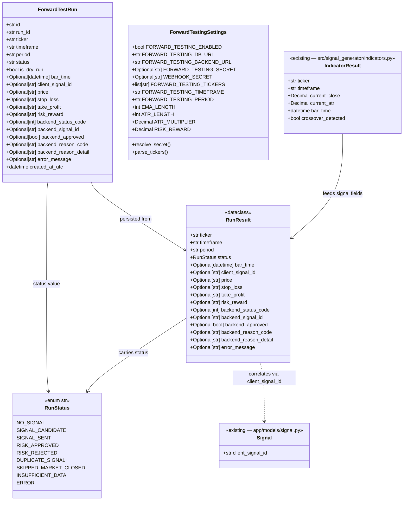

# V0.3 — Forward Testing Runner

## Requirements

Build a standalone Python CLI tool (`src/forward_testing/`) that orchestrates the existing signal generator pipeline for multiple tickers on each invocation, persists every evaluation result to the shared SQLite database — including no-signal outcomes — and supports automated scheduling via cron or launchd without modifying the FastAPI server, the webhook pipeline, or the Risk Engine. No Alpaca, no orders.

---

## Entities



**Notes on existing entities:**
- `ForwardTestRun` stores `status` as a plain `String` column (same pattern as `Signal.status`). `RunStatus` enum lives in `src/forward_testing/runner.py` — not in `app/schemas/enums.py`.
- `RunResult` is ephemeral — a `@dataclass`, no ORM, no DB persistence. CLI creates it from `run_ticker()` and persists it as `ForwardTestRun`.
- `IndicatorResult` is unchanged. Forward testing imports it directly from `src.signal_generator.indicators`.
- `ForwardTestRun` has **no foreign key** to `signals.id`. Correlation uses `client_signal_id` as a natural key. `no_signal` and `insufficient_data` rows have no corresponding `Signal` row.
- `risk_reward` in `ForwardTestRun` is computed locally: `(take_profit - price) / (price - stop_loss)`. Not sourced from the server response.

---

## Approach

1. **Standalone package in `src/forward_testing/`**:
   - Mirrors `src/signal_generator/` structure: `config.py`, `market_hours.py`, `runner.py`, `cli.py`.
   - Invoked via `python -m src.forward_testing.cli --once --send` or equivalent.
   - Never runs as a daemon. Cron/launchd provides the 15-minute cadence externally.
   - One deliberate cross-boundary import: `app/database.py` (for `Base`) and `app/models/` (for `ForwardTestRun` and model registration). No imports from `app/services/`, `app/routers/`, `app/schemas/`, or `app/risk/`.

2. **DB model in `app/models/`**:
   - `ForwardTestRun` inherits `Base` from `app/database.py`, ensuring `init_db()` / `Base.metadata.create_all()` creates the `forward_test_runs` table automatically alongside all other tables.
   - CLI calls `create_all()` at startup using `FORWARD_TESTING_DB_URL` (defaults to same file as server: `sqlite:///./alpacaview.db`). Idempotent on repeated runs.

3. **Direct function imports from `src.signal_generator.*`**:
   - Calls `fetch_ohlcv`, `compute_indicators`, `build_payload`, `build_client_signal_id` directly.
   - Enables capturing intermediate states (`insufficient_data`, `no_signal`) before any HTTP call.
   - Runner is a pure function: no global state, no DB session, no click — fully testable via mock injection.

4. **run_id + batch semantics**:
   - One UUID4 `run_id` per CLI invocation, generated in `main()` before the ticker loop.
   - All `ForwardTestRun` rows from the same invocation share `run_id`, enabling batch-level querying and reporting.

5. **Status taxonomy and exit codes**:
   - `risk_approved`, `risk_rejected`, `duplicate_signal`, `no_signal`, `insufficient_data`, `skipped_market_closed`, `signal_candidate` → exit 0.
   - `error`, `signal_sent` (unexpected HTTP) → exit 1.
   - Errors are isolated per ticker. Remaining tickers continue. Exit code reflects the batch outcome.

6. **dry-run always writes to DB with `is_dry_run=True`**:
   - Dry-run evaluations produce a full audit trail. The `is_dry_run` boolean column distinguishes simulation from live runs.
   - If dry-run produces a signal that would have been sent: status = `signal_candidate`.
   - If dry-run produces no signal: status = `no_signal` or `insufficient_data`.
   - No HTTP call is made in dry-run mode. No `Signal` or `RiskDecision` row is created.

7. **Default behavior (neither `--send` nor `--dry-run`)**:
   - Treated as dry-run: `effective_dry_run = dry_run or not send`.
   - Prevents accidental backend calls when the flag is omitted.

---

## Structure

### Inheritance Relationships
1. `ForwardTestRun` extends `Base` (`app/database.py` declarative base) — same pattern as all `app/models/` classes
2. `RunStatus` extends `str, Enum` — same pattern as `SignalStatus`, `RejectionReason`
3. `RunResult` is a `@dataclass` (no inheritance) — same pattern as `IndicatorResult`
4. `ForwardTestingSettings` extends `BaseSettings` (pydantic-settings) — same pattern as `SignalGeneratorSettings`

### Dependencies
1. `cli.py` depends on `config.py`, `market_hours.py`, `runner.py`
2. `cli.py` imports `Base` from `app/database.py` and `ForwardTestRun` from `app/models/forward_test_run.py`; also imports `app.models` (no-op side effect to register all ORM models before `create_all`)
3. `runner.py` depends on `config.py`; imports `fetch_ohlcv`, `compute_indicators`, `build_payload` from `src.signal_generator.*`; imports `RunStatus`, `RunResult` (defined in same module)
4. `market_hours.py` depends on `pytz` only — no app imports, no signal_generator imports
5. `config.py` depends on `pydantic-settings` only — no app imports
6. No file in `src/forward_testing/` imports from `app/services/`, `app/routers/`, `app/schemas/`, or `app/risk/`

### Layered Architecture
1. **CLI layer** (`cli.py`): I/O, exit codes, `run_id` generation, DB session management, market-hours guard, ticker loop, result echo
2. **Config layer** (`config.py`): pydantic-settings, `.env` loading, secret fallback, ticker parsing
3. **Market hours layer** (`market_hours.py`): pure `is_market_open(now)` function — no side effects
4. **Runner layer** (`runner.py`): pure `run_ticker()` orchestration — fetch → compute → build → HTTP → parse → return `RunResult`
5. **DB model layer** (`app/models/forward_test_run.py`): SQLAlchemy ORM definition — imported by CLI for persistence

---

## Operations

### Create SQLAlchemy Model — `app/models/forward_test_run.py`

1. **Responsibility**: Define the `forward_test_runs` SQLite table that persists every forward testing evaluation outcome.

2. **Imports**: `datetime`, `timezone` from `datetime`; `Optional` from `typing`; `uuid4` from `uuid`; `Boolean`, `DateTime`, `Integer`, `String` from `sqlalchemy`; `Mapped`, `mapped_column` from `sqlalchemy.orm`; `Base` from `app.database`.

3. **Define `class ForwardTestRun(Base)`**:

   - `__tablename__ = "forward_test_runs"`
   - `id: Mapped[str]` — `String`, primary key, `default=lambda: str(uuid4())`
   - `run_id: Mapped[str]` — `String`, not nullable, indexed — UUID4 shared across all tickers in one CLI invocation
   - `ticker: Mapped[str]` — `String`, not nullable, indexed
   - `timeframe: Mapped[str]` — `String`, not nullable
   - `period: Mapped[str]` — `String`, not nullable
   - `status: Mapped[str]` — `String`, not nullable — RunStatus string value
   - `is_dry_run: Mapped[bool]` — `Boolean`, not nullable, default `False`
   - `bar_time: Mapped[Optional[datetime]]` — `DateTime(timezone=True)`, nullable — UTC start of closed bar; `None` for no_signal/insufficient_data/skipped/error
   - `client_signal_id: Mapped[Optional[str]]` — `String`, nullable — `None` when no signal generated
   - `price: Mapped[Optional[str]]` — `String`, nullable — Decimal serialised as 4dp string
   - `stop_loss: Mapped[Optional[str]]` — `String`, nullable
   - `take_profit: Mapped[Optional[str]]` — `String`, nullable
   - `risk_reward: Mapped[Optional[str]]` — `String`, nullable — computed locally as `(take_profit - price) / (price - stop_loss)` with 4dp
   - `backend_status_code: Mapped[Optional[int]]` — `Integer`, nullable — HTTP status from `/webhook/signal`; `None` if not sent
   - `backend_signal_id: Mapped[Optional[str]]` — `String`, nullable — server-assigned `signal_id` from response body
   - `backend_approved: Mapped[Optional[bool]]` — `Boolean`, nullable — from response body `approved` field
   - `backend_reason_code: Mapped[Optional[str]]` — `String`, nullable
   - `backend_reason_detail: Mapped[Optional[str]]` — `String`, nullable
   - `error_message: Mapped[Optional[str]]` — `String`, nullable — populated only when `status=error`
   - `created_at_utc: Mapped[datetime]` — `DateTime(timezone=True)`, not nullable, `default=lambda: datetime.now(timezone.utc)`

4. **No relationships, no foreign keys** — `ForwardTestRun` is standalone; correlation to `signals` is via `client_signal_id` string, not a FK constraint.

5. **Constraints**:
   - `run_id` must be indexed for efficient batch queries.
   - `ticker` must be indexed.
   - No unique constraint on `client_signal_id` — dry-run runs can produce duplicate IDs for the same bar.

---

### Update App Models Registry — `app/models/__init__.py`

1. **Responsibility**: Register `ForwardTestRun` in `Base.metadata` so `init_db()` and `create_all()` include the `forward_test_runs` table.

2. **Changes**: Add `from app.models.forward_test_run import ForwardTestRun` import and add `"ForwardTestRun"` to `__all__`.

3. **Result**: `app/models/__init__.py` after change:
   ```
   from app.models.signal import Signal
   from app.models.decision import RiskDecision
   from app.models.webhook_event import WebhookEvent
   from app.models.kill_switch import KillSwitchState
   from app.models.forward_test_run import ForwardTestRun

   __all__ = ["Signal", "RiskDecision", "WebhookEvent", "KillSwitchState", "ForwardTestRun"]
   ```

---

### Create Package Init Files — `src/forward_testing/__init__.py`

1. **Responsibility**: Make `src/forward_testing/` importable as a Python package.
2. **Content**: Empty file.

---

### Create Settings — `src/forward_testing/config.py`

1. **Responsibility**: Load forward testing configuration from environment / `.env`. Isolated from `app/config.py` and `src/signal_generator/config.py`.

2. **Imports**: `Decimal` from `decimal`; `Any`, `Optional` from `typing`; `field_validator`, `model_validator` from `pydantic`; `BaseSettings`, `SettingsConfigDict` from `pydantic_settings`.

3. **Define `class ForwardTestingSettings(BaseSettings)`**:

   Fields:
   - `FORWARD_TESTING_ENABLED: bool = False`
   - `FORWARD_TESTING_DB_URL: str = "sqlite:///./alpacaview.db"` — defaults to same file as server
   - `FORWARD_TESTING_BACKEND_URL: str = "http://127.0.0.1:8000"`
   - `FORWARD_TESTING_SECRET: Optional[str] = None`
   - `WEBHOOK_SECRET: Optional[str] = None` — fallback for secret resolution
   - `FORWARD_TESTING_TICKERS: list[str] = ["SPY", "QQQ", "AAPL", "MSFT", "NVDA"]`
   - `FORWARD_TESTING_TIMEFRAME: str = "15m"`
   - `FORWARD_TESTING_PERIOD: str = "5d"`
   - `EMA_LENGTH: int = 21`
   - `ATR_LENGTH: int = 14`
   - `ATR_MULTIPLIER: Decimal = Decimal("1.5")`
   - `RISK_REWARD: Decimal = Decimal("2.0")`

4. **Add `resolve_secret` model validator** (`mode="after"`):
   - If `FORWARD_TESTING_SECRET` is falsy and `WEBHOOK_SECRET` is set: assign `WEBHOOK_SECRET` to `FORWARD_TESTING_SECRET` via `object.__setattr__`.
   - If both absent: raise `ValueError("FORWARD_TESTING_SECRET is required. Set FORWARD_TESTING_SECRET in .env, or provide WEBHOOK_SECRET as a fallback.")`.

5. **Add `parse_forward_testing_tickers` field validator** (`mode="before"`, field `FORWARD_TESTING_TICKERS`):
   - If `str`: split on comma, strip whitespace, uppercase, discard empty.
   - If `list`: uppercase each item, discard empty.

6. **`model_config`**: `SettingsConfigDict(env_file=".env", env_file_encoding="utf-8", extra="ignore")`.

---

### Create Market Hours Module — `src/forward_testing/market_hours.py`

1. **Responsibility**: Pure function that determines whether a given UTC timestamp falls within US equity market hours. No side effects, no global state, clock-injectable for deterministic testing.

2. **Imports**: `datetime` from `datetime`; `pytz`.

3. **Define `def is_market_open(now: datetime) -> bool`**:
   - Validate `now` has timezone info; if naive, treat as UTC.
   - Localise to `America/New_York` via `now.astimezone(pytz.timezone("America/New_York"))`.
   - If `local.weekday() >= 5` (Saturday=5, Sunday=6): return `False`.
   - Compute `market_open = local.replace(hour=9, minute=30, second=0, microsecond=0)`.
   - Compute `market_close = local.replace(hour=16, minute=0, second=0, microsecond=0)`.
   - Return `market_open <= local < market_close`.

4. **Constraints**:
   - Must use `pytz.timezone("America/New_York")` with `astimezone()` — not `localize()` — to correctly handle DST for UTC inputs.
   - Never call `datetime.now()` inside this function — always receive `now` as argument.

---

### Create Runner Module — `src/forward_testing/runner.py`

1. **Responsibility**: Defines `RunStatus` enum, `RunResult` dataclass, and pure `run_ticker()` function that orchestrates the full pipeline for one ticker and returns a `RunResult`. No DB access, no click, no sys.exit.

2. **Imports**: `dataclass` from `dataclasses`; `datetime`, `timezone` from `datetime`; `Decimal` from `decimal`; `Enum` from `enum`; `Optional` from `typing`; `requests`; `fetch_ohlcv`, `DataFetchError` from `src.signal_generator.data_fetcher`; `compute_indicators` from `src.signal_generator.indicators`; `build_payload`, `build_client_signal_id` from `src.signal_generator.signal_builder`; `ForwardTestingSettings` from `src.forward_testing.config`.

3. **Define `class RunStatus(str, Enum)`**:
   - `NO_SIGNAL = "no_signal"` — no crossover detected, or `build_payload` returned `None`
   - `SIGNAL_CANDIDATE = "signal_candidate"` — dry-run: signal would have been sent
   - `SIGNAL_SENT = "signal_sent"` — signal sent, unexpected HTTP response (not 200/202/409)
   - `RISK_APPROVED = "risk_approved"` — server returned HTTP 202
   - `RISK_REJECTED = "risk_rejected"` — server returned HTTP 200 with `approved=False`
   - `DUPLICATE_SIGNAL = "duplicate_signal"` — server returned HTTP 409 with `reason_code="duplicate_signal"`
   - `SKIPPED_MARKET_CLOSED = "skipped_market_closed"` — `--market-hours-only` and outside hours
   - `INSUFFICIENT_DATA = "insufficient_data"` — `compute_indicators` returned `None`
   - `ERROR = "error"` — `DataFetchError`, network error, unexpected exception, or HTTP 4xx/5xx that is not 409+duplicate

4. **Define `@dataclass class RunResult`**:
   - `ticker: str`
   - `timeframe: str`
   - `period: str`
   - `status: RunStatus`
   - `bar_time: Optional[datetime] = None`
   - `client_signal_id: Optional[str] = None`
   - `price: Optional[str] = None` — 4dp string
   - `stop_loss: Optional[str] = None` — 4dp string
   - `take_profit: Optional[str] = None` — 4dp string
   - `risk_reward: Optional[str] = None` — 4dp string
   - `backend_status_code: Optional[int] = None`
   - `backend_signal_id: Optional[str] = None`
   - `backend_approved: Optional[bool] = None`
   - `backend_reason_code: Optional[str] = None`
   - `backend_reason_detail: Optional[str] = None`
   - `error_message: Optional[str] = None`

5. **Define `def run_ticker(ticker: str, timeframe: str, period: str, settings: ForwardTestingSettings, send: bool, dry_run: bool) -> RunResult`**:

   Step 1 — Fetch OHLCV:
   - `try: df = fetch_ohlcv(ticker, period, timeframe)` — on `DataFetchError`: return `RunResult(ticker, timeframe, period, RunStatus.ERROR, error_message=str(exc))`. On any other exception: return `RunResult(..., RunStatus.ERROR, error_message=f"unexpected: {exc}")`.

   Step 2 — Compute indicators:
   - `result = compute_indicators(df, ticker, timeframe, settings.EMA_LENGTH, settings.ATR_LENGTH)`.
   - If `result is None`: return `RunResult(..., RunStatus.INSUFFICIENT_DATA, error_message="insufficient data for indicators")`.

   Step 3 — Crossover check:
   - If `not result.crossover_detected`: return `RunResult(..., RunStatus.NO_SIGNAL, bar_time=result.bar_time)`.

   Step 4 — Build payload:
   - `payload = build_payload(result, settings.FORWARD_TESTING_SECRET, settings.ATR_MULTIPLIER, settings.RISK_REWARD)`.
   - If `payload is None`: return `RunResult(..., RunStatus.NO_SIGNAL, bar_time=result.bar_time, error_message="stop_loss <= 0")`.

   Step 5 — Compute risk_reward:
   - `price_d = Decimal(payload["price"])`.
   - `sl_d = Decimal(payload["stop_loss"])`.
   - `tp_d = Decimal(payload["take_profit"])`.
   - `rr = (tp_d - price_d) / (price_d - sl_d)`.
   - `rr_str = f"{rr:.4f}"`.

   Step 6 — Build partial RunResult fields (shared by all signal-producing paths):
   - `signal_fields = dict(bar_time=result.bar_time, client_signal_id=payload["client_signal_id"], price=payload["price"], stop_loss=payload["stop_loss"], take_profit=payload["take_profit"], risk_reward=rr_str)`.

   Step 7 — Dry-run dispatch:
   - If `dry_run`: return `RunResult(..., RunStatus.SIGNAL_CANDIDATE, **signal_fields)`.

   Step 8 — Send mode:
   - If `send`:
     - `url = f"{settings.FORWARD_TESTING_BACKEND_URL.rstrip('/')}/webhook/signal"`.
     - `try: resp = requests.post(url, json=payload, timeout=10)` — on `requests.RequestException`: return `RunResult(..., RunStatus.ERROR, **signal_fields, error_message=str(exc))`.
     - Parse body: `try: body = resp.json() except Exception: body = {}`.
     - If `resp.status_code == 409` and `body.get("reason_code") == "duplicate_signal"`: return `RunResult(..., RunStatus.DUPLICATE_SIGNAL, **signal_fields, backend_status_code=409, backend_reason_code="duplicate_signal")`.
     - If `resp.status_code == 202`: return `RunResult(..., RunStatus.RISK_APPROVED, **signal_fields, backend_status_code=202, backend_signal_id=body.get("signal_id"), backend_approved=True, backend_reason_code=body.get("reason_code"), backend_reason_detail=body.get("reason_detail"))`.
     - If `resp.status_code == 200`: return `RunResult(..., RunStatus.RISK_REJECTED, **signal_fields, backend_status_code=200, backend_signal_id=body.get("signal_id"), backend_approved=False, backend_reason_code=body.get("reason_code"), backend_reason_detail=body.get("reason_detail"))`.
     - Else (unexpected status): return `RunResult(..., RunStatus.SIGNAL_SENT, **signal_fields, backend_status_code=resp.status_code, backend_reason_code=body.get("reason_code"), backend_reason_detail=body.get("reason_detail"), error_message=f"unexpected HTTP {resp.status_code}")`.

   Step 9 — Neither --send nor --dry-run (caller ensures this cannot happen via `effective_dry_run` logic in CLI, but guard defensively):
   - return `RunResult(..., RunStatus.SIGNAL_CANDIDATE, **signal_fields)`.

6. **Constraints**:
   - Never call `sys.exit()`, `click.echo()`, or write to DB — those belong to the CLI layer.
   - `FORWARD_TESTING_SECRET` must never appear in any string returned in `error_message`.
   - All `Decimal` arithmetic uses `Decimal` operands, never `float`.

---

### Create CLI Entry Point — `src/forward_testing/cli.py`

1. **Responsibility**: click CLI that owns `run_id` generation, DB initialisation, market hours guard, ticker loop, result persistence, stdout echo, and exit code calculation.

2. **Imports**: `json`, `sys` from stdlib; `datetime`, `timezone` from `datetime`; `uuid4` from `uuid`; `Optional` from `typing`; `click`, `requests`; `create_engine` from `sqlalchemy`; `sessionmaker` from `sqlalchemy.orm`; `Base` from `app.database`; `ForwardTestRun` from `app.models.forward_test_run`; `import app.models` (no-op, registers all models in `Base.metadata`); `is_market_open` from `src.forward_testing.market_hours`; `RunStatus`, `RunResult`, `run_ticker` from `src.forward_testing.runner`; `ForwardTestingSettings` from `src.forward_testing.config`.

3. **Define `@click.command() def main(...)`** with options:
   - `--once`: `is_flag=True`, default `False` — no-op documentation flag.
   - `--tickers`: `default=None` — comma-separated, overrides `FORWARD_TESTING_TICKERS`.
   - `--timeframe`: `default=None` — overrides `FORWARD_TESTING_TIMEFRAME`.
   - `--period`: `default=None` — overrides `FORWARD_TESTING_PERIOD`.
   - `--send`: `is_flag=True`, default `False` — POST to backend when signal found.
   - `--dry-run` (Python name `dry_run`): `is_flag=True`, default `False` — explicit no-POST mode.
   - `--market-hours-only` (Python name `market_hours_only`): `is_flag=True`, default `False`.

4. **`main()` body**:
   1. `settings = ForwardTestingSettings()`.
   2. If `not settings.FORWARD_TESTING_ENABLED`: `click.echo("FORWARD_TESTING_ENABLED=false. Set to true to enable.")`, `sys.exit(0)`.
   3. Call `_init_db(settings.FORWARD_TESTING_DB_URL)` to create engine and call `Base.metadata.create_all(bind=engine)`. Return `(engine, Session)`.
   4. `run_id = str(uuid4())`.
   5. `now = datetime.now(timezone.utc)`.
   6. `effective_dry_run = dry_run or not send`.
   7. Resolve `resolved_tickers`, `resolved_timeframe`, `resolved_period` from CLI args or settings.
   8. If `market_hours_only and not is_market_open(now)`:
      - For each ticker in `resolved_tickers`: write `ForwardTestRun` row with `status=RunStatus.SKIPPED_MARKET_CLOSED`, `is_dry_run=effective_dry_run`, `run_id=run_id`, `ticker`, `timeframe=resolved_timeframe`, `period=resolved_period`.
      - `click.echo(f"Market closed. Skipped {len(resolved_tickers)} tickers.")`, `sys.exit(0)`.
   9. `has_error = False`.
   10. For each ticker in `resolved_tickers`:
       - `result = run_ticker(ticker, resolved_timeframe, resolved_period, settings, send=send, dry_run=effective_dry_run)`.
       - `try: _persist(run_id, result, effective_dry_run, db_session)` — on exception: `click.echo(f"[{ticker}] DB write failed: {exc}", err=True)`, `has_error = True`.
       - `_echo_result(ticker, result)`.
       - If `result.status == RunStatus.ERROR` or `result.status == RunStatus.SIGNAL_SENT`: `has_error = True`.
   11. `sys.exit(1 if has_error else 0)`.

5. **Define `def _init_db(db_url: str) -> tuple`**:
   - Create engine: `create_engine(db_url, connect_args={"check_same_thread": False} if "sqlite" in db_url else {})`.
   - `Base.metadata.create_all(bind=engine)` — idempotent.
   - `Session = sessionmaker(autocommit=False, autoflush=False, bind=engine)`.
   - Return `(engine, Session)`.

6. **Define `def _persist(run_id: str, result: RunResult, is_dry_run: bool, session) -> None`**:
   - Construct `ForwardTestRun` from `RunResult` fields + `run_id` + `is_dry_run`.
   - `session.add(row)`, `session.commit()`.
   - On exception: `session.rollback()`, re-raise.

7. **Define `def _echo_result(ticker: str, result: RunResult) -> None`**:
   - Emit a one-line summary via `click.echo` for each ticker outcome.
   - For `SIGNAL_CANDIDATE`: print payload summary (no secret field).
   - For `RISK_APPROVED` / `RISK_REJECTED`: print backend outcome.
   - For errors: print to stderr via `err=True`.

8. **Define `def _parse_tickers(tickers_str: Optional[str]) -> Optional[list[str]]`**:
   - If `None`: return `None`.
   - Split on comma, strip, uppercase, discard empty — returns `list[str]`.

9. **`if __name__ == "__main__": main()`** at bottom.

10. **Constraints**:
    - `FORWARD_TESTING_SECRET` must never appear in any `click.echo()` or log message.
    - `sys.exit(1)` only for technical errors (`error`, `signal_sent`). `no_signal`, `risk_rejected`, `duplicate_signal`, `skipped_market_closed` are not errors.
    - CLI never runs as a daemon. `--once` is accepted and silently ignored.

---

### Update `.env.example`

1. **Responsibility**: Document the new forward testing settings.

2. **Append after existing generator block**:
   ```
   # Forward Testing (V0.3) — standalone CLI, schedule via cron or launchd
   FORWARD_TESTING_ENABLED=false
   FORWARD_TESTING_DB_URL=sqlite:///./alpacaview.db
   FORWARD_TESTING_BACKEND_URL=http://127.0.0.1:8000
   FORWARD_TESTING_SECRET=change_me
   FORWARD_TESTING_TICKERS=SPY,QQQ,AAPL,MSFT,NVDA
   FORWARD_TESTING_TIMEFRAME=15m
   FORWARD_TESTING_PERIOD=5d
   ```
   (EMA_LENGTH, ATR_LENGTH, ATR_MULTIPLIER, RISK_REWARD already present from V0.2b block.)

---

### Create Market Hours Unit Tests — `tests/test_forward_testing_market_hours.py`

1. **Responsibility**: Pure unit tests for `is_market_open()`. No network, no DB. All times passed as UTC datetimes.

2. **Test helper**: `def make_utc(weekday_offset: int, hour: int, minute: int) -> datetime` — constructs a UTC datetime for a known Monday (2026-05-18) + `weekday_offset` days, at `hour:minute` New York time, correctly converted to UTC accounting for EDT (UTC-4 in May).

3. **Test cases**:
   - `test_weekday_inside_hours_returns_true`: Monday 10:00 ET → `True`.
   - `test_weekday_at_open_boundary_returns_true`: Monday 09:30 ET exactly → `True`.
   - `test_weekday_at_close_boundary_returns_false`: Monday 16:00 ET exactly → `False` (close is exclusive).
   - `test_weekday_before_open_returns_false`: Monday 09:00 ET → `False`.
   - `test_weekday_after_close_returns_false`: Monday 17:00 ET → `False`.
   - `test_saturday_returns_false`: Saturday 12:00 ET → `False`.
   - `test_sunday_returns_false`: Sunday 12:00 ET → `False`.
   - `test_friday_inside_hours_returns_true`: Friday 14:00 ET → `True`.
   - `test_friday_after_close_returns_false`: Friday 16:01 ET → `False`.

---

### Create Runner Unit Tests — `tests/test_forward_testing_runner.py`

1. **Responsibility**: Unit tests for `run_ticker()`. No network, no DB. All external calls mocked.

2. **Test helper `make_settings(**overrides) -> MagicMock`**: baseline `FORWARD_TESTING_SECRET="test-secret"`, `FORWARD_TESTING_BACKEND_URL="http://127.0.0.1:8000"`, `ATR_MULTIPLIER=Decimal("1.5")`, `RISK_REWARD=Decimal("2.0")`, `EMA_LENGTH=21`, `ATR_LENGTH=14`.

3. **Test helper `make_indicator_result(crossover=True) -> IndicatorResult`**: baseline result with crossover flag.

4. **Patch targets**: `src.forward_testing.runner.fetch_ohlcv`, `src.forward_testing.runner.compute_indicators`, `src.forward_testing.runner.build_payload`, `src.forward_testing.runner.requests.post`.

5. **Test cases**:
   - `test_fetch_error_returns_error_status`: `fetch_ohlcv` raises `DataFetchError` → `RunResult.status == RunStatus.ERROR`.
   - `test_unexpected_exception_returns_error_status`: `fetch_ohlcv` raises `RuntimeError` → `RunResult.status == RunStatus.ERROR`.
   - `test_insufficient_data_returns_insufficient_data`: `compute_indicators` returns `None` → `RunStatus.INSUFFICIENT_DATA`.
   - `test_no_crossover_returns_no_signal`: `crossover_detected=False` → `RunStatus.NO_SIGNAL`, `bar_time` populated.
   - `test_build_payload_none_returns_no_signal`: `build_payload` returns `None` → `RunStatus.NO_SIGNAL`.
   - `test_dry_run_with_signal_returns_signal_candidate`: `dry_run=True`, signal produced → `RunStatus.SIGNAL_CANDIDATE`, `is_dry_run` reflected in result.
   - `test_send_202_returns_risk_approved`: HTTP 202, `approved=True` → `RunStatus.RISK_APPROVED`, `backend_approved=True`.
   - `test_send_200_returns_risk_rejected`: HTTP 200, `approved=False` → `RunStatus.RISK_REJECTED`, `backend_approved=False`.
   - `test_send_409_duplicate_returns_duplicate_signal`: HTTP 409 + `reason_code="duplicate_signal"` → `RunStatus.DUPLICATE_SIGNAL`.
   - `test_send_network_error_returns_error`: `requests.post` raises `RequestException` → `RunStatus.ERROR`.
   - `test_send_unexpected_status_returns_signal_sent`: HTTP 503 → `RunStatus.SIGNAL_SENT`, `backend_status_code=503`.
   - `test_risk_reward_computed_correctly`: `price=450`, `stop_loss=447`, `take_profit=456` → `risk_reward="2.0000"`.
   - `test_signal_fields_populated_on_send`: `price`, `stop_loss`, `take_profit`, `client_signal_id` present in result.
   - `test_error_message_does_not_contain_secret`: error result's `error_message` does not include `settings.FORWARD_TESTING_SECRET`.

---

### Create CLI Unit Tests — `tests/test_forward_testing_cli.py`

1. **Responsibility**: CliRunner tests for all CLI flags, exit codes, and DB persistence paths. No real network, no real DB. All external calls mocked.

2. **Test helper `make_settings(**overrides) -> MagicMock`**: same baseline as runner tests, plus `FORWARD_TESTING_ENABLED=True`, `FORWARD_TESTING_TICKERS=["SPY"]`, `FORWARD_TESTING_TIMEFRAME="15m"`, `FORWARD_TESTING_PERIOD="5d"`, `FORWARD_TESTING_DB_URL="sqlite://"`.

3. **Patch targets**: `src.forward_testing.cli.ForwardTestingSettings`, `src.forward_testing.cli.run_ticker`, `src.forward_testing.cli.is_market_open`, `src.forward_testing.cli._init_db`, `src.forward_testing.cli._persist`.

4. **Test cases**:
   - `test_disabled_exits_0`: `FORWARD_TESTING_ENABLED=False` → exit 0, message printed.
   - `test_market_hours_only_closed_exits_0`: `is_market_open` returns `False`, `--market-hours-only` → exit 0, `_persist` called with `SKIPPED_MARKET_CLOSED`.
   - `test_market_hours_only_open_proceeds`: `is_market_open` returns `True`, `--market-hours-only` → `run_ticker` called.
   - `test_no_send_defaults_to_dry_run`: no `--send`, `run_ticker` called with `dry_run=True`.
   - `test_send_flag_calls_run_ticker_with_send_true`: `--send` → `run_ticker` called with `send=True`.
   - `test_no_error_exits_0`: `run_ticker` returns `NO_SIGNAL` → exit 0.
   - `test_error_status_exits_1`: `run_ticker` returns `ERROR` → exit 1.
   - `test_signal_sent_status_exits_1`: `run_ticker` returns `SIGNAL_SENT` → exit 1.
   - `test_risk_rejected_exits_0`: `run_ticker` returns `RISK_REJECTED` → exit 0.
   - `test_duplicate_signal_exits_0`: `run_ticker` returns `DUPLICATE_SIGNAL` → exit 0.
   - `test_one_error_one_success_exits_1`: two tickers, one `ERROR`, one `NO_SIGNAL` → exit 1.
   - `test_db_write_failure_exits_1`: `_persist` raises exception → exit 1, remaining tickers still processed.
   - `test_once_flag_is_no_op`: `--once --dry-run` → same result as `--dry-run` alone.
   - `test_tickers_flag_overrides_settings`: `--tickers NVDA,MSFT` → `run_ticker` called twice with NVDA and MSFT.
   - `test_run_id_shared_across_tickers`: two tickers → both `_persist` calls receive same `run_id`.
   - `test_persist_called_with_is_dry_run_true`: `--dry-run` → `_persist` called with `is_dry_run=True`.

---

### Create Integration Tests — `tests/test_forward_testing_integration.py`

1. **Responsibility**: End-to-end tests using a real in-memory SQLite DB (via the test `conftest.py` pattern) and mocked `run_ticker()`. Verifies that `ForwardTestRun` rows are actually written and readable.

2. **Test cases**:
   - `test_forward_test_run_row_written_to_db`: invoke CLI with `--dry-run`, mock `run_ticker` returning `SIGNAL_CANDIDATE` result, assert one `forward_test_runs` row exists in DB with correct fields.
   - `test_no_signal_row_written_with_correct_status`: mock `run_ticker` returning `NO_SIGNAL`, assert `status="no_signal"`.
   - `test_is_dry_run_column_true_on_dry_run`: `--dry-run` → `is_dry_run=True` in DB row.
   - `test_is_dry_run_column_false_on_send`: `--send`, mock `run_ticker` returning `RISK_APPROVED` → `is_dry_run=False` in DB row.
   - `test_run_id_consistent_across_multiple_tickers`: two tickers → both rows share `run_id`.
   - `test_error_row_has_error_message`: mock `run_ticker` returning `ERROR` with `error_message="fetch failed"` → row has populated `error_message`.
   - `test_skipped_market_closed_rows_written`: `--market-hours-only`, `is_market_open=False` → rows written with `status="skipped_market_closed"`.
   - `test_forward_test_runs_table_created_by_init_db`: fresh in-memory DB, CLI startup → `forward_test_runs` table exists.

---

### Create Documentation — `docs/validation/v0.3-validation.md`

1. **Responsibility**: Operator-facing guide for the forward testing CLI.

2. **Sections**:
   - Overview: purpose (automated forward testing, TradingView replacement + audit trail)
   - Quickstart: enable flag, run once, cron setup example
   - CLI flags reference: all 7 flags with types, defaults, and behavior
   - Operating modes table: dry-run / send / market-hours-only combinations
   - RunStatus reference table: all 9 statuses with meaning and exit code contribution
   - `forward_test_runs` schema: all columns with types, nullability, and description
   - `run_id` semantics: batch grouping, UUID4 per invocation
   - dry-run audit trail: what gets written, `is_dry_run=true` semantics
   - Error handling: per-ticker isolation, batch exit codes
   - Scheduling with cron: example crontab entry
   - Scheduling with launchd: example plist snippet

---

## Norms

1. **Typed Python**: Full type annotations on all functions and dataclass fields. `Optional[X]` not `X | None`. `Decimal` for all price/ratio arithmetic.

2. **Allowed cross-boundary imports**: `src/forward_testing/` may only import from `app/database.py` and `app/models/`. No imports from `app/services/`, `app/routers/`, `app/schemas/`, `app/risk/`, or `app/repositories/`.

3. **`extra="ignore"` on all BaseSettings subclasses**: `ForwardTestingSettings` must use `SettingsConfigDict(extra="ignore")` because the shared `.env` file contains variables from the server, the signal generator, and now forward testing. All three tools must tolerate each other's variables.

4. **Secret fallback pattern**: `FORWARD_TESTING_SECRET` → fall back to `WEBHOOK_SECRET` via `model_validator(mode="after")` with `object.__setattr__`. If both absent, raise `ValueError`. This is identical to `SignalGeneratorSettings.resolve_secret_with_fallback`.

5. **Pure runner**: `run_ticker()` must have no side effects. It must not call `sys.exit()`, `click.echo()`, or write to any DB. It receives all inputs as arguments. This enables full unit testing via mock injection.

6. **`is_market_open` receives `now` as argument**: Never call `datetime.now()` inside `market_hours.py`. The clock is injected by the caller.

7. **DB init at CLI startup**: The CLI calls `Base.metadata.create_all()` before the ticker loop. This is idempotent and safe for repeated invocations. No separate migration tool is required at V0.

8. **`run_id` granularity**: One UUID4 per `main()` invocation, generated before the ticker loop. Never regenerated per ticker.

9. **Exit code semantics**: 0 = all tickers in expected states (including `no_signal`, `risk_rejected`, `duplicate_signal`, `skipped_market_closed`, `signal_candidate`). 1 = at least one ticker resulted in `error` or `signal_sent`, or at least one DB write failed.

10. **No secret in output**: `FORWARD_TESTING_SECRET` must never appear in any `click.echo()`, log message, `error_message` field, or exception string.

---

## Safeguards

1. **No server modification**: `app/routers/`, `app/services/`, `app/risk/`, `app/schemas/`, `app/repositories/` must not be touched. The existing test suite must pass 100% after V0.3 is added.

2. **`FORWARD_TESTING_ENABLED=false` hard gate**: The CLI must check this flag as the very first action after loading settings. If false, echo disabled message and exit 0 immediately — before DB init, before any ticker processing.

3. **No orders, no Alpaca**: `src/forward_testing/` must contain zero imports from any Alpaca library. It may only call `POST /webhook/signal` on the local server. That endpoint itself does not place orders.

4. **`--once` is a no-op**: Accepting `--once` must not start a loop, a scheduler, or a background thread. The CLI always runs once and exits.

5. **Dry-run never calls the backend**: If `effective_dry_run = True`, `requests.post` must not be called for any ticker. DB writes are still performed with `is_dry_run=True`.

6. **No FK to `signals`**: `forward_test_runs` has no `FOREIGN KEY` to `signals.id`. No `ON DELETE CASCADE` or similar. Adding a FK would break `no_signal` and `insufficient_data` rows.

7. **`forward_test_runs.client_signal_id` has no unique constraint**: The same `client_signal_id` can appear in multiple rows (e.g., dry-run called twice within the same 15-minute bar). This is by design.

8. **Per-ticker error isolation**: A `DataFetchError` or unexpected exception for one ticker must not prevent the remaining tickers from being processed. The exception must be caught, recorded as `status=error`, and the loop must continue.

9. **Acceptance Criteria Traceability**:

   | AC# | Requirement | Covered By |
   |-----|-------------|------------|
   | 1 | Execute signal generator per ticker | `run_ticker()` imports from `src.signal_generator.*` |
   | 2 | Real mode, no --force | `force=False` hardcoded; `run_ticker` never calls `build_payload` with force |
   | 3 | Default timeframe 15m, period 5d | `ForwardTestingSettings` defaults |
   | 4 | Default tickers SPY/QQQ/AAPL/MSFT/NVDA | `ForwardTestingSettings.FORWARD_TESTING_TICKERS` default |
   | 5 | Send to backend only on real signal | `run_ticker` calls `requests.post` only after `crossover_detected=True` and `build_payload` non-None |
   | 6 | Record every evaluation in SQLite | `_persist()` called for every ticker result including `no_signal` |
   | 7 | 9 status values (including signal_candidate) | `RunStatus` enum |
   | 8 | 18 recorded fields | `ForwardTestRun` model columns |
   | 9 | `forward_test_runs` table | `app/models/forward_test_run.py` |
   | 10 | `--once --send` valid invocation | `--once` accepted as no-op |
   | 11 | CLI flags: --tickers, --timeframe, --period, --send, --dry-run, --market-hours-only | All in click options |
   | 12 | dry-run: no backend call | `effective_dry_run=True` → no `requests.post` |
   | 13 | --send: call /webhook/signal on signal | `run_ticker` POST logic |
   | 14 | no_signal saved when no crossover | `RunStatus.NO_SIGNAL` → `_persist()` |
   | 15 | duplicate_signal on 409, exit 0 | `RunStatus.DUPLICATE_SIGNAL` → exit 0 |
   | 16 | No /webhook/signal modification | `app/routers/webhook.py` untouched |
   | 17 | No Alpaca | No Alpaca imports in `src/forward_testing/` |
   | 18 | No orders | Runner produces `RunResult` only |
   | 19 | Unit + integration tests | 4 test files, 37+ test cases |
   | 20 | docs/validation/v0.3-validation.md | Operator guide |
   | D1 | --once no-op | Accepted by click, not checked in body |
   | D2 | dry-run writes DB with is_dry_run=True | `_persist` called with `is_dry_run=True` |
   | D3 | signal_candidate status for dry-run signals | `RunStatus.SIGNAL_CANDIDATE` |
   | D4 | Per-ticker error isolation, exit 1 on any error | `has_error` flag + continue loop |
