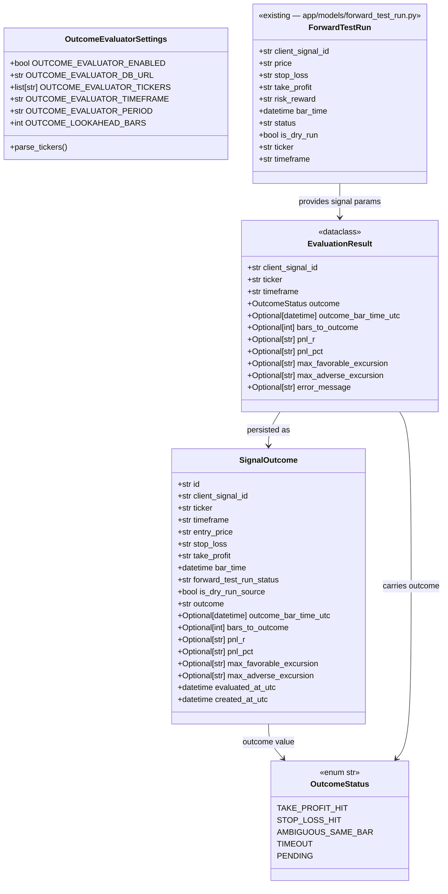

# V0.3b — Signal Outcome Evaluator

## Requirements

Build a standalone Python CLI tool (`src/outcome_evaluator/`) that reads signal records from `forward_test_runs`, downloads subsequent OHLCV bars via yfinance, evaluates whether each BUY signal reached its take-profit, stop-loss, or expired without resolution, and persists a complete audit trail of outcomes and PnL metrics in a new `signal_outcomes` table — without modifying any server component, without calling Alpaca, and without placing orders.

---

## Entities



**Notes on entities:**
- `SignalOutcome` stores `outcome` as a plain `String` column — same pattern as `Signal.status` and `ForwardTestRun.status`. `OutcomeStatus` enum lives in `src/outcome_evaluator/evaluator.py`.
- `EvaluationResult` is ephemeral — a `@dataclass`, no ORM. The CLI creates it from `evaluate_signal()` and maps it to `SignalOutcome`.
- `entry_price`, `stop_loss`, `take_profit`, `pnl_r` are stored as 4dp strings. `pnl_pct`, `max_favorable_excursion`, `max_adverse_excursion` as 6dp strings.
- `ForwardTestRun` is read-only from this package — never modified.
- `client_signal_id` is UNIQUE in `signal_outcomes` — one row per signal regardless of how many `forward_test_runs` rows share that ID.

---

## Approach

1. **Standalone package in `src/outcome_evaluator/`**:
   - Mirrors `src/forward_testing/` structure: `config.py`, `evaluator.py`, `cli.py`.
   - Invoked via `python -m src.outcome_evaluator.cli --once` or equivalent.
   - Never runs as a daemon. Cron/launchd provides the periodic scheduling.
   - Cross-boundary imports limited to `app/database.py` (for `Base`), `app/models/` (for `SignalOutcome`, `ForwardTestRun`), and `src/signal_generator/data_fetcher.py` (for `fetch_ohlcv`, `DataFetchError`). No imports from `app/services/`, `app/routers/`, `app/schemas/`, `app/risk/`, `app/repositories/`.

2. **Pure evaluator function**:
   - `evaluate_signal()` receives all inputs as arguments: signal parameters (entry_price, sl, tp, bar_time, risk_reward), pre-fetched DataFrame, and lookahead_bars.
   - Returns `EvaluationResult`. No DB, no network calls, no click.
   - The CLI layer owns: querying `forward_test_runs`, deduplicating by `client_signal_id`, fetching OHLCV (once per ticker), calling `evaluate_signal()`, and upserting `SignalOutcome`.

3. **One yfinance call per ticker**:
   - All signals for the same ticker share a single `fetch_ohlcv()` call per CLI run.
   - Signals are grouped by ticker before the evaluation loop to avoid rate limiting.
   - The downloaded DataFrame covers `period` days of history from now — the evaluator filters to bars strictly after each signal's `bar_time`.

4. **Idempotency strategy**:
   - Terminal outcomes (`take_profit_hit`, `stop_loss_hit`, `ambiguous_same_bar`, `timeout`) are never overwritten.
   - `pending` outcomes are re-evaluated on every run until they resolve to a terminal outcome.
   - Idempotency check precedes the yfinance fetch — terminal outcomes are skipped immediately without downloading data.

5. **Dry-run mode**:
   - `--dry-run` means "evaluate and print, but do not write to DB". No `signal_outcomes` rows are created or updated.
   - Note: `--dry-run` in the outcome evaluator is purely an output guard. It has no relation to `is_dry_run` in `forward_test_runs`.

6. **`--client-signal-id` mode**:
   - Bypasses all ticker filtering. Queries a single signal by `client_signal_id`.
   - If not found (or not evaluable), prints `no_candidate_found: <id>` and exits 0.
   - Useful for debugging individual signals.

---

## Structure

### Inheritance Relationships
1. `SignalOutcome` extends `Base` (`app/database.py` declarative base) — same pattern as all `app/models/` classes
2. `OutcomeStatus` extends `str, Enum` — same pattern as `RunStatus`, `SignalStatus`
3. `EvaluationResult` is a `@dataclass` (no inheritance) — same pattern as `RunResult`, `IndicatorResult`
4. `OutcomeEvaluatorSettings` extends `BaseSettings` (pydantic-settings) — same pattern as `ForwardTestingSettings`

### Dependencies
1. `cli.py` depends on `config.py`, `evaluator.py`
2. `cli.py` imports `Base` from `app/database.py`; imports `SignalOutcome` from `app/models/signal_outcome.py`; imports `ForwardTestRun` from `app/models/forward_test_run.py`; imports `app.models` (no-op side effect)
3. `cli.py` imports `fetch_ohlcv`, `DataFetchError` from `src.signal_generator.data_fetcher`
4. `evaluator.py` depends on `pandas` and `decimal` only — no app imports, no signal_generator imports
5. `config.py` depends on `pydantic-settings` only — no app imports
6. No file in `src/outcome_evaluator/` imports from `app/services/`, `app/routers/`, `app/schemas/`, `app/risk/`, or `app/repositories/`

### Layered Architecture
1. **CLI layer** (`cli.py`): DB init, `forward_test_runs` query, deduplication, ticker grouping, OHLCV fetch, evaluation loop, idempotency guard, upsert, echo, exit codes
2. **Config layer** (`config.py`): pydantic-settings, `.env` loading, ticker parsing
3. **Evaluator layer** (`evaluator.py`): pure `evaluate_signal()` function, `OutcomeStatus` enum, `EvaluationResult` dataclass, `TERMINAL_OUTCOMES` constant — no side effects
4. **DB model layer** (`app/models/signal_outcome.py`): SQLAlchemy ORM definition — imported by CLI for persistence

---

## Operations

### Create SQLAlchemy Model — `app/models/signal_outcome.py`

1. **Responsibility**: Define the `signal_outcomes` SQLite table that persists one evaluated outcome row per `client_signal_id`.

2. **Imports**: `datetime`, `timezone` from `datetime`; `Optional` from `typing`; `uuid4` from `uuid`; `Boolean`, `DateTime`, `Integer`, `String`, `UniqueConstraint` from `sqlalchemy`; `Mapped`, `mapped_column` from `sqlalchemy.orm`; `Base` from `app.database`.

3. **Define `class SignalOutcome(Base)`**:

   - `__tablename__ = "signal_outcomes"`
   - `__table_args__ = (UniqueConstraint("client_signal_id", name="uq_signal_outcomes_client_signal_id"),)`
   - `id: Mapped[str]` — `String`, primary key, `default=lambda: str(uuid4())`
   - `client_signal_id: Mapped[str]` — `String`, not nullable, `unique=True`, indexed
   - `ticker: Mapped[str]` — `String`, not nullable, indexed
   - `timeframe: Mapped[str]` — `String`, not nullable
   - `entry_price: Mapped[str]` — `String`, not nullable — 4dp string copied from `forward_test_runs.price`
   - `stop_loss: Mapped[str]` — `String`, not nullable — 4dp string
   - `take_profit: Mapped[str]` — `String`, not nullable — 4dp string
   - `bar_time: Mapped[datetime]` — `DateTime(timezone=True)`, not nullable — UTC start of entry bar
   - `forward_test_run_status: Mapped[str]` — `String`, not nullable — status from the source `forward_test_runs` row (e.g. `"risk_approved"`, `"signal_candidate"`)
   - `is_dry_run_source: Mapped[bool]` — `Boolean`, not nullable — `is_dry_run` from source row
   - `outcome: Mapped[str]` — `String`, not nullable — `OutcomeStatus` string value
   - `outcome_bar_time_utc: Mapped[Optional[datetime]]` — `DateTime(timezone=True)`, nullable — bar where outcome occurred; `None` for `pending`
   - `bars_to_outcome: Mapped[Optional[int]]` — `Integer`, nullable
   - `pnl_r: Mapped[Optional[str]]` — `String`, nullable — 4dp string; `None` for non-terminal or ambiguous outcomes
   - `pnl_pct: Mapped[Optional[str]]` — `String`, nullable — 6dp string; ratio `(exit - entry) / entry`
   - `max_favorable_excursion: Mapped[Optional[str]]` — `String`, nullable — 6dp string; `max(high - entry_price)` over evaluated bars; `None` if no bars
   - `max_adverse_excursion: Mapped[Optional[str]]` — `String`, nullable — 6dp string; `min(low - entry_price)` over evaluated bars; `None` if no bars
   - `evaluated_at_utc: Mapped[datetime]` — `DateTime(timezone=True)`, not nullable, updated on re-evaluation — `default=lambda: datetime.now(timezone.utc)`
   - `created_at_utc: Mapped[datetime]` — `DateTime(timezone=True)`, not nullable, immutable after insert — `default=lambda: datetime.now(timezone.utc)`

4. **Constraints**:
   - `client_signal_id` must be unique — enforced by both `unique=True` on the column and the `UniqueConstraint` in `__table_args__`.
   - No foreign key to `forward_test_runs` — correlation is via `client_signal_id` natural key only.
   - `ticker` indexed for ticker-based queries.

---

### Update App Models Registry — `app/models/__init__.py`

1. **Responsibility**: Register `SignalOutcome` in `Base.metadata` so `init_db()` and `create_all()` include the `signal_outcomes` table.

2. **Changes**: Add `from app.models.signal_outcome import SignalOutcome` import and add `"SignalOutcome"` to `__all__`.

3. **Result**: `app/models/__init__.py` after change:
   ```
   from app.models.signal import Signal
   from app.models.decision import RiskDecision
   from app.models.webhook_event import WebhookEvent
   from app.models.kill_switch import KillSwitchState
   from app.models.forward_test_run import ForwardTestRun
   from app.models.signal_outcome import SignalOutcome

   __all__ = ["Signal", "RiskDecision", "WebhookEvent", "KillSwitchState", "ForwardTestRun", "SignalOutcome"]
   ```

---

### Create Package Init — `src/outcome_evaluator/__init__.py`

1. **Responsibility**: Make `src/outcome_evaluator/` importable as a Python package.
2. **Content**: Empty file.

---

### Create Settings — `src/outcome_evaluator/config.py`

1. **Responsibility**: Load outcome evaluator configuration from environment / `.env`. Isolated from all other `Settings` classes. No secret required — the evaluator makes no HTTP calls.

2. **Imports**: `Any` from `typing`; `field_validator` from `pydantic`; `BaseSettings`, `SettingsConfigDict` from `pydantic_settings`.

3. **Define `class OutcomeEvaluatorSettings(BaseSettings)`**:

   Fields:
   - `OUTCOME_EVALUATOR_ENABLED: bool = False`
   - `OUTCOME_EVALUATOR_DB_URL: str = "sqlite:///./alpacaview.db"` — defaults to same file as server and forward tester
   - `OUTCOME_EVALUATOR_TICKERS: list[str] = ["SPY", "QQQ", "AAPL", "MSFT", "NVDA"]`
   - `OUTCOME_EVALUATOR_TIMEFRAME: str = "15m"`
   - `OUTCOME_EVALUATOR_PERIOD: str = "5d"` — yfinance lookback window
   - `OUTCOME_LOOKAHEAD_BARS: int = 26` — ≈ one full 15m session

4. **Add `parse_outcome_evaluator_tickers` field validator** (`mode="before"`, field `OUTCOME_EVALUATOR_TICKERS`):
   - If `str`: split on comma, strip whitespace, uppercase, discard empty.
   - If `list`: uppercase each item, discard empty.

5. **`model_config`**: `SettingsConfigDict(env_file=".env", env_file_encoding="utf-8", extra="ignore")`.

---

### Create Evaluator Module — `src/outcome_evaluator/evaluator.py`

1. **Responsibility**: Defines `OutcomeStatus` enum, `EvaluationResult` dataclass, `TERMINAL_OUTCOMES` constant, and pure `evaluate_signal()` function. No DB access, no network calls, no click, no sys.exit.

2. **Imports**: `dataclass` from `dataclasses`; `datetime`, `timezone` from `datetime`; `Decimal` from `decimal`; `Enum` from `enum`; `Optional` from `typing`; `pandas as pd`.

3. **Define `class OutcomeStatus(str, Enum)`**:
   - `TAKE_PROFIT_HIT = "take_profit_hit"` — high of a post-entry bar >= take_profit
   - `STOP_LOSS_HIT = "stop_loss_hit"` — low of a post-entry bar <= stop_loss
   - `AMBIGUOUS_SAME_BAR = "ambiguous_same_bar"` — same bar hits both tp and sl
   - `TIMEOUT = "timeout"` — lookahead_bars exhausted without a hit
   - `PENDING = "pending"` — insufficient future bars; re-evaluable

4. **Define `TERMINAL_OUTCOMES: frozenset[str]`**:
   ```
   TERMINAL_OUTCOMES = frozenset({
       OutcomeStatus.TAKE_PROFIT_HIT.value,
       OutcomeStatus.STOP_LOSS_HIT.value,
       OutcomeStatus.AMBIGUOUS_SAME_BAR.value,
       OutcomeStatus.TIMEOUT.value,
   })
   ```

5. **Define `@dataclass class EvaluationResult`**:
   - `client_signal_id: str`
   - `ticker: str`
   - `timeframe: str`
   - `outcome: OutcomeStatus`
   - `outcome_bar_time_utc: Optional[datetime] = None`
   - `bars_to_outcome: Optional[int] = None`
   - `pnl_r: Optional[str] = None` — 4dp string
   - `pnl_pct: Optional[str] = None` — 6dp string
   - `max_favorable_excursion: Optional[str] = None` — 6dp string
   - `max_adverse_excursion: Optional[str] = None` — 6dp string
   - `error_message: Optional[str] = None`

6. **Define `def evaluate_signal(client_signal_id, ticker, timeframe, entry_price, stop_loss, take_profit, bar_time, risk_reward, df, lookahead_bars) -> EvaluationResult`**:

   Full signatures:
   ```
   evaluate_signal(
       client_signal_id: str,
       ticker: str,
       timeframe: str,
       entry_price: Decimal,
       stop_loss: Decimal,
       take_profit: Decimal,
       bar_time: datetime,
       risk_reward: Optional[Decimal],
       df: pd.DataFrame,
       lookahead_bars: int,
   ) -> EvaluationResult
   ```

   Step 1 — Normalize `bar_time` to UTC-aware:
   - If `bar_time.tzinfo is None`: `bar_time = bar_time.replace(tzinfo=timezone.utc)`.
   - `bar_ts = pd.Timestamp(bar_time).tz_convert("UTC")`.

   Step 2 — Normalize df index to UTC-aware:
   - `df_index = df.index`
   - If `df_index.tzinfo is None`: `df_index = df_index.tz_localize("UTC")`
   - Build normalized copy: `norm_df = df.copy(); norm_df.index = df_index`

   Step 3 — Filter to bars strictly after entry bar:
   - `future_df = norm_df[norm_df.index > bar_ts]`
   - `eval_df = future_df.iloc[:lookahead_bars]`

   Step 4 — Edge case: `lookahead_bars == 0`:
   - Return `EvaluationResult(client_signal_id, ticker, timeframe, OutcomeStatus.TIMEOUT, bars_to_outcome=0)`

   Step 5 — Edge case: no bars in `future_df`:
   - Return `EvaluationResult(..., OutcomeStatus.PENDING, bars_to_outcome=0)`

   Step 6 — Iterate through `eval_df` rows to evaluate outcome:
   - Initialize: `mfe_val = None`, `mae_val = None`, `outcome = None`, `outcome_bar_time = None`, `bars_to_outcome_val = None`
   - For each `(i, (ts, bar))` in `enumerate(eval_df.iterrows())`:
     - `high = Decimal(str(float(bar["High"])))`
     - `low = Decimal(str(float(bar["Low"])))`
     - `favorable = high - entry_price`
     - `adverse = low - entry_price`
     - Update MFE: `mfe_val = favorable if mfe_val is None else max(mfe_val, favorable)`
     - Update MAE: `mae_val = adverse if mae_val is None else min(mae_val, adverse)`
     - Check outcome (ambiguous first):
       - If `high >= take_profit and low <= stop_loss`: `outcome = OutcomeStatus.AMBIGUOUS_SAME_BAR`
       - Elif `high >= take_profit`: `outcome = OutcomeStatus.TAKE_PROFIT_HIT`
       - Elif `low <= stop_loss`: `outcome = OutcomeStatus.STOP_LOSS_HIT`
     - If outcome found:
       - Convert `ts` to UTC-aware datetime: `outcome_bar_time = ts.to_pydatetime().astimezone(timezone.utc)` if `ts.tzinfo is not None` else `ts.to_pydatetime().replace(tzinfo=timezone.utc)`
       - `bars_to_outcome_val = i + 1`
       - `break`

   Step 7 — Determine final outcome if no event detected:
   - If `len(eval_df) >= lookahead_bars`:
     - `outcome = OutcomeStatus.TIMEOUT`
     - `bars_to_outcome_val = lookahead_bars`
     - Set `outcome_bar_time` = last bar in `eval_df` converted to UTC-aware datetime (same pattern as Step 6)
   - Else:
     - `outcome = OutcomeStatus.PENDING`
     - `bars_to_outcome_val = len(eval_df)`
     - `outcome_bar_time = None`

   Step 8 — Compute `pnl_r` and `pnl_pct`:
   - If `outcome == TAKE_PROFIT_HIT`:
     - `rr = risk_reward if risk_reward is not None else (take_profit - entry_price) / (entry_price - stop_loss)`
     - `pnl_r_str = f"{rr:.4f}"`
     - `pnl_pct_str = f"{(take_profit - entry_price) / entry_price:.6f}"`
   - Elif `outcome == STOP_LOSS_HIT`:
     - `pnl_r_str = "-1.0000"`
     - `pnl_pct_str = f"{(stop_loss - entry_price) / entry_price:.6f}"`
   - Else (`AMBIGUOUS_SAME_BAR`, `TIMEOUT`, `PENDING`):
     - `pnl_r_str = None`, `pnl_pct_str = None`

   Step 9 — Format MFE/MAE:
   - `mfe_str = f"{mfe_val:.6f}" if mfe_val is not None else None`
   - `mae_str = f"{mae_val:.6f}" if mae_val is not None else None`

   Step 10 — Return:
   ```
   return EvaluationResult(
       client_signal_id=client_signal_id,
       ticker=ticker,
       timeframe=timeframe,
       outcome=outcome,
       outcome_bar_time_utc=outcome_bar_time,
       bars_to_outcome=bars_to_outcome_val,
       pnl_r=pnl_r_str,
       pnl_pct=pnl_pct_str,
       max_favorable_excursion=mfe_str,
       max_adverse_excursion=mae_str,
   )
   ```

7. **Constraints**:
   - Never call `sys.exit()`, `click.echo()`, `requests.*`, or any DB operation.
   - Check ambiguous_same_bar BEFORE individual tp/sl checks (first `if`, not `elif`).
   - All `Decimal` arithmetic uses `Decimal` operands — never `float`.
   - `bar_time` in the DataFrame comparison must be timezone-aligned with `bar_ts`.

---

### Create CLI Entry Point — `src/outcome_evaluator/cli.py`

1. **Responsibility**: click CLI that owns DB init, source signal querying, deduplication, ticker grouping, OHLCV fetch, evaluation loop, idempotency guard, DB upsert, stdout echo, and exit code calculation.

2. **Imports**: `sys` from stdlib; `collections.defaultdict`; `datetime`, `timezone` from `datetime`; `Decimal` from `decimal`; `Optional` from `typing`; `click`; `sqlalchemy.create_engine`; `sqlalchemy.exc.IntegrityError`; `sqlalchemy.orm.sessionmaker`; `import app.models` (no-op, registers all models); `Base` from `app.database`; `ForwardTestRun` from `app.models.forward_test_run`; `SignalOutcome` from `app.models.signal_outcome`; `fetch_ohlcv`, `DataFetchError` from `src.signal_generator.data_fetcher`; `evaluate_signal`, `EvaluationResult`, `OutcomeStatus`, `TERMINAL_OUTCOMES` from `src.outcome_evaluator.evaluator`; `OutcomeEvaluatorSettings` from `src.outcome_evaluator.config`.

3. **Define constant `EVALUABLE_STATUSES: tuple[str, ...]`**:
   ```
   EVALUABLE_STATUSES = ("signal_candidate", "risk_approved", "risk_rejected", "duplicate_signal")
   ```

4. **Define `@click.command() def main(...)`** with options:
   - `--once`: `is_flag=True`, default `False` — no-op documentation flag.
   - `--tickers`: `default=None` — comma-separated, overrides `OUTCOME_EVALUATOR_TICKERS`.
   - `--timeframe`: `default=None` — overrides `OUTCOME_EVALUATOR_TIMEFRAME`.
   - `--period`: `default=None` — overrides `OUTCOME_EVALUATOR_PERIOD`.
   - `--lookahead-bars` (Python name `lookahead_bars`): `type=int`, `default=None` — overrides `OUTCOME_LOOKAHEAD_BARS`.
   - `--include-dry-run` (Python name `include_dry_run`): `is_flag=True`, default `False`.
   - `--client-signal-id` (Python name `client_signal_id`): `default=None`.
   - `--dry-run` (Python name `dry_run`): `is_flag=True`, default `False` — evaluate but do not write to DB.

5. **`main()` body**:
   1. `settings = OutcomeEvaluatorSettings()`.
   2. If `not settings.OUTCOME_EVALUATOR_ENABLED`: echo disabled message, `sys.exit(0)`.
   3. `engine, Session = _init_db(settings.OUTCOME_EVALUATOR_DB_URL)`.
   4. `db_session = Session()`.
   5. `resolved_tickers = _parse_tickers(tickers) or settings.OUTCOME_EVALUATOR_TICKERS`.
   6. `resolved_timeframe = timeframe or settings.OUTCOME_EVALUATOR_TIMEFRAME`.
   7. `resolved_period = period or settings.OUTCOME_EVALUATOR_PERIOD`.
   8. `resolved_lookahead = lookahead_bars if lookahead_bars is not None else settings.OUTCOME_LOOKAHEAD_BARS`.
   9. Source signals:
      - If `client_signal_id` is not None:
        - `source_rows = _query_single_signal(db_session, client_signal_id, include_dry_run)`
        - If empty: `click.echo(f"no_candidate_found: {client_signal_id}")`, `db_session.close()`, `sys.exit(0)`.
      - Else:
        - `source_rows = _query_signals(db_session, resolved_tickers, include_dry_run)`.
   10. Group by ticker: `by_ticker = defaultdict(list); for row in source_rows: by_ticker[row.ticker].append(row)`.
   11. `has_error = False`.
   12. For each `(ticker, ticker_rows)` in `by_ticker.items()`:
       - Ticker-level idempotency pre-filter: `pending_rows = [r for r in ticker_rows if not _is_terminal_in_db(db_session, r.client_signal_id)]`. If `pending_rows` is empty, call `_echo_skipped(r.client_signal_id)` for each row and `continue` — avoids a yfinance fetch for fully resolved tickers.
       - Try: `df = fetch_ohlcv(ticker, resolved_period, resolved_timeframe)`.
         On `DataFetchError`: `click.echo(f"[{ticker}] fetch failed: {exc}", err=True)`, `has_error = True`, `continue`.
         On any other exception: same pattern.
       - For each `row` in `ticker_rows`:
         - `existing = _get_existing_outcome(db_session, row.client_signal_id)`
         - If `existing` and `existing.outcome in TERMINAL_OUTCOMES`: `_echo_skipped(row.client_signal_id)`, `continue`.
         - Try: call `evaluate_signal(client_signal_id=row.client_signal_id, ticker=row.ticker, timeframe=row.timeframe, entry_price=Decimal(row.entry_price), stop_loss=Decimal(row.stop_loss), take_profit=Decimal(row.take_profit), bar_time=row.bar_time, risk_reward=Decimal(row.risk_reward) if row.risk_reward else None, df=df, lookahead_bars=resolved_lookahead)`.
           On exception: `click.echo(f"[{row.client_signal_id}] eval error: {exc}", err=True)`, `has_error = True`, `continue`.
         - `_echo_result(eval_result)`.
         - If not `dry_run`:
           - Try: `_upsert(db_session, eval_result, row, existing)`.
             On exception: `click.echo(f"[{row.client_signal_id}] DB write failed: {exc}", err=True)`, `has_error = True`.
   13. `db_session.close()`.
   14. `sys.exit(1 if has_error else 0)`.

   **Note on `entry_price`**: The CLI reads `row.price` from `ForwardTestRun` and passes it as `entry_price` to both `evaluate_signal()` and the `SignalOutcome.entry_price` field.

6. **Define `def _init_db(db_url: str) -> tuple`** (identical pattern to `forward_testing/cli.py`):
   - `connect_args = {"check_same_thread": False} if "sqlite" in db_url else {}`
   - `engine = create_engine(db_url, connect_args=connect_args)`
   - `Base.metadata.create_all(bind=engine)` — idempotent
   - `Session = sessionmaker(autocommit=False, autoflush=False, bind=engine)`
   - Return `(engine, Session)`.

7. **Define `def _query_signals(session, tickers: list[str], include_dry_run: bool) -> list[ForwardTestRun]`**:
   - Query `ForwardTestRun` with filters:
     - `client_signal_id IS NOT NULL`
     - `price IS NOT NULL`
     - `stop_loss IS NOT NULL`
     - `take_profit IS NOT NULL`
     - `bar_time IS NOT NULL`
     - `status IN EVALUABLE_STATUSES`
     - `ticker IN tickers`
     - If `not include_dry_run`: `is_dry_run == False`
   - Sort by `created_at_utc` ascending.
   - Deduplicate in Python: keep first occurrence per `client_signal_id`.
   - Return deduplicated list.

8. **Define `def _query_single_signal(session, client_signal_id: str, include_dry_run: bool) -> list[ForwardTestRun]`**:
   - Query `ForwardTestRun` with same field-presence and status filters as `_query_signals`, but with `client_signal_id == client_signal_id` (no ticker filter).
   - Apply `include_dry_run` filter.
   - Return first qualifying row (by `created_at_utc`) as a single-item list, or empty list if not found.

9. **Define `def _get_existing_outcome(session, client_signal_id: str) -> Optional[SignalOutcome]`**:
   - `return session.query(SignalOutcome).filter_by(client_signal_id=client_signal_id).first()`

9.5. **Define `def _is_terminal_in_db(session, client_signal_id: str) -> bool`** (ticker-level pre-filter helper):
   - `existing = _get_existing_outcome(session, client_signal_id)`
   - `return existing is not None and existing.outcome in TERMINAL_OUTCOMES`
   - Used by `main()` to skip the yfinance fetch for a ticker whose signals are all already resolved.

10. **Define `def _upsert(session, eval_result: EvaluationResult, source_row: ForwardTestRun, existing: Optional[SignalOutcome]) -> None`**:
    - If `existing is None`:
      - Construct `SignalOutcome` from `eval_result` + `source_row` fields.
      - `session.add(row)`, `session.commit()`.
      - On `IntegrityError`: `session.rollback()`, re-raise (duplicate insert in concurrent run — handled at call site).
    - Elif `existing.outcome == OutcomeStatus.PENDING.value`:
      - Update all mutable fields: `existing.outcome`, `existing.outcome_bar_time_utc`, `existing.bars_to_outcome`, `existing.pnl_r`, `existing.pnl_pct`, `existing.max_favorable_excursion`, `existing.max_adverse_excursion`, `existing.evaluated_at_utc = datetime.now(timezone.utc)`.
      - `session.commit()`.
    - Else:
      - Terminal outcome — do not modify. Return silently.

11. **Define `def _echo_result(eval_result: EvaluationResult) -> None`**:
    - `TAKE_PROFIT_HIT`: one-line summary with `pnl_r`, `pnl_pct`, `bars_to_outcome`.
    - `STOP_LOSS_HIT`: one-line summary with `pnl_r`, `pnl_pct`, `bars_to_outcome`.
    - `AMBIGUOUS_SAME_BAR`: one-line summary with `bars_to_outcome`.
    - `TIMEOUT`: one-line summary with `bars_to_outcome`.
    - `PENDING`: one-line summary with `bars_to_outcome`.

12. **Define `def _echo_skipped(client_signal_id: str) -> None`**:
    - `click.echo(f"[{client_signal_id}] skipped: terminal outcome already recorded")`

13. **Define `def _parse_tickers(tickers_str: Optional[str]) -> Optional[list[str]]`**:
    - If `None`: return `None`.
    - Split on comma, strip, uppercase, discard empty.

14. **`if __name__ == "__main__": main()`** at bottom.

15. **Constraints**:
    - Never write to `forward_test_runs` — read-only.
    - `sys.exit(1)` only for technical errors (fetch failure, eval exception, DB write failure). `pending`, `timeout`, `take_profit_hit`, `stop_loss_hit`, `ambiguous_same_bar`, and `no_candidate_found` are not errors.

---

### Update `.env.example`

1. **Append after the Forward Testing block**:
   ```
   # Outcome Evaluator (V0.3b) — standalone CLI, schedule via cron or launchd
   OUTCOME_EVALUATOR_ENABLED=false
   OUTCOME_EVALUATOR_DB_URL=sqlite:///./alpacaview.db
   OUTCOME_EVALUATOR_TICKERS=SPY,QQQ,AAPL,MSFT,NVDA
   OUTCOME_EVALUATOR_TIMEFRAME=15m
   OUTCOME_EVALUATOR_PERIOD=5d
   OUTCOME_LOOKAHEAD_BARS=26
   ```

---

### Create Evaluator Unit Tests — `tests/test_outcome_evaluator_evaluator.py`

1. **Responsibility**: Pure unit tests for `evaluate_signal()`. No network, no DB. All DataFrames injected as synthetic pandas DataFrames.

2. **Test helper `make_df(rows: list[dict]) -> pd.DataFrame`**: Build a UTC-aware DatetimeIndex DataFrame with `High`, `Low`, `Close` columns.
   - Each row dict: `{"ts": datetime, "high": float, "low": float, "close": float}`.
   - Index = UTC-aware timestamps.

3. **Test helper `make_signal(**overrides)`**: default `entry_price=Decimal("450.0000")`, `stop_loss=Decimal("447.0000")`, `take_profit=Decimal("456.0000")`, `risk_reward=Decimal("2.0000")`, `bar_time=BASE_BAR_TIME` (2026-05-20T14:30:00Z).

4. **Test cases**:
   - `test_take_profit_hit_on_first_bar`: one bar with `high=456.50` → `TAKE_PROFIT_HIT`, `bars_to_outcome=1`.
   - `test_stop_loss_hit_on_first_bar`: one bar with `low=446.50` → `STOP_LOSS_HIT`, `bars_to_outcome=1`.
   - `test_ambiguous_same_bar`: one bar with `high=456.50, low=446.50` → `AMBIGUOUS_SAME_BAR`, no PnL.
   - `test_take_profit_hit_on_third_bar`: two neutral bars then tp bar → `bars_to_outcome=3`.
   - `test_timeout_when_lookahead_exhausted`: exactly 26 bars, no hit → `TIMEOUT`, `bars_to_outcome=26`, `outcome_bar_time_utc = last bar time`.
   - `test_pending_when_insufficient_bars`: 5 bars, lookahead=26, no hit → `PENDING`, `bars_to_outcome=5`, `outcome_bar_time_utc=None`.
   - `test_empty_dataframe_returns_pending`: empty df → `PENDING`, `bars_to_outcome=0`.
   - `test_lookahead_zero_returns_timeout`: lookahead=0 → `TIMEOUT`, `bars_to_outcome=0`.
   - `test_entry_bar_excluded`: entry bar itself has `high=456.50`; only one post-entry bar has `high=451` (below tp) → `PENDING` (entry bar not counted).
   - `test_pnl_r_take_profit_hit`: entry=450, sl=447, tp=456, rr=2.0 → `pnl_r="2.0000"`.
   - `test_pnl_r_stop_loss_hit`: → `pnl_r="-1.0000"`.
   - `test_pnl_pct_take_profit_hit`: (456-450)/450 = 0.013333... → `pnl_pct` starts with "0.013333".
   - `test_pnl_pct_stop_loss_hit`: (447-450)/450 = -0.006667... → `pnl_pct` starts with "-0.006667".
   - `test_pnl_null_for_ambiguous`: `pnl_r=None`, `pnl_pct=None`.
   - `test_pnl_null_for_timeout`: `pnl_r=None`, `pnl_pct=None`.
   - `test_pnl_null_for_pending`: `pnl_r=None`, `pnl_pct=None`.
   - `test_mfe_is_max_high_minus_entry`: 3 bars with highs [451, 453, 452] → `mfe = "3.0000"` (453-450).
   - `test_mae_is_min_low_minus_entry`: 3 bars with lows [449, 448, 449] → `mae = "-2.0000"` (448-450).
   - `test_mfe_mae_null_when_no_bars`: empty post-entry df → `mfe=None`, `mae=None`.
   - `test_mfe_mae_populated_for_pending`: partial bars → partial excursion values stored.
   - `test_mfe_stops_at_outcome_bar`: outcome detected at bar 2 → MFE/MAE only up to bar 2.
   - `test_timezone_naive_df_handled`: naive-indexed df → no TypeError.
   - `test_risk_reward_fallback_recomputed`: `risk_reward=None` passed → `pnl_r` computed from tp/price/sl.

---

### Create CLI Unit Tests — `tests/test_outcome_evaluator_cli.py`

1. **Responsibility**: CliRunner tests for all CLI flags, exit codes, idempotency paths. No real network, no real DB. All external calls mocked.

2. **Patch targets**: `src.outcome_evaluator.cli.OutcomeEvaluatorSettings`, `src.outcome_evaluator.cli.fetch_ohlcv`, `src.outcome_evaluator.cli.evaluate_signal`, `src.outcome_evaluator.cli._init_db`, `src.outcome_evaluator.cli._query_signals`, `src.outcome_evaluator.cli._query_single_signal`, `src.outcome_evaluator.cli._get_existing_outcome`, `src.outcome_evaluator.cli._upsert`.

3. **Test cases**:
   - `test_disabled_exits_0`: `OUTCOME_EVALUATOR_ENABLED=False` → exit 0.
   - `test_no_signals_exits_0`: `_query_signals` returns empty list → exit 0.
   - `test_take_profit_hit_exits_0`: `evaluate_signal` returns `TAKE_PROFIT_HIT` result → exit 0.
   - `test_error_exits_1`: `fetch_ohlcv` raises `DataFetchError` → exit 1.
   - `test_terminal_outcome_skipped`: `_get_existing_outcome` returns `TAKE_PROFIT_HIT` row → `_upsert` not called, exit 0.
   - `test_pending_outcome_reevaluated`: `_get_existing_outcome` returns `PENDING` row → `_upsert` called.
   - `test_dry_run_does_not_call_upsert`: `--dry-run` → `_upsert` never called.
   - `test_once_flag_is_no_op`: `--once --dry-run` → same as `--dry-run`.
   - `test_include_dry_run_flag_passed_to_query`: `--include-dry-run` → `_query_signals` called with `include_dry_run=True`.
   - `test_client_signal_id_calls_single_query`: `--client-signal-id foo` → `_query_single_signal` called, not `_query_signals`.
   - `test_client_signal_id_not_found_exits_0`: `_query_single_signal` returns empty → echo `no_candidate_found`, exit 0.
   - `test_lookahead_bars_override`: `--lookahead-bars 10` → `evaluate_signal` called with `lookahead_bars=10`.
   - `test_tickers_flag_override`: `--tickers NVDA` → `_query_signals` called with `["NVDA"]`.
   - `test_multiple_tickers_one_fetch_per_ticker`: two tickers → `fetch_ohlcv` called twice.
   - `test_upsert_failure_exits_1`: `_upsert` raises exception → exit 1, remaining signals still processed.

---

### Create Integration Tests — `tests/test_outcome_evaluator_integration.py`

1. **Responsibility**: End-to-end tests using a real in-memory SQLite DB (StaticPool) and mocked yfinance. Verifies that `SignalOutcome` rows are actually written, updated, and idempotency is enforced.

2. **Fixtures**: `mem_db` (StaticPool in-memory SQLite with `Base.metadata.create_all()`), seeded `ForwardTestRun` rows.

3. **Test cases**:
   - `test_take_profit_hit_row_written`: invoke CLI with `--send`-equivalent; mock `evaluate_signal` returns `TAKE_PROFIT_HIT`; assert one `signal_outcomes` row with `outcome="take_profit_hit"`.
   - `test_pending_row_written_on_insufficient_bars`: mock `evaluate_signal` returns `PENDING`; assert row has `outcome="pending"`, `outcome_bar_time_utc=None`.
   - `test_pending_row_updated_on_re_evaluation`: first run writes `pending`; second run with more bars returns `TAKE_PROFIT_HIT`; assert row now has `outcome="take_profit_hit"`.
   - `test_terminal_outcome_not_overwritten`: existing `take_profit_hit` row; second run attempts evaluation; assert row unchanged.
   - `test_dry_run_does_not_write_row`: `--dry-run` flag; assert no rows in `signal_outcomes`.
   - `test_client_signal_id_not_found_exits_0`: signal not in `forward_test_runs`; assert exit 0, no crash.
   - `test_idempotency_same_signal_evaluated_twice`: two CLI runs for same signal; assert only one row in `signal_outcomes`.
   - `test_signal_outcomes_table_created_by_init_db`: fresh in-memory DB; CLI startup → `signal_outcomes` table exists.

---

### Create Documentation — `docs/validation/v0.3b-validation.md`

1. **Responsibility**: Operator-facing guide for the outcome evaluator CLI.

2. **Sections**:
   - Overview: purpose (evaluate actual price outcomes for forward-tested signals, build PnL audit trail)
   - Quickstart: enable flag, run once, example commands
   - CLI flags reference: all 8 flags with types, defaults, and behavior
   - `OutcomeStatus` reference: all 5 statuses with definition, terminal vs. non-terminal, exit code contribution
   - `signal_outcomes` schema: all columns with types, nullability, and description
   - PnL formulas: exact formulas for `pnl_r` and `pnl_pct` per outcome type
   - MFE/MAE semantics: definition, units, per-outcome behavior
   - Idempotency contract: terminal outcomes immutable, pending re-evaluable
   - `--period` and data availability: how to handle old signals, when to increase `--period`
   - `--client-signal-id` mode: usage and behavior
   - Dry-run mode: what gets printed, what does not get written
   - Scheduling with cron: example crontab entry
   - Scheduling with launchd: example plist snippet

---

## Norms

1. **Typed Python**: Full type annotations on all functions and dataclass fields. `Optional[X]` not `X | None`. `Decimal` for all price arithmetic (never `float`).

2. **Allowed cross-boundary imports**: `src/outcome_evaluator/` may only import from `app/database.py`, `app/models/signal_outcome.py`, `app/models/forward_test_run.py`, and `src/signal_generator/data_fetcher.py`. No imports from `app/services/`, `app/routers/`, `app/schemas/`, `app/risk/`, `app/repositories/`, or `src/forward_testing/`.

3. **`extra="ignore"` on all BaseSettings subclasses**: `OutcomeEvaluatorSettings` must use `SettingsConfigDict(extra="ignore")` because the shared `.env` file contains variables from the server, signal generator, and forward tester.

4. **Pure evaluator**: `evaluate_signal()` must have no side effects. No `sys.exit()`, no `click.echo()`, no DB access, no `fetch_ohlcv()`. All inputs are injected as arguments. This enables full unit testing via synthetic DataFrames.

5. **One yfinance call per ticker**: The CLI must group signals by ticker and call `fetch_ohlcv()` once per ticker per run. Never call `fetch_ohlcv()` inside the per-signal loop.

6. **Ambiguous check before individual checks**: In `evaluate_signal()`, always check `high >= take_profit AND low <= stop_loss` before checking each condition separately. The `if tp_and_sl: ambiguous` branch must precede `elif tp: take_profit_hit` and `elif sl: stop_loss_hit`.

7. **Terminal outcomes are immutable**: Once `take_profit_hit`, `stop_loss_hit`, `ambiguous_same_bar`, or `timeout` is written to `signal_outcomes`, `_upsert` must never change it. Only `pending` rows may be updated.

8. **Decimal precision rules**:
   - `entry_price`, `stop_loss`, `take_profit`, `pnl_r`: stored as 4dp strings (`f"{val:.4f}"`).
   - `pnl_pct`, `max_favorable_excursion`, `max_adverse_excursion`: stored as 6dp strings (`f"{val:.6f}"`).

9. **Exit code semantics**: 0 = all signals processed (including `pending`, `timeout`, `take_profit_hit`, `stop_loss_hit`, `ambiguous_same_bar`, `no_candidate_found`). 1 = at least one `DataFetchError`, eval exception, or DB write failure.

10. **No secret in output**: `OUTCOME_EVALUATOR_DB_URL` must never appear in any `click.echo()` or error message. (No secret field exists, but DB URL may contain credentials in production — guard against printing it.)

---

## Safeguards

1. **No server modification**: `app/routers/`, `app/services/`, `app/risk/`, `app/schemas/`, `app/repositories/`, and `app/models/signal.py` must not be touched. The existing test suite must pass 100% after V0.3b is added.

2. **`OUTCOME_EVALUATOR_ENABLED=false` hard gate**: The CLI must check this flag as the very first action after loading settings. If false, echo disabled message and exit 0 — before DB init, before any query.

3. **No Alpaca imports**: `src/outcome_evaluator/` must contain zero imports from any Alpaca library.

4. **No orders**: The evaluator reads data and writes analysis results only. It never calls `/webhook/signal`, never creates `Signal` or `RiskDecision` rows, never modifies `forward_test_runs`.

5. **`--once` is a no-op**: Accepted for cron/launchd readability. Must not start a loop, scheduler, or background thread.

6. **`--dry-run` never writes to DB**: If `dry_run=True`, `_upsert` must not be called for any signal. This must be checked in `main()` before calling `_upsert`, not inside `_upsert`.

7. **Terminal outcome immutability**: `_upsert` must check `existing.outcome in TERMINAL_OUTCOMES` and silently return without any DB modification. This constraint applies even if called concurrently.

8. **Entry bar exclusion**: The DataFrame filter `norm_df.index > bar_ts` must use strict `>`, not `>=`. The entry bar must never be included in the evaluation window.

9. **`client_signal_id` unique in `signal_outcomes`**: Enforced by `unique=True` on the column and a named `UniqueConstraint` in `__table_args__`. On `IntegrityError` during INSERT, roll back and re-raise — do not silently swallow.

10. **Acceptance Criteria Traceability**:

    | AC# | Requirement | Covered By |
    |-----|-------------|------------|
    | 1 | Read `forward_test_runs` with non-null signal fields | `_query_signals` filter |
    | 2 | Evaluable statuses: signal_candidate, risk_approved, risk_rejected, duplicate_signal | `EVALUABLE_STATUSES` constant |
    | 3 | Exclude non-evaluable statuses | `EVALUABLE_STATUSES` whitelist |
    | 4 | Default exclude `is_dry_run=true`; `--include-dry-run` overrides | `_query_signals` filter + CLI flag |
    | 5 | Download bars via yfinance | `fetch_ohlcv()` in CLI, grouped by ticker |
    | 6 | `take_profit_hit` when `high >= take_profit` | `evaluate_signal()` Step 6 |
    | 7 | `stop_loss_hit` when `low <= stop_loss` | `evaluate_signal()` Step 6 |
    | 8 | `ambiguous_same_bar` when same bar hits both | `evaluate_signal()` Step 6, checked first |
    | 9 | `timeout` after `OUTCOME_LOOKAHEAD_BARS` | `evaluate_signal()` Step 7 |
    | 10 | `pending` when insufficient future bars | `evaluate_signal()` Step 7 |
    | 11 | Skip entry bar | strict `>` filter in `evaluate_signal()` Step 3 |
    | 12 | `signal_outcomes` table | `app/models/signal_outcome.py` |
    | 13 | Idempotency: skip terminal, re-evaluate pending | `_get_existing_outcome()` + `_upsert()` |
    | 14 | `outcome`, `outcome_bar_time_utc`, `bars_to_outcome` | `EvaluationResult` + `SignalOutcome` |
    | 15 | `pnl_r`, `pnl_pct` | `evaluate_signal()` Step 8 |
    | 16 | `max_favorable_excursion`, `max_adverse_excursion` | `evaluate_signal()` Step 6 accumulation |
    | 17 | CLI `python -m src.outcome_evaluator.cli --once` | `src/outcome_evaluator/cli.py` |
    | 18 | All 8 CLI flags | click options in `main()` |
    | 19 | `--dry-run`: print, no write | `if not dry_run: _upsert(...)` guard |
    | 20 | No `/webhook/signal` modification | no imports from `app/routers/` |
    | 21 | No Alpaca | no Alpaca imports |
    | 22 | No orders | evaluator is read + analyse only |
    | 23 | Unit + integration tests | 3 test files, 40+ test cases |
    | 24 | `docs/validation/v0.3b-validation.md` | operator guide |
    | D1 | `--period` = yfinance lookback, default 5d | `OutcomeEvaluatorSettings.OUTCOME_EVALUATOR_PERIOD` |
    | D2 | Dedup by `client_signal_id`, first by `created_at_utc` | `_query_signals()` Python dedup |
    | D3 | pnl_r/pnl_pct formulas per outcome | `evaluate_signal()` Step 8 |
    | D4 | `outcome_bar_time_utc` semantics | `evaluate_signal()` Step 6 & 7 |
    | D5 | MFE/MAE 6dp, partial for pending | `evaluate_signal()` Step 6 & 9 |
    | D6 | `bars_to_outcome` semantics | `evaluate_signal()` Step 6 & 7 |
    | D7 | `--client-signal-id` bypasses tickers | `_query_single_signal()` path in `main()` |
