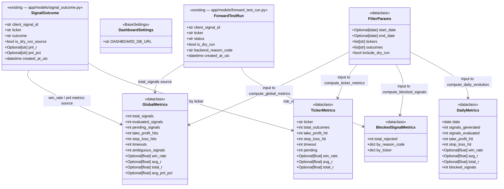

# V0.4 — Streamlit Reporting Dashboard

## Requirements

Build a multi-page Streamlit dashboard (`dashboard/streamlit_app.py`) that reads data directly from SQLite via a standalone `src/reporting/` package, computes trading metrics (global, per-ticker, blocked signals, daily evolution) through pure testable functions, and renders 5 interactive pages with sidebar filters — without touching the FastAPI server, Alpaca, or order execution.

---

## Entities



**Notes on entities:**
- `FilterParams`, `GlobalMetrics`, `TickerMetrics`, `BlockedSignalMetrics`, `DailyMetrics` are all `@dataclass` — ephemeral, no ORM.
- `DashboardSettings` reads from `.env` with `extra="ignore"` to tolerate other tools' variables.
- `ForwardTestRun` and `SignalOutcome` are read-only from the reporting layer — never modified.
- `total_signals` uses DISTINCT `client_signal_id` from `forward_test_runs`; all PnL/outcome metrics use `signal_outcomes`.
- `GlobalMetrics.total_signals` and outcome-based metrics are filtered by their respective tables' `created_at_utc`; a signal generated on Day 1 and evaluated on Day 2 will appear in different date buckets for each metric.

---

## Approach

1. **Standalone `src/reporting/` package**:
   - Mirrors `src/forward_testing/` and `src/outcome_evaluator/` structure: `config.py`, `db.py`, `metrics.py`.
   - No Streamlit imports. No `sys.exit()`. No click. No `app/routers/` imports.
   - Pure functions: `compute_global_metrics(session, filters)`, `compute_ticker_metrics(session, filters)`, `compute_blocked_signals(session, filters)`, `compute_daily_evolution(session, filters)`.
   - Allowed cross-boundary imports: `app/models/forward_test_run.py`, `app/models/signal_outcome.py`, `app/database.py` (for `Base` only if needed). No `app/services/`, `app/routers/`, `app/risk/`.

2. **`dashboard/` entry point and pages**:
   - `dashboard/streamlit_app.py`: path bootstrap → `st.set_page_config()` → cached settings + engine → `st.session_state` (dual keys) → informational sidebar (DB URL + clear-cache button) → missing-pages guard → `st.navigation()` → `navigation.run()`. No global filter widgets — filters are per-page.
   - `dashboard/pages/`: 5 page modules, each reads `st.session_state["engine"]` and manages its own `FilterParams` (defaults to `FilterParams()` when `st.session_state["filters"]` is not set), calls `src.reporting.metrics` functions, renders.
   - Two separate `@st.cache_resource` functions: `load_dashboard_settings()` (returns `DashboardSettings()`) and `load_reporting_engine()` (calls `get_reporting_engine()` with try/except TypeError fallback).
   - Short-lived sessions: each page render creates and closes a session via `get_reporting_session(engine)`.

3. **Metric computation strategy**:
   - `total_signals`: `COUNT(DISTINCT client_signal_id)` from `forward_test_runs` WHERE `status IN EVALUABLE_STATUSES`.
   - `evaluated_signals`: `COUNT(*)` from `signal_outcomes` WHERE `outcome IN TERMINAL_OUTCOMES`.
   - `pending_signals`: `COUNT(*)` from `signal_outcomes` WHERE `outcome = 'pending'`.
   - `win_rate`: `take_profit_hits / (take_profit_hits + stop_loss_hits)`; `None` when denominator is 0.
   - `avg_r`, `total_r`: fetch non-null `pnl_r` strings, parse to `float`, compute in Python.
   - `avg_pnl_pct`: same as above for `pnl_pct`.
   - Blocked signals: `forward_test_runs` WHERE `status = 'risk_rejected'`, grouped by `backend_reason_code` and `ticker`.
   - Daily evolution: separate GROUP BY queries on `DATE(created_at_utc)` for `forward_test_runs` and `signal_outcomes`, merged by date in Python.

4. **No FastAPI dependency**: dashboard instantiates its own engine from `DashboardSettings.DASHBOARD_DB_URL`. Does NOT call `get_db()`, does NOT import `app/main.py`.

5. **Plotly charts**: `plotly.express` for bar charts, line charts. Already in `requirements.txt`.

---

## Structure

### Inheritance Relationships
1. `DashboardSettings` extends `BaseSettings` (pydantic-settings) — same pattern as `ForwardTestingSettings`, `OutcomeEvaluatorSettings`
2. `FilterParams`, `GlobalMetrics`, `TickerMetrics`, `BlockedSignalMetrics`, `DailyMetrics` are `@dataclass` (no inheritance) — same pattern as `RunResult`, `EvaluationResult`

### Dependencies
1. `src/reporting/metrics.py` imports `ForwardTestRun` from `app.models.forward_test_run` and `SignalOutcome` from `app.models.signal_outcome`
2. `src/reporting/db.py` imports `DashboardSettings` from `src.reporting.config`
3. `dashboard/streamlit_app.py` imports `DashboardSettings` from `src.reporting.config` and `get_reporting_engine` from `src.reporting.db` — does NOT import `get_reporting_session`, `FilterParams`, or `get_available_tickers`
4. `dashboard/pages/*.py` imports metric functions from `src.reporting.metrics`; each page reads `engine` from `st.session_state["engine"]` and manages its own `FilterParams`
5. No file in `src/reporting/` or `dashboard/` imports from `app/services/`, `app/routers/`, `app/risk/`, `app/schemas/`, `app/repositories/`

### Layered Architecture
1. **Config layer** (`src/reporting/config.py`): pydantic-settings, `.env` loading
2. **DB layer** (`src/reporting/db.py`): engine factory + session context manager
3. **Metrics layer** (`src/reporting/metrics.py`): pure metric functions + dataclasses, no UI
4. **UI entry point** (`dashboard/streamlit_app.py`): page config, cached engine, sidebar filters, navigation
5. **UI pages** (`dashboard/pages/`): render-only modules, consume metrics layer

---

## Operations

### Create Package Init — `src/reporting/__init__.py`

1. **Responsibility**: Make `src/reporting/` importable as a Python package.
2. **Content**: Empty file.

---

### Create Settings — `src/reporting/config.py`

1. **Responsibility**: Load dashboard configuration from environment / `.env`. No secret required — the dashboard is read-only.

2. **Imports**: `BaseSettings`, `SettingsConfigDict` from `pydantic_settings`.

3. **Define `class DashboardSettings(BaseSettings)`**:
   - `DASHBOARD_DB_URL: str = "sqlite:///./alpacaview.db"` — defaults to same file as server and forward tester

4. **`model_config`**: `SettingsConfigDict(env_file=".env", env_file_encoding="utf-8", extra="ignore")`.

---

### Create DB Module — `src/reporting/db.py`

1. **Responsibility**: Engine factory and short-lived session context manager for the reporting layer.

2. **Imports**: `contextlib.contextmanager`; `typing.Generator`; `sqlalchemy.create_engine`; `sqlalchemy.orm.sessionmaker`, `Session`.

3. **Define `def get_reporting_engine(db_url: str)`**:
   - `connect_args = {"check_same_thread": False} if "sqlite" in db_url else {}`
   - `return create_engine(db_url, connect_args=connect_args)`

4. **Define `@contextmanager def get_reporting_session(engine) -> Generator[Session, None, None]`**:
   - `Session = sessionmaker(autocommit=False, autoflush=False, bind=engine)`
   - `session = Session()`
   - `try: yield session; finally: session.close()`

---

### Create Metrics Module — `src/reporting/metrics.py`

1. **Responsibility**: Pure, testable metric computation. No Streamlit, no HTTP, no sys.exit. All inputs injected as arguments.

2. **Imports**: `dataclass`, `field` from `dataclasses`; `date`, `datetime`, `timezone` from `datetime`; `Optional` from `typing`; `defaultdict` from `collections`; `func`, `distinct` from `sqlalchemy`; `Session` from `sqlalchemy.orm`; `ForwardTestRun` from `app.models.forward_test_run`; `SignalOutcome` from `app.models.signal_outcome`.

3. **Define constants**:
   ```
   EVALUABLE_STATUSES: tuple[str, ...] = (
       "signal_candidate", "risk_approved", "risk_rejected", "duplicate_signal"
   )
   TERMINAL_OUTCOMES: tuple[str, ...] = (
       "take_profit_hit", "stop_loss_hit", "ambiguous_same_bar", "timeout"
   )
   ```

4. **Define `@dataclass class FilterParams`**:
   - `start_date: Optional[date] = None`
   - `end_date: Optional[date] = None`
   - `tickers: list[str] = field(default_factory=list)` — empty = all tickers
   - `outcomes: list[str] = field(default_factory=list)` — empty = all outcomes
   - `include_dry_run: bool = False`

5. **Define `@dataclass class GlobalMetrics`**:
   - `total_signals: int = 0`
   - `evaluated_signals: int = 0`
   - `pending_signals: int = 0`
   - `take_profit_hits: int = 0`
   - `stop_loss_hits: int = 0`
   - `timeouts: int = 0`
   - `ambiguous_signals: int = 0`
   - `win_rate: Optional[float] = None`
   - `avg_r: Optional[float] = None`
   - `total_r: Optional[float] = None`
   - `avg_pnl_pct: Optional[float] = None`

6. **Define `@dataclass class TickerMetrics`**:
   - `ticker: str`
   - `total_outcomes: int = 0`
   - `take_profit_hit: int = 0`
   - `stop_loss_hit: int = 0`
   - `timeout: int = 0`
   - `pending: int = 0`
   - `win_rate: Optional[float] = None`
   - `avg_r: Optional[float] = None`
   - `total_r: Optional[float] = None`

7. **Define `@dataclass class BlockedSignalMetrics`**:
   - `total_rejected: int = 0`
   - `by_reason_code: dict[str, int] = field(default_factory=dict)`
   - `by_ticker: dict[str, int] = field(default_factory=dict)`

8. **Define `@dataclass class DailyMetrics`**:
   - `date: date`
   - `signals_generated: int = 0`
   - `signals_evaluated: int = 0`
   - `take_profit_hit: int = 0`
   - `stop_loss_hit: int = 0`
   - `win_rate: Optional[float] = None`
   - `avg_r: Optional[float] = None`
   - `total_r: Optional[float] = None`
   - `blocked_signals: int = 0`

9. **Define `def _parse_float(value: Optional[str]) -> Optional[float]`**:
   - Return `float(value)` if `value is not None` else `None`.

10. **Define `def _compute_win_rate(tp: int, sl: int) -> Optional[float]`**:
    - `denom = tp + sl`
    - Return `tp / denom` if `denom > 0` else `None`.

11. **Define `def _apply_ftr_filters(query, filters: FilterParams)`**:
    - If `filters.start_date`: `.filter(ForwardTestRun.created_at_utc >= datetime.combine(filters.start_date, datetime.min.time()).replace(tzinfo=timezone.utc))`
    - If `filters.end_date`: `.filter(ForwardTestRun.created_at_utc < datetime.combine(filters.end_date + timedelta(days=1), datetime.min.time()).replace(tzinfo=timezone.utc))`
    - If `filters.tickers`: `.filter(ForwardTestRun.ticker.in_(filters.tickers))`
    - If `not filters.include_dry_run`: `.filter(ForwardTestRun.is_dry_run == False)`
    - Return filtered query.

12. **Define `def _apply_so_filters(query, filters: FilterParams)`**:
    - Same date/ticker/dry_run pattern as `_apply_ftr_filters` but on `SignalOutcome.created_at_utc`, `SignalOutcome.ticker`, `SignalOutcome.is_dry_run_source`.
    - If `filters.outcomes`: `.filter(SignalOutcome.outcome.in_(filters.outcomes))`
    - Return filtered query.

13. **Define `def get_available_tickers(session: Session) -> list[str]`**:
    - Query distinct non-null `ForwardTestRun.ticker`, order ascending.
    - Return as `list[str]`.

14. **Define `def compute_global_metrics(session: Session, filters: FilterParams) -> GlobalMetrics`**:

    Step 1 — total_signals (from `forward_test_runs`):
    - Base query: `session.query(func.count(distinct(ForwardTestRun.client_signal_id)))`.filter(`ForwardTestRun.client_signal_id.isnot(None)`, `ForwardTestRun.status.in_(EVALUABLE_STATUSES)`)`.
    - Apply `_apply_ftr_filters` (date + ticker + dry_run filters only — no outcome filter on ftr).
    - `total_signals = result or 0`.

    Step 2 — outcome counts (from `signal_outcomes`):
    - Query: `session.query(SignalOutcome.outcome, func.count(SignalOutcome.id)).group_by(SignalOutcome.outcome)`.
    - Apply `_apply_so_filters` (without outcome filter — we want all outcomes for counting).
    - Build `counts: dict[str, int] = {}` from result rows.
    - `evaluated_signals = sum(counts.get(o, 0) for o in TERMINAL_OUTCOMES)`
    - `pending_signals = counts.get("pending", 0)`
    - `take_profit_hits = counts.get("take_profit_hit", 0)`
    - `stop_loss_hits = counts.get("stop_loss_hit", 0)`
    - `timeouts = counts.get("timeout", 0)`
    - `ambiguous_signals = counts.get("ambiguous_same_bar", 0)`

    Step 3 — pnl_r aggregation:
    - Query: `session.query(SignalOutcome.pnl_r).filter(SignalOutcome.pnl_r.isnot(None))`.
    - Apply `_apply_so_filters`.
    - `pnl_r_values = [_parse_float(row.pnl_r) for row in result if row.pnl_r is not None]`.
    - `total_r = sum(pnl_r_values) if pnl_r_values else None`.
    - `avg_r = total_r / len(pnl_r_values) if pnl_r_values else None`.

    Step 4 — pnl_pct aggregation:
    - Same as Step 3 but for `SignalOutcome.pnl_pct`.
    - `avg_pnl_pct = sum(vals) / len(vals) if vals else None`.

    Step 5 — Return:
    ```
    return GlobalMetrics(
        total_signals=total_signals,
        evaluated_signals=evaluated_signals,
        pending_signals=pending_signals,
        take_profit_hits=take_profit_hits,
        stop_loss_hits=stop_loss_hits,
        timeouts=timeouts,
        ambiguous_signals=ambiguous_signals,
        win_rate=_compute_win_rate(take_profit_hits, stop_loss_hits),
        avg_r=avg_r,
        total_r=total_r,
        avg_pnl_pct=avg_pnl_pct,
    )
    ```

15. **Define `def compute_ticker_metrics(session: Session, filters: FilterParams) -> list[TickerMetrics]`**:

    Step 1 — Query outcome counts grouped by ticker and outcome:
    - `session.query(SignalOutcome.ticker, SignalOutcome.outcome, func.count(SignalOutcome.id)).group_by(SignalOutcome.ticker, SignalOutcome.outcome)`.
    - Apply `_apply_so_filters`.
    - Build `by_ticker: dict[str, dict[str, int]]` from result rows.

    Step 2 — Query pnl_r values grouped by ticker:
    - `session.query(SignalOutcome.ticker, SignalOutcome.pnl_r).filter(SignalOutcome.pnl_r.isnot(None))`.
    - Apply `_apply_so_filters`.
    - Build `pnl_by_ticker: dict[str, list[float]]`.

    Step 3 — Build and return `list[TickerMetrics]` (one per ticker, sorted by ticker):
    - For each ticker: extract counts, compute `total_outcomes`, `win_rate`, `avg_r`, `total_r`.
    - Return sorted by `ticker`.

16. **Define `def compute_blocked_signals(session: Session, filters: FilterParams) -> BlockedSignalMetrics`**:

    Step 1 — total_rejected:
    - Base query: `session.query(func.count(ForwardTestRun.id)).filter(ForwardTestRun.status == "risk_rejected")`.
    - Apply `_apply_ftr_filters`.
    - `total_rejected = result or 0`.

    Step 2 — by_reason_code:
    - `session.query(ForwardTestRun.backend_reason_code, func.count(ForwardTestRun.id)).filter(ForwardTestRun.status == "risk_rejected").group_by(ForwardTestRun.backend_reason_code)`.
    - Apply `_apply_ftr_filters`.
    - Build `by_reason_code: dict[str, int]` — use `"unknown"` for null `backend_reason_code`.

    Step 3 — by_ticker:
    - `session.query(ForwardTestRun.ticker, func.count(ForwardTestRun.id)).filter(ForwardTestRun.status == "risk_rejected").group_by(ForwardTestRun.ticker)`.
    - Apply `_apply_ftr_filters`.
    - Build `by_ticker: dict[str, int]`.

    Step 4 — Return `BlockedSignalMetrics(total_rejected, by_reason_code, by_ticker)`.

17. **Define `def compute_daily_evolution(session: Session, filters: FilterParams) -> list[DailyMetrics]`**:

    Step 1 — signals_generated and blocked_signals per date (from `forward_test_runs`):
    - `session.query(func.date(ForwardTestRun.created_at_utc).label("d"), func.count(distinct(ForwardTestRun.client_signal_id)).label("generated"), func.sum((ForwardTestRun.status == "risk_rejected").cast(Integer)).label("blocked")).filter(ForwardTestRun.client_signal_id.isnot(None), ForwardTestRun.status.in_(EVALUABLE_STATUSES)).group_by("d")`.
    - Apply `_apply_ftr_filters`.
    - Build `ftr_by_date: dict[str, tuple[int, int]]`.

    Step 2 — outcome counts and pnl per date (from `signal_outcomes`):
    - `session.query(func.date(SignalOutcome.created_at_utc).label("d"), SignalOutcome.outcome, func.count(SignalOutcome.id), SignalOutcome.pnl_r).group_by("d", SignalOutcome.outcome)` — actually query raw rows grouped by date and outcome for counts; then a separate query for pnl values.
    - Build `so_by_date: dict[str, dict[str, int]]` for outcome counts.
    - Build `pnl_by_date: dict[str, list[float]]` for pnl aggregation.

    Step 3 — Merge all dates, return `list[DailyMetrics]` sorted by date ascending.

    **Implementation note**: Step 2's query approach — run two separate queries:
    - Counts: `GROUP BY date, outcome`.
    - PnL: fetch all non-null `pnl_r` with their date, aggregate in Python.

---

### Create Package Init — `dashboard/__init__.py`

1. **Responsibility**: Make `dashboard/` importable as a Python package.
2. **Content**: Empty file.

---

### Create Package Init — `dashboard/pages/__init__.py`

1. **Responsibility**: Make `dashboard/pages/` importable.
2. **Content**: Empty file.

---

### Create Streamlit Entry Point — `dashboard/streamlit_app.py`

1. **Responsibility**: Configure the Streamlit app, bootstrap the Python path for reliable imports, instantiate cached settings and engine, render the sidebar (DB URL + clear-cache button), store settings/engine in `st.session_state`, and run the multi-page navigation. Filters are per-page, not global.

2. **Imports**: `pathlib.Path`; `sys`; `streamlit as st`; `DashboardSettings` from `src.reporting.config`; `get_reporting_engine` from `src.reporting.db`.

3. **Path bootstrapping** (before any project imports):
   ```
   CURRENT_DIR = Path(__file__).resolve().parent
   PROJECT_ROOT = CURRENT_DIR.parent
   PAGES_DIR = CURRENT_DIR / "pages"
   if str(PROJECT_ROOT) not in sys.path:
       sys.path.insert(0, str(PROJECT_ROOT))
   ```

4. **`st.set_page_config(page_title="AlpacaView Dashboard", page_icon="📊", layout="wide", initial_sidebar_state="expanded")`** — called after path bootstrap, before any other Streamlit calls.

5. **Define two `@st.cache_resource` functions**:
   - `def load_dashboard_settings() -> DashboardSettings`: returns `DashboardSettings()`
   - `def load_reporting_engine()`: calls `load_dashboard_settings()`, then `get_reporting_engine(settings.DASHBOARD_DB_URL)` with `try/except TypeError` fallback to `get_reporting_engine()`

6. **Initialize and store in `st.session_state`**:
   - `settings = load_dashboard_settings(); engine = load_reporting_engine()`
   - Store under dual keys: `st.session_state["settings"] = st.session_state["dashboard_settings"] = settings`
   - Store under dual keys: `st.session_state["engine"] = st.session_state["reporting_engine"] = engine`

7. **Sidebar** (informational — no global filter widgets):
   - `st.sidebar.title("AlpacaView")` + `st.sidebar.caption("Forward Testing Dashboard")`
   - `st.sidebar.markdown("### Database")` + `st.sidebar.code(settings.DASHBOARD_DB_URL)`
   - `st.sidebar.markdown("### Filters")` + caption: `"Use each page's filters/tables to explore..."`
   - "Clear cache / refresh data" button: `st.cache_data.clear(); st.cache_resource.clear(); st.rerun()`

8. **Missing pages guard**: check that all 5 page files exist under `PAGES_DIR`; call `st.stop()` with error listing missing paths if any are absent.

9. **Multi-page navigation** (absolute paths via `PAGES_DIR`):
   ```
   pages = [
       st.Page(str(PAGES_DIR / "overview.py"), title="Overview", icon="📊"),
       st.Page(str(PAGES_DIR / "outcomes_by_ticker.py"), title="Outcomes by Ticker", icon="🎯"),
       st.Page(str(PAGES_DIR / "blocked_signals.py"), title="Blocked Signals", icon="🛑"),
       st.Page(str(PAGES_DIR / "daily_evolution.py"), title="Daily Evolution", icon="📈"),
       st.Page(str(PAGES_DIR / "raw_data.py"), title="Raw Data", icon="🧾"),
   ]
   navigation = st.navigation(pages)
   navigation.run()
   ```

10. **Constraints**: `st.set_page_config()` must be the first Streamlit call (after path bootstrap). The `@st.cache_resource` functions are called once per Streamlit process. `st.session_state["filters"]` is NOT set here — each page manages its own `FilterParams` and defaults to `FilterParams()` when not set. Sessions must not be stored in `st.session_state`.

---

### Create Overview Page — `dashboard/pages/overview.py`

1. **Responsibility**: Display 11 global KPI metrics and an outcome distribution bar chart.

2. **Logic**:
   - Read `engine = st.session_state["engine"]` and `filters = st.session_state.get("filters", FilterParams())`.
   - `with get_reporting_session(engine) as session: metrics = compute_global_metrics(session, filters)`.
   - Display `st.title("Overview")`.
   - Row 1 (4 columns): `total_signals`, `evaluated_signals`, `pending_signals`, `win_rate` (formatted as `f"{metrics.win_rate:.1%}"` or `"—"` if None).
   - Row 2 (4 columns): `take_profit_hits`, `stop_loss_hits`, `timeouts`, `ambiguous_signals`.
   - Row 3 (3 columns + spacer): `avg_r` (4dp), `total_r` (4dp), `avg_pnl_pct` (formatted as %).
   - Plotly bar chart: outcome distribution with labels `take_profit_hit`, `stop_loss_hit`, `ambiguous_same_bar`, `timeout`, `pending` and their counts.

3. **Display format**: `win_rate` shown as percentage (e.g. `"75.0%"`); `avg_r` and `total_r` shown to 4 decimal places; `avg_pnl_pct` as percentage.

---

### Create Outcomes by Ticker Page — `dashboard/pages/outcomes_by_ticker.py`

1. **Responsibility**: Show per-ticker outcome breakdown and win_rate comparison.

2. **Logic**:
   - Read `engine` and `filters` from `st.session_state`.
   - `metrics_list = compute_ticker_metrics(session, filters)`.
   - Display `st.dataframe()` with all `TickerMetrics` fields. Cast `win_rate`, `avg_r`, `total_r` to float for display (not string).
   - Plotly grouped bar chart: x=ticker, bars for `take_profit_hit`, `stop_loss_hit`, `timeout`, `pending`.
   - Plotly bar chart: x=ticker, y=`win_rate` — only for tickers with non-None win_rate.

---

### Create Blocked Signals Page — `dashboard/pages/blocked_signals.py`

1. **Responsibility**: Show `risk_rejected` signals from the forward-testing pipeline, broken down by reason code and ticker.

2. **Logic**:
   - Read `engine` and `filters` from `st.session_state`.
   - `metrics = compute_blocked_signals(session, filters)`.
   - Display `st.metric("Total Blocked", metrics.total_rejected)`.
   - Plotly bar chart: x=reason_code, y=count — from `metrics.by_reason_code`.
   - Plotly bar chart: x=ticker, y=count — from `metrics.by_ticker`.
   - Show both as `st.dataframe()` tables below the charts.

3. **Note**: This page explicitly sources only `forward_test_runs` with `status=risk_rejected`. Do not show webhook_events or risk_decisions data.

---

### Create Daily Evolution Page — `dashboard/pages/daily_evolution.py`

1. **Responsibility**: Show trends over time: signals generated, evaluated, win_rate, avg_r, blocked signals per calendar date.

2. **Logic**:
   - Read `engine` and `filters` from `st.session_state`.
   - `daily_list = compute_daily_evolution(session, filters)`.
   - Plotly line chart: x=date, lines for `signals_generated`, `signals_evaluated`, `blocked_signals`.
   - Plotly line chart: x=date, lines for `take_profit_hit`, `stop_loss_hit`.
   - Plotly line chart: x=date, line for `win_rate` (skip None values).
   - Plotly line chart: x=date, line for `avg_r` (skip None values).
   - `st.dataframe()` with full `DailyMetrics` table below charts.

---

### Create Raw Data Page — `dashboard/pages/raw_data.py`

1. **Responsibility**: Show filterable raw table contents for `forward_test_runs` and `signal_outcomes`.

2. **Logic**:
   - Read `engine` and `filters` from `st.session_state`.
   - `tab1, tab2 = st.tabs(["forward_test_runs", "signal_outcomes"])`.
   - **tab1**: Query `ForwardTestRun` rows with date + ticker + dry_run filters applied; `st.dataframe(pd.DataFrame(...))`. Cast `pnl_r` and related string numerics to float. Add `st.download_button` for CSV.
   - **tab2**: Query `SignalOutcome` rows with same filters; same display pattern.
   - Limit to most recent 1000 rows per tab to avoid performance issues.

3. **Import**: `pandas as pd` for DataFrame construction.

---

### Update `.env.example`

1. **Append after the Outcome Evaluator block**:
   ```
   # Dashboard (V0.4) — Streamlit reporting dashboard
   DASHBOARD_DB_URL=sqlite:///./alpacaview.db
   ```

---

### Create Metrics Unit Tests — `tests/test_dashboard_metrics.py`

1. **Responsibility**: Pure unit tests for all functions in `src.reporting.metrics`. No network, no Streamlit. Uses StaticPool in-memory SQLite.

2. **Fixture `mem_db`**: StaticPool SQLite with `Base.metadata.create_all()`. Returns `(engine, Session)`.

3. **Seed helpers**:
   - `seed_ftr(Session, ticker, status, client_signal_id, is_dry_run=False, backend_reason_code=None, created_at=None) -> ForwardTestRun`
   - `seed_so(Session, client_signal_id, ticker, outcome, pnl_r=None, pnl_pct=None, is_dry_run_source=False, created_at=None) -> SignalOutcome`

4. **Test cases**:
   - `test_global_metrics_empty_db`: fresh DB → all zeros, win_rate/avg_r/total_r=None.
   - `test_total_signals_distinct_client_signal_id`: 2 ftr rows same `client_signal_id` → `total_signals=1`.
   - `test_total_signals_excludes_no_signal`: ftr with `status="no_signal"` → not counted.
   - `test_total_signals_excludes_skipped_market_closed`: `status="skipped_market_closed"` → not counted.
   - `test_evaluated_signals_excludes_pending`: so with `outcome="pending"` → not in `evaluated_signals`.
   - `test_win_rate_three_tp_one_sl`: 3 tp + 1 sl → `win_rate=0.75`.
   - `test_win_rate_none_when_no_terminal_outcomes`: 0 tp + 0 sl → `win_rate=None`.
   - `test_win_rate_zero_sl`: 3 tp + 0 sl → `win_rate=1.0`.
   - `test_avg_r_excludes_null`: 1 row with pnl_r=None, 1 with `"2.0000"` → `avg_r=2.0`.
   - `test_total_r_sum`: rows with pnl_r `"2.0000"`, `"-1.0000"` → `total_r=1.0`.
   - `test_avg_pnl_pct_calculation`: rows with pnl_pct `"0.013333"`, `"-0.006667"` → avg ≈ 0.003333.
   - `test_ticker_metrics_groups_by_ticker`: 2 tickers → 2 TickerMetrics rows.
   - `test_blocked_signals_risk_rejected_only`: ftr with `status="risk_rejected"` → `total_rejected=1`.
   - `test_blocked_signals_excludes_duplicate_signal`: `status="duplicate_signal"` → `total_rejected=0`.
   - `test_blocked_signals_by_reason_code`: 2 rows with different `backend_reason_code` → 2-key dict.
   - `test_blocked_signals_null_reason_code_mapped_to_unknown`: null `backend_reason_code` → key `"unknown"`.
   - `test_daily_evolution_groups_by_date`: 2 dates → 2 DailyMetrics rows, sorted ascending.
   - `test_filter_by_ticker`: FilterParams(tickers=["SPY"]) with mixed-ticker data → only SPY.
   - `test_filter_by_date_range`: data outside range excluded.
   - `test_dry_run_excluded_by_default`: `is_dry_run_source=True` → excluded from metrics.
   - `test_dry_run_included_when_flag_set`: `FilterParams(include_dry_run=True)` → included.

---

### Create Documentation — `docs/validation/v0.4-validation.md`

1. **Responsibility**: Operator-facing guide for the V0.4 dashboard.

2. **Sections**:
   - Overview: purpose, data sources, read-only guarantee
   - Quickstart: enable `DASHBOARD_DB_URL`, run `streamlit run dashboard/streamlit_app.py`
   - Pages reference: all 5 pages with description and data source
   - Sidebar filters reference: all 5 filters with behavior and scope
   - Metric definitions: all 11 global metrics with formulas and data source
   - Win_rate formula: denominator definition, exclusions
   - Blocked signals scope: forward-testing pipeline only, V0.4 limitation
   - Data source separation: total_signals vs evaluated_signals date bucket difference
   - Dry-run behavior: what changes when "Include dry-run runs" is toggled
   - Performance notes: raw data page limit (1000 rows per tab)
   - Configuration: `DASHBOARD_DB_URL` in `.env`

---

## Norms

1. **Typed Python**: Full type annotations on all functions and dataclass fields. `Optional[X]` not `X | None`. `float` for aggregated PnL metrics in memory (string precision is preserved in DB; float precision is sufficient for display).

2. **Allowed cross-boundary imports for `src/reporting/`**: Only `app/models/forward_test_run.py`, `app/models/signal_outcome.py`. No `app/services/`, `app/routers/`, `app/schemas/`, `app/risk/`, `app/repositories/`, no `src/forward_testing/`, no `src/outcome_evaluator/`.

3. **`extra="ignore"` on all BaseSettings subclasses**: `DashboardSettings` must use `SettingsConfigDict(extra="ignore")`.

4. **Pure metrics layer**: `compute_*` functions must have no side effects. No `st.*`, no `sys.exit()`, no HTTP, no file I/O. All inputs injected as arguments.

5. **`@st.cache_resource` split pattern**: The entry point uses two separate `@st.cache_resource` functions — one for settings, one for the engine. This allows the engine to depend on the cached settings without nesting a non-cached call inside a cached function. Sessions are cheap and must be short-lived (one per render, closed in `finally`).

6. **Path bootstrapping in entry point**: `dashboard/streamlit_app.py` computes `PROJECT_ROOT = Path(__file__).resolve().parent.parent` and inserts it into `sys.path` before any project imports. This ensures `streamlit run dashboard/streamlit_app.py` works from any working directory. All other files rely on the standard Python import resolution (they are imported after the path is set).

6. **Win_rate denominator whitelist**: Only `take_profit_hit` and `stop_loss_hit` count. The implementation must use an explicit whitelist (`tp + sl`) — not `total_outcomes - pending - ambiguous - ...`. This is defensive against future outcome values (`no_data`, `error`).

7. **Null safety for PnL**: `pnl_r` and `pnl_pct` are nullable strings. `_parse_float(None)` returns `None`. All aggregations (`avg_r`, `total_r`) return `None` when the input list is empty — never `0.0`.

8. **Blocked signals from forward-testing pipeline only**: `compute_blocked_signals` queries only `forward_test_runs` with `status="risk_rejected"`. `webhook_events` and `risk_decisions` are excluded in V0.4.

9. **No Streamlit imports in `src/reporting/`**: `src/reporting/` must be importable without Streamlit installed. All UI rendering is in `dashboard/`.

10. **DISTINCT for total_signals**: `COUNT(DISTINCT client_signal_id)` not `COUNT(*)`. Multiple `forward_test_runs` rows may share the same `client_signal_id`.

---

## Safeguards

1. **No server modification**: `app/routers/`, `app/services/`, `app/risk/`, `app/schemas/`, `app/repositories/`, and `app/models/` (existing files) must not be touched. Existing test suite must pass 100% after V0.4.

2. **Read-only DB access**: No `session.add()`, `session.commit()`, `session.delete()` anywhere in `src/reporting/` or `dashboard/`. The dashboard is purely analytical.

3. **No Alpaca imports**: `src/reporting/` and `dashboard/` must contain zero imports from any Alpaca library.

4. **No orders**: The dashboard reads and visualizes data only. It never creates `Signal`, `RiskDecision`, or `ForwardTestRun` rows.

5. **`ZeroDivisionError` guard**: `_compute_win_rate(tp, sl)` must return `None` (not raise) when `tp + sl == 0`. No division without checking the denominator first.

6. **`st.set_page_config()` must be first Streamlit call**: In `dashboard/streamlit_app.py`, `st.set_page_config()` must be the first `st.*` call. The path bootstrap block (`Path`/`sys.path`) is allowed before it because it contains no Streamlit calls. Any `st.*` call before `set_page_config()` raises `StreamlitAPIException`.

7. **Session lifecycle**: Every `get_reporting_session(engine)` usage must be in a `with` block (or try/finally). Sessions must be closed after use. Do not store sessions in `st.session_state`.

8. **Acceptance Criteria Traceability**:

    | AC# | Requirement | Covered By |
    |-----|-------------|------------|
    | 1 | Read data from SQLite | `src/reporting/db.py` engine from `DASHBOARD_DB_URL` |
    | 2 | Use forward_test_runs, signal_outcomes, risk_decisions, signals, webhook_events | ftr + so used; risk_decisions/signals/webhook_events available for future pages |
    | 3 | Global metrics (11 fields) | `compute_global_metrics()` → Overview page |
    | 4 | Metrics by ticker (9 columns) | `compute_ticker_metrics()` → Outcomes by Ticker page |
    | 5 | Blocked signals (3 views) | `compute_blocked_signals()` → Blocked Signals page |
    | 6 | Daily evolution (8 columns) | `compute_daily_evolution()` → Daily Evolution page |
    | 7 | Filters: date range, ticker, outcome, include_dry_run | `FilterParams` — managed per-page; pages read `st.session_state.get("filters", FilterParams())` and fall back to defaults |
    | 8 | `streamlit run dashboard/streamlit_app.py` | `dashboard/streamlit_app.py` entry point |
    | 9 | 5 pages | `dashboard/pages/` with `st.navigation()` |
    | 10 | Metrics logic separate from dashboard | `src/reporting/metrics.py` pure functions |
    | 11 | No /webhook/signal modification | No `app/` file changes |
    | 12 | No Alpaca | Guaranteed |
    | 13 | No orders | Read-only DB access |
    | 14 | Unit tests for metrics | `tests/test_dashboard_metrics.py`, 21 test cases |
    | 15 | docs/validation/v0.4-validation.md | Operator guide |
    | D1 | total_signals = DISTINCT csid from ftr WHERE status IN EVALUABLE | `compute_global_metrics()` Step 1 |
    | D3 | Blocked signals = ftr WHERE status=risk_rejected only | `compute_blocked_signals()` ftr-only query |
    | D5 | st.navigation() + dashboard/pages/ | `streamlit_app.py` navigation structure |
    | D1b | duplicate_signal doesn't double-count (DISTINCT) | DISTINCT in total_signals query |
    | D1c | pending from signal_outcomes only | `compute_global_metrics()` Step 2 |
