# V0.5 — Free Cloud Migration

## Requirements

Migrate alpacaview's scheduled pipelines (forward-testing, outcome-evaluator) to GitHub Actions with Supabase Postgres as the shared database, deploy the Streamlit dashboard to Community Cloud, and keep local SQLite development fully intact — without adding Alpaca, creating orders, or executing real trades.

---

## Entities

```mermaid
classDiagram
direction TB

class ForwardTestingSettings {
    <<BaseSettings — updated>>
    +Optional[str] DATABASE_URL
    +Optional[str] FORWARD_TESTING_DB_URL
    +bool FORWARD_TESTING_ENABLED
    +Optional[str] FORWARD_TESTING_SECRET
    +Optional[str] WEBHOOK_SECRET
    +str FORWARD_TESTING_BACKEND_URL
    +resolve_db_url() ForwardTestingSettings
    +resolve_secret() ForwardTestingSettings
}

class OutcomeEvaluatorSettings {
    <<BaseSettings — updated>>
    +Optional[str] DATABASE_URL
    +Optional[str] OUTCOME_EVALUATOR_DB_URL
    +bool OUTCOME_EVALUATOR_ENABLED
    +resolve_db_url() OutcomeEvaluatorSettings
}

class DashboardSettings {
    <<BaseSettings — updated>>
    +Optional[str] DATABASE_URL
    +Optional[str] DASHBOARD_DB_URL
    +resolve_db_url() DashboardSettings
}

class InitDbScript {
    <<scripts/init_db.py>>
    +DATABASE_URL from os.environ
    +Base.metadata.create_all()
    +SELECT 1 connectivity check
}

class ForwardTestingWorkflow {
    <<.github/workflows/forward-testing.yml>>
    +trigger: schedule cron, workflow_dispatch
    +env: DATABASE_URL, WEBHOOK_SECRET, FORWARD_TESTING_ENABLED, FORWARD_TESTING_BACKEND_URL
    +command: python -m src.forward_testing.cli
}

class OutcomeEvaluatorWorkflow {
    <<.github/workflows/outcome-evaluator.yml>>
    +trigger: schedule cron, workflow_dispatch
    +env: DATABASE_URL, OUTCOME_EVALUATOR_ENABLED
    +command: python -m src.outcome_evaluator.cli
}

class InitDbWorkflow {
    <<.github/workflows/init-db.yml>>
    +trigger: workflow_dispatch only
    +env: DATABASE_URL
    +command: python scripts/init_db.py
}

class HealthCheckWorkflow {
    <<.github/workflows/health-check.yml>>
    +trigger: workflow_dispatch only
    +env: DATABASE_URL
    +SELECT 1 check
}

ForwardTestingSettings --> ForwardTestingWorkflow : injected via secrets
OutcomeEvaluatorSettings --> OutcomeEvaluatorWorkflow : injected via secrets
DashboardSettings --> InitDbWorkflow : DATABASE_URL shared
InitDbScript --> InitDbWorkflow : runs in job step
```



**Notes:**
- `DATABASE_URL` resolves as: tool-specific URL (if set) → `DATABASE_URL` → `sqlite:///./alpacaview.db`.
- `ForwardTestingSettings.FORWARD_TESTING_DB_URL` and peers are `Optional[str] = None`; the `resolve_db_url` validator fills the value.
- `app/config.py` (`Settings`) already reads `DATABASE_URL` directly — no change needed.
- `app/database.py` already guards `connect_args` on `"sqlite" in DATABASE_URL` — no change needed.

---

## Approach

1. **DATABASE_URL fallback chain** (one secret to rule them all):
   - Each `BaseSettings` subclass that owns a tool-specific DB URL adds `DATABASE_URL: Optional[str] = None` and a `resolve_db_url` `model_validator` that fills the tool URL from `DATABASE_URL` when not explicitly set.
   - Priority: tool-specific env var > `DATABASE_URL` > `sqlite:///./alpacaview.db`.
   - This keeps existing local `.env` overrides intact and requires only one GitHub Secret (`DATABASE_URL`) for all cloud workflows.

2. **Postgres driver**: Add `psycopg2-binary` to `requirements.txt`. No other dependency changes. All existing SQLAlchemy code is already Postgres-compatible.

3. **Postgres compatibility fix in `compute_daily_evolution`**: Replace `group_by("d")` (string alias) with `group_by(func.date(col))` (explicit expression) for both FTR and SO queries. Aliases are not portable across dialects in GROUP BY clauses. The fix works identically in SQLite.

4. **GitHub Actions workflows**: 4 YAML files under `.github/workflows/`. Each workflow: checks out code → sets up Python 3.12 → installs deps from `requirements.txt` → injects secrets as env vars → runs the specified CLI command.

5. **`--send` flag constraint**: The `--send` flag in `forward-testing.cli` POSTs signals to `FORWARD_TESTING_BACKEND_URL`. In V0.5 the FastAPI backend is local-only. Workflow uses `--send` as specified; `FORWARD_TESTING_BACKEND_URL` must be set as a GitHub Secret pointing to the backend. If the backend is not publicly accessible, use `--dry-run` instead — signals are written to DB as `signal_candidate` (evaluable by outcome evaluator) without contacting the backend.

6. **SSL for Supabase**: No code changes. Operators include `?sslmode=require` in the `DATABASE_URL` connection string. All engine factories already pass empty `connect_args` for non-SQLite — SSL is negotiated at the driver level via the URL parameter.

7. **No secrets in logs**: CLIs never echo `DATABASE_URL` or any `*_DB_URL`. The `_SecretFilter` in `app/main.py` protects the FastAPI server. Workflow YAML injects secrets via GitHub's masked-variable mechanism — they are automatically redacted in job logs.

---

## Structure

### Inheritance Relationships
1. `ForwardTestingSettings` extends `BaseSettings` — adds `DATABASE_URL` field + `resolve_db_url` validator
2. `OutcomeEvaluatorSettings` extends `BaseSettings` — same pattern
3. `DashboardSettings` extends `BaseSettings` — same pattern

### Dependencies
1. `scripts/init_db.py` imports `app.models` (all 7 models) and `app.database.Base` — triggers full schema creation
2. `.github/workflows/*.yml` depends on `requirements.txt` being installable on `ubuntu-latest`
3. `src/reporting/metrics.py` — `compute_daily_evolution` updated, no new imports

### Layered Architecture
1. **Settings layer** (updated): Each tool's settings class gains fallback resolution — tool URL → DATABASE_URL → SQLite default
2. **DB layer** (unchanged): `app/database.py`, `src/reporting/db.py`, each CLI's `_init_db()` — all already handle sqlite vs postgres
3. **CLI layer** (unchanged): `src/forward_testing/cli.py`, `src/outcome_evaluator/cli.py` — no changes needed
4. **Metrics layer** (single fix): `src/reporting/metrics.py` — `group_by("d")` → explicit expression
5. **Workflow layer** (new): `.github/workflows/*.yml` — GitHub Actions execution environment
6. **Initialization layer** (new): `scripts/init_db.py` — explicit, idempotent schema creation

---

## Operations

### Update `requirements.txt` — add `psycopg2-binary`

1. **Responsibility**: Enable Postgres connectivity. This is the only new dependency for V0.5.
2. **Change**: Append `psycopg2-binary` (no version pin — let pip resolve; pin in `requirements.lock.txt`).
3. **Placement**: After existing database-related entries (near `SQLAlchemy`, `peewee`).
4. **Constraints**: Do not remove or change any existing entry. Do not add `asyncpg`.

---

### Update `src/forward_testing/config.py` — DATABASE_URL fallback

1. **Responsibility**: Allow `FORWARD_TESTING_DB_URL` to be resolved from the shared `DATABASE_URL` when not explicitly set.

2. **Changes to existing fields**:
   - Change `FORWARD_TESTING_DB_URL: str = "sqlite:///./alpacaview.db"` → `FORWARD_TESTING_DB_URL: Optional[str] = None`
   - Add new field: `DATABASE_URL: Optional[str] = None`

3. **Add new `model_validator`** (before the existing `resolve_secret`):
   - Method name: `resolve_db_url`
   - Mode: `"after"`
   - Logic: if `self.FORWARD_TESTING_DB_URL` is None or empty: `object.__setattr__(self, "FORWARD_TESTING_DB_URL", self.DATABASE_URL or "sqlite:///./alpacaview.db")`
   - Return `self`

4. **Imports to add**: `Optional` already imported. No new imports needed.

5. **Constraints**: Do not change the existing `resolve_secret` validator. The resolved `FORWARD_TESTING_DB_URL` is always a non-None `str` after both validators run. All CLI code that uses `settings.FORWARD_TESTING_DB_URL` as a string continues to work.

---

### Update `src/outcome_evaluator/config.py` — DATABASE_URL fallback

1. **Responsibility**: Allow `OUTCOME_EVALUATOR_DB_URL` to be resolved from `DATABASE_URL`.

2. **Changes to existing fields**:
   - Change `OUTCOME_EVALUATOR_DB_URL: str = "sqlite:///./alpacaview.db"` → `OUTCOME_EVALUATOR_DB_URL: Optional[str] = None`
   - Add new field: `DATABASE_URL: Optional[str] = None`

3. **Add new `model_validator`**:
   - Method name: `resolve_db_url`
   - Mode: `"after"`
   - Logic: if `self.OUTCOME_EVALUATOR_DB_URL` is None or empty: `object.__setattr__(self, "OUTCOME_EVALUATOR_DB_URL", self.DATABASE_URL or "sqlite:///./alpacaview.db")`
   - Return `self`

4. **Imports to add**: Add `model_validator` to pydantic imports (alongside existing `field_validator`); add `Optional` to typing imports.

5. **Constraints**: Same as forward testing config. `OUTCOME_EVALUATOR_DB_URL` always resolves to a non-None `str`.

---

### Update `src/reporting/config.py` — DATABASE_URL fallback

1. **Responsibility**: Allow `DASHBOARD_DB_URL` to be resolved from `DATABASE_URL`.

2. **Changes to existing fields**:
   - Change `DASHBOARD_DB_URL: str = "sqlite:///./alpacaview.db"` → `DASHBOARD_DB_URL: Optional[str] = None`
   - Add new field: `DATABASE_URL: Optional[str] = None`

3. **Add new `model_validator`**:
   - Method name: `resolve_db_url`
   - Mode: `"after"`
   - Logic: if `self.DASHBOARD_DB_URL` is None or empty: `object.__setattr__(self, "DASHBOARD_DB_URL", self.DATABASE_URL or "sqlite:///./alpacaview.db")`
   - Return `self`

4. **Imports to add**: `Optional` from `typing`; `model_validator` from `pydantic`.

5. **Constraints**: `dashboard/streamlit_app.py` calls `DashboardSettings().DASHBOARD_DB_URL` — must always resolve to a non-None `str`.

---

### Fix `src/reporting/metrics.py` — Postgres-portable `group_by` in `compute_daily_evolution`

1. **Responsibility**: Replace `group_by("d")` string-alias references with explicit SQLAlchemy expressions that are portable across SQLite and Postgres.

2. **Changes** (inside `compute_daily_evolution` only — no other function is touched):

   **Query 1 (FTR)** — before the `ftr_q` query:
   - Assign local variable: `_ftr_date = func.date(ForwardTestRun.created_at_utc)`
   - In the `session.query(...)` call: replace `func.date(ForwardTestRun.created_at_utc).label("d")` with `_ftr_date.label("d")`
   - Replace `.group_by("d")` with `.group_by(_ftr_date)`

   **Query 2 (SO counts)** — before the `so_count_q` query:
   - Assign local variable: `_so_date = func.date(SignalOutcome.created_at_utc)`
   - Replace `func.date(SignalOutcome.created_at_utc).label("d")` with `_so_date.label("d")`
   - Replace `.group_by("d", SignalOutcome.outcome)` with `.group_by(_so_date, SignalOutcome.outcome)`

   **Query 3 (SO pnl)** — no change. Uses `func.date(...).label("d")` for row access only, no GROUP BY.

3. **Constraints**: All existing 21 unit tests in `test_dashboard_metrics.py` must continue to pass. Do not change any function signature, dataclass, or constant in this file.

---

### Create `scripts/init_db.py` — DB initialization entry point

1. **Responsibility**: Standalone script that creates all tables in the target database. Idempotent — safe to run multiple times (SQLAlchemy skips existing tables). Used by `init-db.yml` and as a local setup command.

2. **Create `scripts/__init__.py`**: Empty file (makes `scripts/` a package, not strictly required but conventional).

3. **`scripts/init_db.py` structure**:
   - Import `os`, `sys`
   - Import `app.models` (noqa F401) — registers all 7 ORM models with `Base.metadata`
   - Import `Base` from `app.database`
   - Import `create_engine`, `text` from `sqlalchemy`
   - Read `DATABASE_URL = os.environ.get("DATABASE_URL", "sqlite:///./alpacaview.db")`
   - Set `connect_args = {"check_same_thread": False} if "sqlite" in DATABASE_URL else {}`
   - Create engine and call `Base.metadata.create_all(bind=engine)`
   - Run `SELECT 1` via `engine.connect()` to confirm connectivity
   - Print: `"Database initialized. Tables: {list(Base.metadata.tables.keys())}"`
   - Exit 0 on success; print error and exit 1 on exception

4. **Constraints**: Never print `DATABASE_URL` to stdout. Never commit. The script is safe to run multiple times.

---

### Create `.github/workflows/forward-testing.yml`

1. **Responsibility**: Run the forward-testing CLI on a schedule and on demand, using Supabase Postgres via GitHub Secrets.

2. **File structure**:
   ```yaml
   name: Forward Testing

   on:
     schedule:
       - cron: '*/15 * * * *'
     workflow_dispatch:

   jobs:
     run:
       runs-on: ubuntu-latest
       timeout-minutes: 10
       steps:
         - uses: actions/checkout@v4
         - uses: actions/setup-python@v5
           with:
             python-version: '3.12'
             cache: 'pip'
         - name: Install dependencies
           run: pip install -r requirements.txt
         - name: Run forward testing
           env:
             DATABASE_URL: ${{ secrets.DATABASE_URL }}
             WEBHOOK_SECRET: ${{ secrets.WEBHOOK_SECRET }}
             FORWARD_TESTING_ENABLED: ${{ secrets.FORWARD_TESTING_ENABLED }}
             FORWARD_TESTING_BACKEND_URL: ${{ secrets.FORWARD_TESTING_BACKEND_URL }}
           run: |
             python -m src.forward_testing.cli \
               --once \
               --tickers SPY,QQQ,AAPL,MSFT,NVDA \
               --timeframe 15m \
               --period 5d \
               --send \
               --market-hours-only
   ```

3. **Secret dependencies**:
   - `DATABASE_URL`: Supabase Postgres connection string with `?sslmode=require`
   - `WEBHOOK_SECRET`: Used by `resolve_secret` validator as fallback for `FORWARD_TESTING_SECRET`
   - `FORWARD_TESTING_ENABLED`: Must be `"true"` to pass the CLI's early-exit guard
   - `FORWARD_TESTING_BACKEND_URL`: URL of the FastAPI backend; required for `--send` to send signals to the risk engine. If the backend is not publicly accessible, change `--send` to `--dry-run` in the run step.

4. **Constraints**: Do not echo secrets in run steps. `timeout-minutes: 10` prevents runaway jobs. `pip cache: 'pip'` reduces install time.

---

### Create `.github/workflows/outcome-evaluator.yml`

1. **Responsibility**: Run the outcome evaluator CLI on a schedule and on demand. Idempotent by design (existing terminal-outcome guard).

2. **File structure**:
   ```yaml
   name: Outcome Evaluator

   on:
     schedule:
       - cron: '*/15 * * * *'
     workflow_dispatch:

   jobs:
     run:
       runs-on: ubuntu-latest
       timeout-minutes: 10
       steps:
         - uses: actions/checkout@v4
         - uses: actions/setup-python@v5
           with:
             python-version: '3.12'
             cache: 'pip'
         - name: Install dependencies
           run: pip install -r requirements.txt
         - name: Run outcome evaluator
           env:
             DATABASE_URL: ${{ secrets.DATABASE_URL }}
             OUTCOME_EVALUATOR_ENABLED: ${{ secrets.OUTCOME_EVALUATOR_ENABLED }}
           run: |
             python -m src.outcome_evaluator.cli \
               --once \
               --tickers SPY,QQQ,AAPL,MSFT,NVDA \
               --timeframe 15m \
               --period 5d \
               --lookahead-bars 26
   ```

3. **Secret dependencies**:
   - `DATABASE_URL`: same Supabase connection string
   - `OUTCOME_EVALUATOR_ENABLED`: must be `"true"`

4. **Constraints**: No `WEBHOOK_SECRET` needed (outcome evaluator does not call the backend). `timeout-minutes: 10` matches forward testing.

---

### Create `.github/workflows/init-db.yml`

1. **Responsibility**: One-time (or anytime) Postgres schema initialization. `workflow_dispatch` only — never scheduled.

2. **File structure**:
   ```yaml
   name: Init DB

   on:
     workflow_dispatch:

   jobs:
     init:
       runs-on: ubuntu-latest
       timeout-minutes: 5
       steps:
         - uses: actions/checkout@v4
         - uses: actions/setup-python@v5
           with:
             python-version: '3.12'
             cache: 'pip'
         - name: Install dependencies
           run: pip install -r requirements.txt
         - name: Initialize database schema
           env:
             DATABASE_URL: ${{ secrets.DATABASE_URL }}
           run: python scripts/init_db.py
   ```

3. **Constraints**: Idempotent — `Base.metadata.create_all()` skips existing tables. Safe to run before first use and after adding new models.

---

### Create `.github/workflows/health-check.yml`

1. **Responsibility**: Verify Postgres connectivity with a minimal `SELECT 1` check. Useful after initial setup or when debugging secret configuration.

2. **File structure**:
   ```yaml
   name: Health Check

   on:
     workflow_dispatch:

   jobs:
     check:
       runs-on: ubuntu-latest
       timeout-minutes: 3
       steps:
         - uses: actions/checkout@v4
         - uses: actions/setup-python@v5
           with:
             python-version: '3.12'
             cache: 'pip'
         - name: Install dependencies
           run: pip install -r requirements.txt
         - name: Check DB connectivity
           env:
             DATABASE_URL: ${{ secrets.DATABASE_URL }}
           run: |
             python -c "
             import os, sys
             from sqlalchemy import create_engine, text
             db_url = os.environ.get('DATABASE_URL', 'sqlite:///./alpacaview.db')
             engine = create_engine(db_url)
             with engine.connect() as conn:
                 conn.execute(text('SELECT 1'))
             print('DB connection OK')
             "
   ```

3. **Constraints**: Does not print `DATABASE_URL`. Exits 0 on success; Python exception propagates as exit 1.

---

### Update `.env.example` — add DATABASE_URL block

1. **Responsibility**: Document the new shared `DATABASE_URL` variable and its Supabase format.

2. **Append a new block** at the top (before the existing `WEBHOOK_SECRET` line):
   ```
   # Shared database URL — used as fallback for all tool-specific DB URLs.
   # Local development (default): leave commented out or set to SQLite.
   # Supabase Postgres: postgresql://postgres.<project>:<password>@aws-0-<region>.pooler.supabase.com:6543/postgres?sslmode=require
   # DATABASE_URL=sqlite:///./alpacaview.db
   ```

3. **Constraints**: Do not change any existing entry. The comment must not contain real credentials.

---

### Update `.gitignore` — deduplicate and clean

1. **Responsibility**: Remove duplicate blocks while preserving all current exclusions. The file currently has two identical blocks stacked.

2. **Replace the entire file** with a single clean version containing exactly one occurrence of each rule, organized into labeled sections:
   ```
   # Secrets and environment
   .env

   # Local database
   *.db
   alpacaview.db

   # Virtual environment
   .venv/
   venv/

   # Runtime logs
   logs/
   *.log

   # Python cache
   __pycache__/
   *.pyc
   *.pyo
   .pytest_cache/

   # Build artifacts
   *.egg-info/
   dist/
   build/
   .coverage
   htmlcov/
   ```

3. **Constraints**: All entries currently in `.gitignore` must be present in the final version. Do not add new entries beyond what is already there.

---

### Create `docs/deployment/free-cloud-runner.md`

1. **Responsibility**: End-to-end operator guide for deploying alpacaview's scheduled pipelines to the free cloud stack (GitHub Actions + Supabase).

2. **Sections to include**:
   - **Overview**: architecture diagram (GitHub Actions → Supabase Postgres ← Streamlit Community Cloud)
   - **Prerequisites**: GitHub account, Supabase account, public repo
   - **Step 1 — Create Supabase project**: name, region, password, wait for provisioning
   - **Step 2 — Get connection string**: Settings → Database → Connection string → URI mode; append `?sslmode=require`; format: `postgresql://postgres.<project>:<password>@aws-0-<region>.pooler.supabase.com:6543/postgres?sslmode=require`
   - **Step 3 — Configure GitHub Secrets**: table of all 6 required secrets with values
     ```
     DATABASE_URL          = <supabase connection string with ?sslmode=require>
     WEBHOOK_SECRET        = <same value as local .env>
     FORWARD_TESTING_ENABLED    = true
     OUTCOME_EVALUATOR_ENABLED  = true
     FORWARD_TESTING_BACKEND_URL = <backend URL or http://localhost:8000 if local only>
     ```
     Note: `DASHBOARD_DB_URL` is not required as a separate secret — `DashboardSettings` falls back to `DATABASE_URL`.
   - **Step 4 — Initialize DB**: run `init-db.yml` manually from Actions → Run workflow
   - **Step 5 — Validate tables**: Supabase dashboard → Table Editor → confirm 7 tables exist
   - **Step 6 — Test workflow manually**: run `forward-testing.yml` → workflow_dispatch; run `outcome-evaluator.yml` → workflow_dispatch; check logs
   - **Step 7 — Activate scheduled workflows**: GitHub disables scheduled workflows on inactive repos — push a commit or run manually once to activate
   - **Step 8 — Monitor**: GitHub Actions → workflow run history; Supabase → Table Editor for row counts
   - **Local development**: `DATABASE_URL` absent → SQLite default; no changes to local `.env` required
   - **Troubleshooting**: connection refused (missing `?sslmode=require`), `ENABLED=false` (secret not set), tables not created (run `init-db.yml`), `--send` errors (backend not reachable — use `--dry-run` as alternative)

---

### Create `docs/deployment/streamlit-community-cloud.md`

1. **Responsibility**: Guide for deploying the dashboard to Streamlit Community Cloud.

2. **Sections to include**:
   - **Overview**: Community Cloud reads directly from Supabase Postgres via `DASHBOARD_DB_URL`
   - **Prerequisites**: Streamlit account (free), public GitHub repo
   - **Step 1 — Connect repo**: app.streamlit.io → New app → select repo → branch: `main` → main file: `dashboard/streamlit_app.py`
   - **Step 2 — Set secrets**: App settings → Secrets → TOML format:
     ```toml
     DATABASE_URL = "postgresql://..."
     ```
     Note: `DASHBOARD_DB_URL` is optional — `DashboardSettings` falls back to `DATABASE_URL`.
   - **Step 3 — Deploy**: click Deploy; Community Cloud installs `requirements.txt` automatically
   - **Step 4 — Validate**: open app URL → Overview page shows metrics
   - **Notes**: free tier is public; do not expose sensitive operational data; the app is read-only (no writes); Community Cloud may sleep after inactivity (opens on next request)
   - **Local run**: `streamlit run dashboard/streamlit_app.py` (reads `DASHBOARD_DB_URL` from `.env`)

---

### Create `tests/test_v05_cloud_migration.py`

1. **Responsibility**: Verify DATABASE_URL fallback chain in all three settings classes, SQLite default when nothing is set, and absence of Alpaca imports.

2. **Test helper**: Define `_isolated_settings(cls, **kwargs)` that subclasses the target settings class with `env_file=None` (no `.env` file during tests) and instantiates with the given kwargs. This prevents `.env` file from interfering with fallback assertions.

3. **Test cases** (13 tests):
   - `test_forward_testing_uses_database_url_when_specific_url_not_set`: `DATABASE_URL=postgres_url`, no `FORWARD_TESTING_DB_URL` → `settings.FORWARD_TESTING_DB_URL == postgres_url`
   - `test_forward_testing_specific_url_takes_precedence`: both set → tool-specific URL wins
   - `test_forward_testing_defaults_to_sqlite_when_neither_set`: neither `DATABASE_URL` nor `FORWARD_TESTING_DB_URL` set → `"sqlite:///./alpacaview.db"`
   - `test_outcome_evaluator_uses_database_url_when_specific_url_not_set`: same pattern
   - `test_outcome_evaluator_specific_url_takes_precedence`: tool-specific wins
   - `test_outcome_evaluator_defaults_to_sqlite`: neither set → SQLite default
   - `test_dashboard_uses_database_url_when_specific_url_not_set`: same pattern
   - `test_dashboard_specific_url_takes_precedence`: tool-specific wins
   - `test_dashboard_defaults_to_sqlite`: neither set → SQLite default
   - `test_no_alpaca_imports_in_src`: scan `src/**/*.py` — no line contains `"alpaca"`
   - `test_no_alpaca_imports_in_app`: scan `app/**/*.py` — no line contains `"alpaca"`
   - `test_no_alpaca_imports_in_dashboard`: scan `dashboard/**/*.py` — no line contains `"alpaca"`
   - `test_no_order_execution_in_source`: scan `src/**/*.py` + `app/**/*.py` — no occurrence of `"place_order"`, `"submit_order"`, `"create_order"`, `"alpaca_trade_api"`, `"alpaca.trading"`

4. **Import pattern for isolation**:
   ```python
   from pydantic_settings import BaseSettings, SettingsConfigDict

   def _make_isolated(base_cls, **init_kwargs):
       class _Isolated(base_cls):
           model_config = SettingsConfigDict(env_file=None, extra="ignore")
       return _Isolated(**init_kwargs)
   ```

5. **Scan helper**:
   ```python
   import pathlib
   def _scan_files(*glob_dirs: str, pattern: str) -> list[str]:
       matches = []
       root = pathlib.Path(".")
       for d in glob_dirs:
           for f in root.glob(f"{d}/**/*.py"):
               if pattern in f.read_text():
                   matches.append(str(f))
       return matches
   ```

6. **Constraints**: All 264 existing tests must pass after adding this file. No network calls. No DB writes. `_isolated_settings` must not touch the real `.env` file.

---

## Norms

1. **`model_validator` ordering**: In Pydantic v2, multiple `@model_validator(mode="after")` methods are called in definition order. `resolve_db_url` must be defined before `resolve_secret` in `ForwardTestingSettings` to ensure both run. Use `object.__setattr__` for setting fields (Pydantic v2 model instances are frozen by default in after-validators).

2. **Optional[str] = None pattern**: All three `*_DB_URL` fields change from `str = "sqlite:..."` to `Optional[str] = None`. After the `resolve_db_url` validator, the field is always a non-None `str`. All existing CLI code that uses these fields as strings continues to work without changes.

3. **Credentials never in logs**: `DATABASE_URL` must not appear in `click.echo()`, `print()`, workflow run steps, or any committed file. Workflow YAML uses `${{ secrets.X }}` — GitHub automatically masks secret values in logs.

4. **`requirements.txt` is the install contract**: GitHub Actions, Streamlit Community Cloud, and local `pip install -r requirements.txt` all use this file. Every new runtime dependency must be added here. `requirements.lock.txt` is for pinning but is not used by CI.

5. **Idempotent operations**: `Base.metadata.create_all()` skips existing tables. Both CLIs have terminal-outcome guards. GitHub Actions can retry or overlap without corrupting data.

6. **SSL via connection string only**: `?sslmode=require` is part of the `DATABASE_URL` value — not in application code. Engine factories remain database-agnostic.

7. **`workflow_dispatch` + `schedule` pattern**: Scheduled workflows must also have `workflow_dispatch` so they can be triggered manually for testing and initial validation. `init-db.yml` and `health-check.yml` are `workflow_dispatch` only (no schedule).

8. **GitHub Actions schedule activation**: GitHub disables scheduled workflows on repos with no recent activity. The first push of the workflow files will activate them. A manual run via `workflow_dispatch` also activates the schedule.

---

## Safeguards

1. **No Alpaca imports**: No file under `src/`, `app/`, or `dashboard/` may import any Alpaca package. Enforced by `test_no_alpaca_imports_*` tests.

2. **No order execution**: No file may contain `place_order`, `submit_order`, `create_order`, `alpaca_trade_api`, or `alpaca.trading`. Enforced by `test_no_order_execution_in_source`.

3. **No secrets committed**: `.env`, `alpacaview.db`, `logs/`, `.venv/` must remain in `.gitignore`. The cleaned `.gitignore` must cover all of these. Never commit `DATABASE_URL` or any Postgres credentials.

4. **SQLite local parity**: When `DATABASE_URL` is not set and the tool-specific URL is not set, all settings classes must resolve to `sqlite:///./alpacaview.db`. Enforced by `test_*_defaults_to_sqlite` tests.

5. **Existing tests unbroken**: All 264 tests currently passing must continue to pass after V0.5 changes. The `_DB_URL` field type change (`str` → `Optional[str]`) must not affect any existing test.

6. **`compute_daily_evolution` group_by fix**: The expression `group_by("d")` must not appear anywhere in `src/reporting/metrics.py` after V0.5. Replace with explicit `func.date(col)` expression variable.

7. **No module-level engine from `DATABASE_URL` for CLIs**: Both CLIs use their own `_init_db()` — they must NOT use the module-level engine from `app/database.py`. This separation already exists and must not be changed.

8. **Acceptance Criteria Traceability**:

   | AC# | Requirement | Covered By |
   |-----|-------------|------------|
   | 1 | Postgres via DATABASE_URL | `psycopg2-binary` in requirements; fallback validators in 3 settings classes |
   | 2 | SQLite local default | `resolve_db_url` falls back to `"sqlite:///./alpacaview.db"`; enforced by tests |
   | 3 | DB init script/command | `scripts/init_db.py`; `init-db.yml` workflow |
   | 4 | SQLite/Postgres type compatibility | Models unchanged; `group_by("d")` fix in `compute_daily_evolution` |
   | 5 | `forward-testing.yml` | `.github/workflows/forward-testing.yml` with `*/15 * * * *` + `workflow_dispatch` |
   | 6 | `outcome-evaluator.yml` | `.github/workflows/outcome-evaluator.yml` same pattern |
   | 7 | `init-db.yml` | `.github/workflows/init-db.yml` `workflow_dispatch` only |
   | 8 | `health-check.yml` | `.github/workflows/health-check.yml` `workflow_dispatch` only |
   | 9 | GitHub Secrets documentation | `docs/deployment/free-cloud-runner.md` table of 5 required secrets |
   | 10 | Dashboard reads DATABASE_URL fallback | `DashboardSettings.resolve_db_url` validator |
   | 11 | Streamlit Community Cloud prep | `docs/deployment/streamlit-community-cloud.md`; `requirements.txt` with `psycopg2-binary` |
   | 12 | `docs/deployment/free-cloud-runner.md` | Full operator guide with 8-step checklist |
   | 13 | `.gitignore` cleanup | Deduplicated single-block `.gitignore` |
   | 14 | Tests for DATABASE_URL | 9 settings-fallback tests in `test_v05_cloud_migration.py` |
   | 15 | No Alpaca / no orders verification | 4 scan-based tests in `test_v05_cloud_migration.py` |
   | 16 | Credentials not in logs | Existing `_SecretFilter`; CLIs never echo DB URLs; workflow masked secrets |
   | D1 | DATABASE_URL single-secret fallback | All 3 `resolve_db_url` validators |
   | D5 | SSL via connection string | Documented in deployment guides; no code changes |
   | D6 | `group_by` Postgres fix | `_ftr_date` / `_so_date` local variables in `compute_daily_evolution` |
